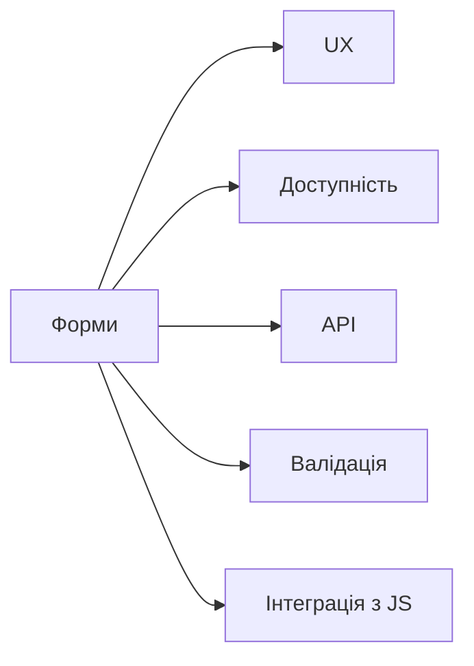

# Форми: <form>, input, textarea, select, button

## Вступ

Форми — основний механізм збору даних у вебі. Вони забезпечують взаємодію користувача з сайтом, дозволяють надсилати інформацію, реєструватися, здійснювати пошук, оформлювати замовлення.

## Історія/Походження

### Віхи розвитку форм

-   **HTML 2.0:** `<form>`, `<input>`, `<textarea>`, `<select>`, `<button>`

### Тег <form>

### Тег <input>

### Тег <textarea>

### Тег <select>

### Тег <button>

### Семантика та доступність

## Приклад коду

### Базова форма

```html
<form action="/submit" method="post">
    <label for="name">Ім’я:</label>
    <input type="text" id="name" name="name" required />
    <button type="submit">Відправити</button>
</form>
```

### Форма з різними типами input

```html
<form>
    <input type="email" placeholder="Email" required />
    <input type="password" placeholder="Пароль" required />
    <input type="date" />
    <input type="range" min="0" max="100" />
    <input type="color" />
</form>
```

### Випадаючий список

```html
<select name="country">
    <option value="ua">Україна</option>
    <option value="pl">Польща</option>
    <option value="de">Німеччина</option>
</select>
```

### Багаторядковий текст

```html
<textarea
    name="comment"
    rows="4"
    cols="40"
    placeholder="Ваш коментар"
></textarea>
```

### Кнопки

```html
<button type="submit">Відправити</button> <button type="reset">Очистити</button>
```

### Неочевидний приклад: input з pattern

```html
<input type="text" pattern="[A-Za-z]{3,}" title="Мінімум 3 латинські літери" />
```

### Неочевидний приклад: input autocomplete

```html
<input type="text" autocomplete="on" placeholder="Пошук..." />
```

### Неочевидний приклад: input readonly

```html
<input type="text" value="Тільки для читання" readonly />
```

### Неочевидний приклад: input file

```html
<input type="file" accept="image/*" />
```

### Неочевидний приклад: група радіо-кнопок

```html
<label><input type="radio" name="gender" value="male" /> Чоловік</label>
<label><input type="radio" name="gender" value="female" /> Жінка</label>
```

### Неочевидний приклад: multiple select

```html
<select name="fruits" multiple>
    <option value="apple">Яблуко</option>
    <option value="banana">Банан</option>
    <option value="orange">Апельсин</option>
</select>
```

### Неочевидний приклад: aria-label

```html
<input type="text" aria-label="Пошук" />
```

## Пояснення під капотом

Браузер парсить `<form>`, створює DOM-елементи, обробляє події (submit, change, input), інтегрує з API (FormData, Validation), забезпечує валідацію, автозаповнення, доступність. Атрибути керують поведінкою: required, pattern, autocomplete, readonly, disabled.

### Як працюють форми у рушії

Форми інтегруються з рушієм браузера, обробляють події, надсилають дані на сервер, можуть взаємодіяти з JS (AJAX, fetch), впливають на UX, доступність, безпеку.

## Нюанси та підводні камені

-   Відсутність `<label>` — погана доступність
-   Відсутність атрибуту `required` — неочікувана поведінка
-   Неправильний тип input — некоректна валідація
-   Відсутність атрибуту `name` — дані не надсилаються
-   Надмірне використання disabled — поганий UX
-   Відсутність aria-атрибутів — недоступно для скрінрідерів
-   Відсутність enctype для file — не надсилаються файли

## Діаграми

```mermaid
graph TD
    FORM[<form>] --> INPUT[<input>]
    FORM --> TEXTAREA[<textarea>]
    FORM --> SELECT[<select>]
    FORM --> BUTTON[<button>]
    INPUT --> TYPE[type]
    INPUT --> NAME[name]
    INPUT --> REQUIRED[required]
    SELECT --> OPTION[<option>]
    SELECT --> OPTGROUP[<optgroup>]
```





## Приклад застосування в реальних проєктах

-   Реєстрація — input, select, textarea, валідація
-   Пошук — input autocomplete, aria-label
-   Форма зворотного зв’язку — textarea, input, button
-   Завантаження файлів — input file, enctype
-   Опитування — radio, checkbox, multiple select

### Кейс: UX

Автозаповнення, валідація, aria-label — для зручності користувача.

### Кейс: доступність

Лейбли, aria-атрибути — для скрінрідерів.

### Кейс: інтеграція з JS

AJAX, fetch, FormData — для динамічного надсилання даних.

## Крос-посилання

-   [Посилання та навігація](./06-links-navigation.md)
-   [Семантичний HTML](./03-semantic-tags.md)
-   [Best practices](./10-best-practices.md)
-   [Текстові елементи](./04-text.md)

## Підсумок

-   Форми — основа взаємодії у вебі
-   `<form>`, `<input>`, `<textarea>`, `<select>`, `<button>` — фундаментальні теги
-   Семантика, доступність, UX — ключові аспекти
-   Важливо використовувати правильні атрибути
-   Неочевидні приклади — для інтеграції, доступності, UX
