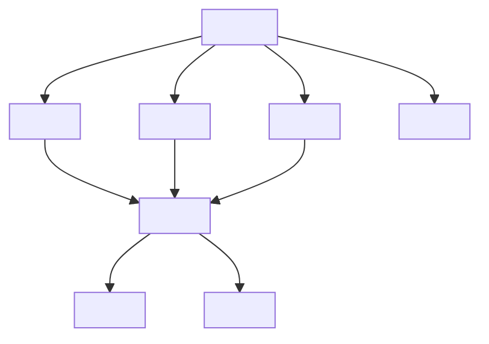
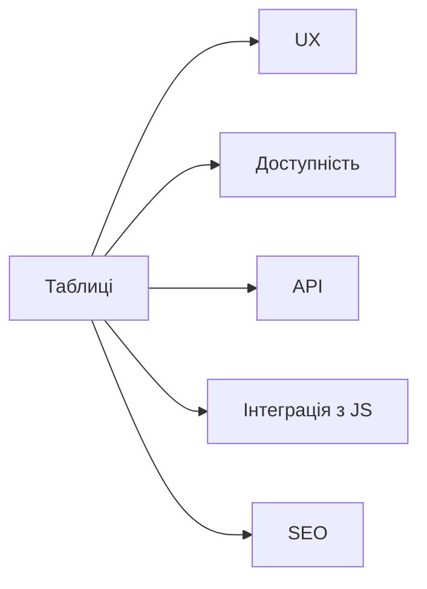

# Таблиці: <table>, <thead>, <tbody>, <tfoot>, <tr>, <td>, <th>

---

## Вступ

Таблиці — це структурований спосіб представлення даних у HTML. Вони використовуються для відображення числової, текстової інформації, звітів, фінансових даних, розкладів, порівнянь.

---

## Історія/Походження

Перші версії HTML містили базовий тег `<table>`. З розвитком стандарту додано семантичні елементи `<thead>`, `<tbody>`, `<tfoot>`, атрибути для доступності, стилізації, інтеграції з CSS та JS.

### Віхи розвитку таблиць

-   **HTML 3.2:** `<table>`, `<tr>`, `<td>`, `<th>`
-   **HTML4/HTML5:** `<thead>`, `<tbody>`, `<tfoot>`, атрибути `scope`, `colspan`, `rowspan`, ARIA

---

## Основний матеріал

### Тег `<table>`

-   Контейнер для всієї таблиці
-   Атрибути: `border`, `cellpadding`, `cellspacing`, `summary`, `width`, `height`

### Тег `<thead>`

-   Заголовок таблиці
-   Містить рядки `<tr>` з комірками `<th>`

### Тег `<tbody>`

-   Основна частина таблиці
-   Містить рядки `<tr>` з комірками `<td>`

### Тег `<tfoot>`

-   Підсумкова частина таблиці
-   Містить рядки `<tr>` з комірками `<td>` або `<th>`

### Тег `<tr>`

-   Рядок таблиці
-   Містить `<td>` або `<th>`

### Тег `<td>`

-   Комірка з даними
-   Атрибути: `colspan`, `rowspan`, `headers`, `scope`

### Тег `<th>`

-   Комірка-заголовок
-   Атрибути: `scope`, `colspan`, `rowspan`, `headers`

### Семантика та доступність

-   Атрибути `scope`, `aria-describedby`, `aria-label` — для скрінрідерів
-   Використання `<caption>` для заголовку таблиці

---

## Приклад коду

### Базова таблиця

```html
<table border="1">
    <caption>
        Розклад занять
    </caption>
    <thead>
        <tr>
            <th>День</th>
            <th>Час</th>
            <th>Предмет</th>
        </tr>
    </thead>
    <tbody>
        <tr>
            <td>Понеділок</td>
            <td>10:00</td>
            <td>Математика</td>
        </tr>
        <tr>
            <td>Вівторок</td>
            <td>12:00</td>
            <td>Фізика</td>
        </tr>
    </tbody>
    <tfoot>
        <tr>
            <td colspan="3">Всього занять: 2</td>
        </tr>
    </tfoot>
</table>
```

### Таблиця з об'єднанням комірок

```html
<table border="1">
    <tr>
        <th rowspan="2">Ім'я</th>
        <th colspan="2">Оцінки</th>
    </tr>
    <tr>
        <td>Математика</td>
        <td>Фізика</td>
    </tr>
    <tr>
        <td>Олег</td>
        <td>90</td>
        <td>85</td>
    </tr>
</table>
```

### Доступна таблиця

```html
<table aria-label="Фінансовий звіт">
    <caption>
        Фінансовий звіт
    </caption>
    <thead>
        <tr>
            <th scope="col">Місяць</th>
            <th scope="col">Дохід</th>
            <th scope="col">Витрати</th>
        </tr>
    </thead>
    <tbody>
        <tr>
            <td>Січень</td>
            <td>10000</td>
            <td>7000</td>
        </tr>
    </tbody>
</table>
```

---

## Пояснення під капотом

Браузер парсить `<table>`, створює DOM-структуру, обробляє рядки та комірки, забезпечує навігацію для скрінрідерів, дозволяє стилізувати через CSS, інтегрувати з JS (сортування, фільтрація).

### Як працюють таблиці у рушії

Таблиці інтегруються з рушієм браузера, підтримують семантику, доступність, можуть бути інтерактивними через JS, впливають на UX, SEO.

---

## Нюанси та підводні камені

-   Відсутність `<thead>`, `<tfoot>` — погана семантика
-   Відсутність `<caption>` — незрозумілий зміст
-   Надмірне використання об'єднання комірок — складність для доступності
-   Відсутність атрибуту `scope` — проблеми для скрінрідерів
-   Відсутність aria-атрибутів — недоступно для скрінрідерів
-   Таблиці для layout — погана практика

---

## Діаграми





---

## Приклад застосування в реальних проєктах

-   Розклад занять — `<table>`, `<thead>`, `<tbody>`, `<tfoot>`, `<caption>`
-   Фінансовий звіт — доступна таблиця з aria-атрибутами
-   Порівняння товарів — об'єднання комірок, семантика
-   Звіти — інтеграція з JS для сортування, фільтрації

### Кейс: доступність

ARIA, scope, caption — для скрінрідерів.

### Кейс: інтерактивність

JS — сортування, фільтрація, пагінація.

---

## Крос-посилання

-   [Форми](./07-forms.md)
-   [Семантичний HTML](./03-semantic-tags.md)
-   [Best practices](./10-best-practices.md)
-   [Текстові елементи](./04-text.md)

---

## Підсумок

-   Таблиці — основа структурованого представлення даних
-   `<table>`, `<thead>`, `<tbody>`, `<tfoot>`, `<tr>`, `<td>`, `<th>` — фундаментальні теги
-   Семантика, доступність, інтерактивність — ключові аспекти
-   Важливо використовувати правильні атрибути
-   Діаграми, кейси, крос-посилання — для глибшого розуміння
