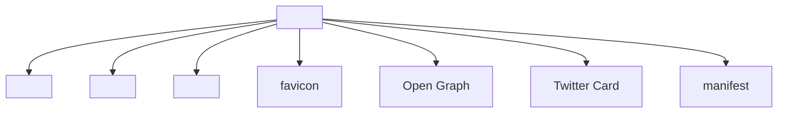
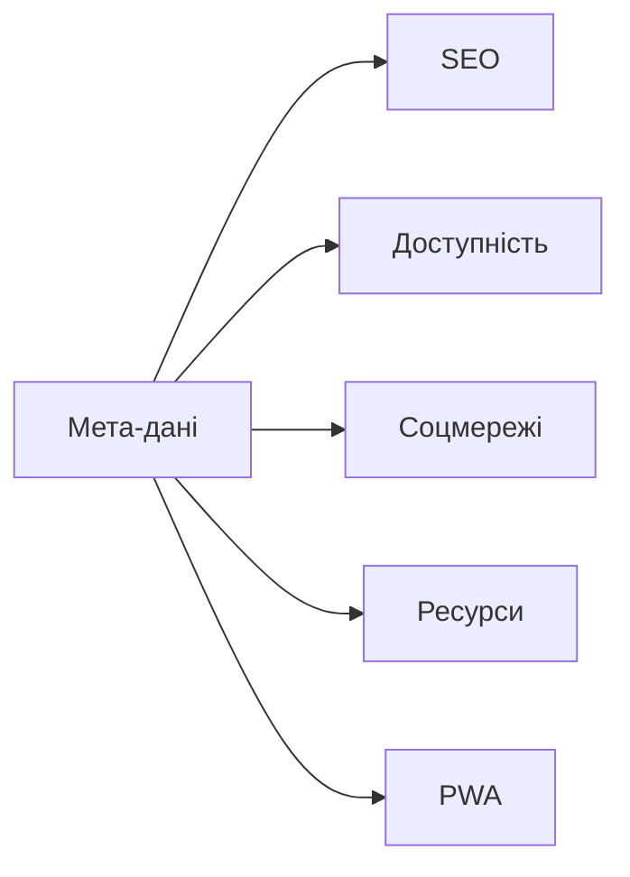

# Мета-дані та head: <meta>, <title>, <link>, favicon, SEO

## Вступ

Мета-дані та елементи `<head>` — фундамент для SEO, доступності, інтеграції з браузером, соціальними мережами, API. Вони визначають назву сторінки, опис, ключові слова, фавікон, підключення стилів та скриптів.

## Історія/Походження

Перші версії HTML містили лише базові елементи `<title>`, `<meta>`. З розвитком стандарту додано `<link>`, фавікон, Open Graph, атрибути для SEO, інтеграцію з API, адаптивність.

### Віхи розвитку head

-   **HTML 2.0:** `<title>`, `<meta>`
-   **HTML4/HTML5:** `<link>`, фавікон, Open Graph, viewport, charset

## Основний матеріал

### Тег <head>

-   `<head>` — контейнер для мета-даних, стилів, скриптів

### Тег <title>

-   `<title>` — назва сторінки у вкладці браузера

### Тег <meta>

-   `<meta>` — мета-дані: опис, ключові слова, charset, viewport, автор, robots
-   Атрибути: `name`, `content`, `charset`, `http-equiv`

### Тег <link>

-   `<link>` — підключення стилів, фавіконів, шрифтів, маніфестів
-   Атрибути: `rel`, `href`, `type`, `sizes`

### Фавікон

-   `<link rel="icon" href="favicon.ico" type="image/x-icon">` — іконка сайту

### SEO

-   Мета-дані впливають на індексацію, рейтинг, відображення у пошукових системах
-   Open Graph, Twitter Cards — для соціальних мереж

### Семантика та доступність

-   Опис, ключові слова, автор — для пошукових систем, скрінрідерів

## Приклад коду

### Базовий head

```html
<head>
    <title>Мій сайт</title>
    <meta charset="UTF-8" />
    <meta name="description" content="Опис сторінки" />
    <meta name="keywords" content="HTML, CSS, JavaScript" />
    <meta name="author" content="Олег" />
    <meta name="viewport" content="width=device-width, initial-scale=1.0" />
    <link rel="icon" href="favicon.ico" type="image/x-icon" />
    <link rel="stylesheet" href="styles.css" />
</head>
```

### Неочевидний приклад: Open Graph

```html
<meta property="og:title" content="Мій сайт" />
<meta property="og:description" content="Опис для соцмереж" />
<meta property="og:image" content="preview.jpg" />
<meta property="og:url" content="https://mysite.com" />
```

### Неочевидний приклад: Twitter Card

```html
<meta name="twitter:card" content="summary_large_image" />
<meta name="twitter:title" content="Мій сайт" />
<meta name="twitter:description" content="Опис для Twitter" />
<meta name="twitter:image" content="preview.jpg" />
```

### Неочевидний приклад: viewport

```html
<meta name="viewport" content="width=device-width, initial-scale=1.0" />
```

### Неочевидний приклад: підключення шрифтів

```html
<link rel="stylesheet" href="https://fonts.googleapis.com/css?family=Roboto" />
```

### Неочевидний приклад: manifest

```html
<link rel="manifest" href="site.webmanifest" />
```

### Неочевидний приклад: alternate

```html
<link rel="alternate" href="/rss.xml" type="application/rss+xml" title="RSS" />
```

## Пояснення під капотом

Браузер парсить `<head>`, створює DOM-елементи, інтегрує мета-дані з пошуковими системами, соціальними мережами, API. Атрибути керують поведінкою: charset, viewport, robots, Open Graph, Twitter Cards, favicon, підключення стилів та скриптів.

### Як працює head у рушії

Елементи `<head>` інтегруються з рушієм браузера, впливають на рендеринг, SEO, доступність, кешування, відображення у соцмережах, підключення ресурсів.

## Нюанси та підводні камені

-   Відсутність charset — проблеми з кодуванням
-   Відсутність viewport — поганий вигляд на мобільних
-   Відсутність опису — поганий SEO
-   Відсутність фавікону — неінформативна вкладка
-   Відсутність Open Graph/Twitter Cards — погане відображення у соцмережах
-   Надмірне використання ключових слів — штраф у пошукових системах
-   Відсутність manifest — немає PWA

## Діаграми





## Приклад застосування в реальних проєктах

-   Блоги — опис, ключові слова, Open Graph
-   Корпоративні сайти — фавікон, manifest, шрифти
-   SPA — viewport, manifest, підключення стилів
-   E-commerce — SEO, Twitter Cards, Open Graph
-   PWA — manifest, favicon

### Кейс: SEO

Мета-дані, опис, ключові слова, Open Graph — для індексації.

### Кейс: доступність

Опис, автор, charset — для скрінрідерів, браузерів.

### Кейс: інтеграція з соцмережами

Open Graph, Twitter Cards — для гарного вигляду при поширенні.

## Крос-посилання

-   [Семантичний HTML](./03-semantic-tags.md)
-   [Best practices](./10-best-practices.md)
-   [Текстові елементи](./04-text.md)
-   [Медіа](./05-media.md)

## Підсумок

-   Мета-дані — основа SEO, доступності, інтеграції
-   `<head>`, `<meta>`, `<title>`, `<link>`, favicon — фундаментальні елементи
-   Семантика, опис, ключові слова, Open Graph — для пошукових систем, соцмереж
-   Важливо використовувати правильні атрибути
-   Неочевидні приклади — для інтеграції, доступності, PWA
