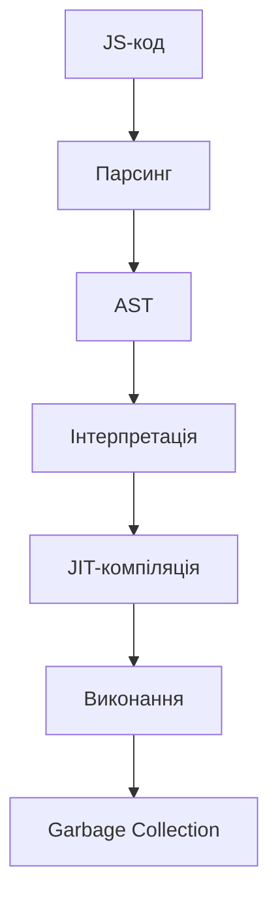
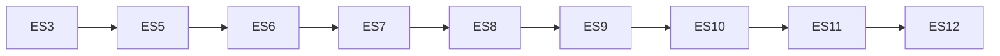

# Вступ: історія, рушії, еволюція JS

## Вступ

JavaScript — це мова програмування, яка стала фундаментом сучасного вебу. Вона забезпечує інтерактивність, динаміку, автоматизацію та зв’язок між користувачем і сервером. JS — єдина мова, що виконується у браузері, і одна з найпопулярніших у світі.

## Історія JavaScript

-   **1995:** Брендан Айк створює першу версію JS за 10 днів для браузера Netscape Navigator.
-   **1996:** Microsoft додає JScript у Internet Explorer.
-   **1997:** ECMAScript — офіційний стандарт JS (ECMA-262).
-   **2009:** Node.js — запуск JS на сервері.
-   **2015:** ES6 (ECMAScript 2015) — революційне оновлення: класи, модулі, стрілочні функції.
-   **2020+:** JS — основа SPA, PWA, мобільних додатків, серверних рішень.

### Віхи розвитку

-   Від простих скриптів до складних фреймворків (React, Vue, Angular)
-   Від браузерного API до серверних платформ (Node.js)
-   Від imperative до declarative підходів

## Рушії JavaScript

Рушій JS — це програма, яка інтерпретує та виконує JS-код. Кожен браузер має власний рушій:

| Браузер | Рушій          |
| ------- | -------------- |
| Chrome  | V8             |
| Firefox | SpiderMonkey   |
| Safari  | JavaScriptCore |
| Edge    | Chakra/V8      |
| Opera   | V8             |

### Як працює рушій JS

-   Парсинг: розбір коду на абстрактне синтаксичне дерево (AST)
-   Інтерпретація: виконання простих інструкцій
-   JIT-компіляція: оптимізація та прискорення виконання
-   Garbage collection: автоматичне очищення пам’яті

#### Діаграма: життєвий цикл JS-коду



## Еволюція JavaScript

### ECMAScript

-   ECMAScript — стандарт, який визначає синтаксис та функціонал JS
-   Щорічні оновлення: нові можливості, оптимізація, безпека

### Основні етапи еволюції

-   **ES3 (1999):** регулярні вирази, try/catch
-   **ES5 (2009):** strict mode, JSON, Array methods
-   **ES6 (2015):** let/const, класи, модулі, стрілочні функції, проміси
-   **ES7+ (2016+):** async/await, генератори, нові структури даних

### Вплив еволюції

-   Зростання продуктивності рушіїв
-   Поява нових парадигм (reactive, functional)
-   Розширення екосистеми: npm, Yarn, Webpack

## Неочевидні приклади

### 1. JIT-компіляція

JS рушії не просто інтерпретують код, а й компілюють "гарячі" ділянки у машинний код для прискорення.

```js
function sum(a, b) {
    return a + b;
}
// Часто викликається — рушій оптимізує функцію
```

### 2. Garbage Collection

Автоматичне очищення пам’яті, але з нюансами (наприклад, циклічні посилання можуть затримати GC).

```js
let a = {};
let b = {};
a.ref = b;
b.ref = a;
// GC не завжди одразу очищає пам’ять
```

### 3. Event Loop

JS — однопотокова мова, але може виконувати асинхронні задачі через event loop.

```js
console.log("A");
setTimeout(() => console.log("B"), 0);
console.log("C");
// Вивід: A, C, B
```

## Підводні камені

-   Різні рушії — різна поведінка (V8 vs. SpiderMonkey)
-   Старі браузери — відсутність підтримки нових стандартів
-   Garbage Collection — не гарантує миттєвого очищення
-   Event Loop — неочевидна асинхронність

## Best practices

-   Пишіть код згідно стандарту ECMAScript
-   Використовуйте сучасні можливості (let/const, модулі, async/await)
-   Тестуйте у різних рушіях
-   Використовуйте transpilers (Babel) для підтримки старих браузерів
-   Оптимізуйте пам’ять та продуктивність

## Діаграма: еволюція JS



## Крос-посилання

-   [JS: синтаксис](./02-syntax.md)
-   [JS: event loop](./04-event-loop.md)
-   [JS: best practices](./10-best-practices.md)
-   [HTML: роль JS](../HTML/05-js-role.md)

## Підсумок

-   JS — основа сучасного вебу
-   Рушії — ключ до продуктивності та безпеки
-   Еволюція — постійне вдосконалення, нові можливості
-   Неочевидні механізми — JIT, GC, event loop
-   Best practices — сучасний синтаксис, тестування, оптимізація
