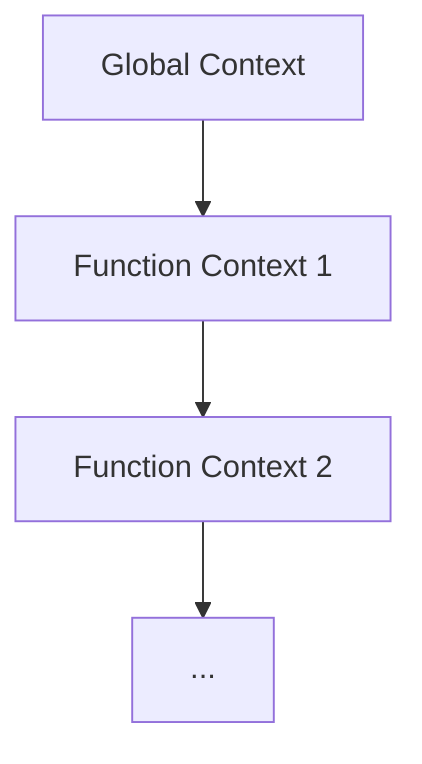

# Execution context, Lexical Environment, Scope chain

## Вступ

Execution context, Lexical Environment та Scope chain — це фундаментальні механізми JavaScript, які визначають, як і де виконуються змінні, функції, об’єкти. Розуміння цих концепцій — ключ до глибокого володіння JS.

## Execution Context

Execution context — це середовище, в якому виконується JS-код. Кожен раз, коли інтерпретатор запускає код, він створює execution context.

### Види execution context

-   **Global Execution Context** — створюється при запуску скрипта, містить глобальні змінні, функції
-   **Function Execution Context** — створюється при виклику функції
-   **Eval Execution Context** — створюється при виконанні коду через `eval()` (рідко використовується)

### Життєвий цикл

1. **Creation phase** — створення Lexical Environment, визначення змінних, функцій
2. **Execution phase** — виконання коду, присвоєння значень

#### Діаграма: стек execution context



## Lexical Environment

Lexical Environment — це структура, яка містить ідентифікатори (змінні, функції) та посилання на зовнішнє середовище.

### Складові

-   **Environment Record** — зберігає змінні, функції
-   **Outer Environment Reference** — посилання на зовнішній Lexical Environment

### Як працює

Кожна функція створює власний Lexical Environment, який містить локальні змінні та посилання на зовнішній контекст.

#### Приклад

```js
let a = 10;
function foo() {
    let b = 20;
    function bar() {
        let c = 30;
        console.log(a, b, c); // 10, 20, 30
    }
    bar();
}
foo();
```

## Scope chain

Scope chain — це ланцюжок Lexical Environment, який дозволяє JS знаходити змінні у зовнішніх контекстах.

### Як працює

-   Якщо змінна не знайдена у поточному Lexical Environment, JS шукає у зовнішньому
-   Ланцюжок формується під час створення функції (lexical scoping)

#### Діаграма: scope chain

```mermaid
graph TD
    BAR[bar()] --> FOO[foo()] --> GLOBAL[global]
```

#### Приклад

```js
let x = 1;
function outer() {
    let y = 2;
    function inner() {
        let z = 3;
        console.log(x, y, z); // 1, 2, 3
    }
    inner();
}
outer();
```

## Неочевидні приклади

### 1. Замикання (Closure)

Closure — це функція, яка "запам’ятовує" свій Lexical Environment навіть після завершення зовнішньої функції.

```js
function makeCounter() {
    let count = 0;
    return function () {
        return ++count;
    };
}
const counter = makeCounter();
console.log(counter()); // 1
console.log(counter()); // 2
```

### 2. Shadowing

Локальна змінна "затіняє" глобальну:

```js
let value = "global";
function test() {
    let value = "local";
    console.log(value); // 'local'
}
test();
```

### 3. ReferenceError через scope chain

```js
function foo() {
    console.log(bar); // ReferenceError
}
foo();
```

## Підводні камені

-   Shadowing — неочевидна поведінка
-   ReferenceError — якщо змінна не знайдена у scope chain
-   Замикання — можливі memory leaks
-   Eval — створює окремий execution context, може порушити безпеку

## Best practices

-   Уникайте глобальних змінних
-   Використовуйте let/const для блочного scope
-   Документуйте складні замикання
-   Не використовуйте eval без крайньої потреби
-   Тестуйте поведінку scope chain у складних функціях

## Діаграма: Lexical Environment

```mermaid
graph TD
    GLOBAL[Global] --> FOO[foo()]
    FOO --> BAR[bar()]
```

## Крос-посилання

-   [JS: замикання](./03-closure.md)
-   [JS: event loop](./04-event-loop.md)
-   [JS: best practices](./10-best-practices.md)

## Підсумок

-   Execution context, Lexical Environment, Scope chain — основа роботи JS
-   Неочевидні приклади — замикання, shadowing, ReferenceError
-   Best practices — блочний scope, уникнення глобальних змінних, документування
