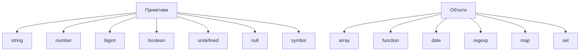

# Типи даних: примітиви, об'єкти, спеціальні типи

## Вступ

Типи даних — фундаментальна частина JavaScript. Від правильного розуміння типів залежить поведінка коду, ефективність, безпека та масштабованість застосунків.

## Примітивні типи

Примітиви — це прості, незмінні типи даних. Всі примітиви порівнюються за значенням.

### Основні примітиви

-   **string** — рядок
-   **number** — число (ціле, дробове, NaN, Infinity)
-   **bigint** — великі цілі числа
-   **boolean** — true/false
-   **undefined** — змінна оголошена, але не має значення
-   **null** — "порожнє" значення
-   **symbol** — унікальний ідентифікатор

#### Приклад

```js
let str = "Hello";
let num = 42;
let big = 12345678901234567890n;
let bool = true;
let und;
let nul = null;
let sym = Symbol("id");
```

### Особливості примітивів

-   Незмінність: значення не можна змінити
-   Порівняння за значенням
-   Зберігаються у стеку пам’яті

## Об'єкти

Об'єкти — складні типи, які можуть містити властивості та методи. Всі об'єкти порівнюються за посиланням.

### Основні типи об'єктів

-   **Object** — базовий тип
-   **Array** — масив
-   **Function** — функція
-   **Date** — дата
-   **RegExp** — регулярний вираз
-   **Map, Set, WeakMap, WeakSet** — структури даних

#### Приклад

```js
let obj = { name: "Alice", age: 30 };
let arr = [1, 2, 3];
function foo() {
    return "bar";
}
let date = new Date();
let map = new Map();
```

### Особливості об'єктів

-   Змінність: властивості можна змінювати
-   Порівняння за посиланням
-   Зберігаються у heap пам’яті

## Спеціальні типи

### undefined

-   Значення змінної, яка оголошена, але не ініціалізована

### null

-   "Порожнє" значення, явно задане

### NaN

-   "Not a Number" — результат некоректних математичних операцій

### Infinity/-Infinity

-   Результат ділення на нуль, переповнення

### Symbol

-   Унікальний ідентифікатор, не співпадає з жодним іншим

### BigInt

-   Для роботи з дуже великими цілими числами

## Діаграма: типи даних у JS



## Неочевидні приклади

### 1. Порівняння примітивів та об'єктів

```js
let a = 5;
let b = 5;
console.log(a === b); // true

let obj1 = { x: 1 };
let obj2 = { x: 1 };
console.log(obj1 === obj2); // false
```

### 2. typeof та нюанси

```js
console.log(typeof null); // 'object' (історична помилка)
console.log(typeof undefined); // 'undefined'
console.log(typeof NaN); // 'number'
console.log(typeof Symbol("id")); // 'symbol'
console.log(typeof 12345678901234567890n); // 'bigint'
```

### 3. Примітиви vs. об'єктні обгортки

```js
let str = "hello";
let strObj = new String("hello");
console.log(typeof str); // 'string'
console.log(typeof strObj); // 'object'
console.log(str === strObj); // false
```

### 4. Особливості NaN

```js
console.log(NaN === NaN); // false
console.log(Number.isNaN(NaN)); // true
```

### 5. BigInt

```js
let big = 1234567890123456789012345678901234567890n;
console.log(big + 1n); // 1234567890123456789012345678901234567891n
```

## Підводні камені

-   typeof null — повертає 'object'
-   Порівняння об'єктів — завжди за посиланням
-   NaN !== NaN
-   Примітиви vs. об'єктні обгортки — різна поведінка
-   BigInt не можна змішувати з number

## Best practices

-   Використовуйте примітиви для простих значень
-   Для складних структур — об'єкти, масиви, карти
-   Уникайте глобальних змінних
-   Перевіряйте типи через typeof, Array.isArray, instanceof
-   Не використовуйте об'єктні обгортки без потреби
-   Для великих чисел — BigInt

## Таблиця: типи даних

| Тип       | typeof      | Приклад            |
| --------- | ----------- | ------------------ |
| string    | 'string'    | 'hello'            |
| number    | 'number'    | 42, NaN, Infinity  |
| bigint    | 'bigint'    | 123n               |
| boolean   | 'boolean'   | true               |
| undefined | 'undefined' | undefined          |
| null      | 'object'    | null               |
| symbol    | 'symbol'    | Symbol('id')       |
| object    | 'object'    | {}, [], new Date() |
| function  | 'function'  | function(){}       |

## Крос-посилання

-   [JS: execution context](./02-execution-context.md)
-   [JS: замикання](./03-closure.md)
-   [JS: best practices](./10-best-practices.md)

## Підсумок

-   Примітиви — прості, незмінні типи
-   Об'єкти — складні, змінні, порівнюються за посиланням
-   Спеціальні типи — NaN, Infinity, Symbol, BigInt
-   Неочевидні приклади — typeof, порівняння, обгортки
-   Best practices — правильний вибір типу, перевірка, уникнення помилок
