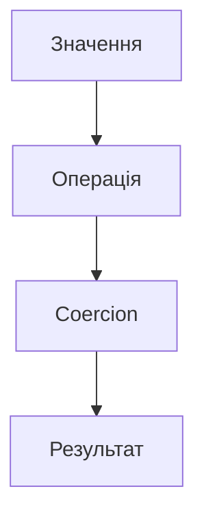

# Операції, порівняння, coercion

## Вступ

Операції, порівняння та coercion (примусове приведення типів) — це фундаментальні механізми JavaScript, які визначають поведінку коду, впливають на логіку, безпеку та продуктивність застосунків.

## Операції

### Арифметичні

-   `+`, `-`, `*`, `/`, `%`, `**`

### Логічні

-   `&&`, `||`, `!`

### Бітові

-   `&`, `|`, `^`, `~`, `<<`, `>>`, `>>>`

### Рядкові

-   Конкатенація: `+`

### Операції над масивами

-   `push`, `pop`, `map`, `filter`, `reduce`, `forEach`

### Операції над об'єктами

-   Доступ до властивостей: `obj.prop`, `obj['prop']`
-   Деструктуризація

#### Приклад

```js
let a = 5 + 3; // 8
let b = "Hello" + " " + "World"; // 'Hello World'
let c = true && false; // false
let d = 10 % 3; // 1
```

## Порівняння

### Оператори порівняння

-   `==` — нестроге порівняння (coercion)
-   `===` — строге порівняння (без coercion)
-   `!=`, `!==`
-   `>`, `<`, `>=`, `<=`

#### Приклад

```js
console.log(2 == "2"); // true (coercion)
console.log(2 === "2"); // false
console.log(null == undefined); // true
console.log(null === undefined); // false
```

### Особливості порівняння

-   Примітиви — за значенням
-   Об'єкти — за посиланням
-   NaN !== NaN

#### Неочевидний приклад

```js
let obj1 = { x: 1 };
let obj2 = { x: 1 };
console.log(obj1 == obj2); // false
console.log(obj1 === obj2); // false
```

## Coercion (примусове приведення типів)

JavaScript автоматично приводить типи у багатьох операціях. Це може призвести до неочікуваної поведінки.

### Явне coercion

-   `Number('42')` → 42
-   `String(42)` → '42'
-   `Boolean(0)` → false

### Неявне coercion

-   `2 + '2'` → '22'
-   `true + 1` → 2
-   `false == 0` → true
-   `null == undefined` → true

#### Таблиця: неявне приведення типів

| Вираз       | Результат |
| ----------- | --------- |
| '5' + 2     | '52'      |
| '5' - 2     | 3         |
| true + 1    | 2         |
| false == 0  | true      |
| null == ''  | false     |
| [] == false | true      |
| [] == ''    | true      |
| [1] == 1    | true      |
| NaN == NaN  | false     |

### Діаграма: coercion у JS



## Неочевидні приклади

### 1. Операції з різними типами

```js
console.log("5" - 2); // 3
console.log("5" + 2); // '52'
console.log([] + {}); // '[object Object]'
console.log({} + []); // 0 (у деяких рушіях)
```

### 2. == vs. ===

```js
console.log(false == ""); // true
console.log(false === ""); // false
console.log(0 == "0"); // true
console.log(0 === "0"); // false
```

### 3. Boolean coercion

```js
console.log(Boolean("")); // false
console.log(Boolean("0")); // true
console.log(Boolean([])); // true
console.log(Boolean({})); // true
```

### 4. Object to primitive

```js
let obj = {
    valueOf() {
        return 42;
    },
    toString() {
        return "hello";
    },
};
console.log(obj + ""); // 'hello'
console.log(obj + 8); // 50
```

## Підводні камені

-   Неочевидне coercion — джерело багатьох багів
-   == vs. === — завжди використовуйте === для надійності
-   NaN !== NaN
-   Операції з null, undefined — особлива поведінка
-   Object to primitive — valueOf/toString

## Best practices

-   Використовуйте === замість ==
-   Явно приводьте типи (Number, String, Boolean)
-   Уникайте неочевидних операцій з різними типами
-   Документуйте складну логіку coercion
-   Тестуйте edge cases

## Крос-посилання

-   [JS: типи даних](./03-types.md)
-   [JS: execution context](./02-execution-context.md)
-   [JS: best practices](./10-best-practices.md)

## Підсумок

-   Операції, порівняння, coercion — основа логіки JS
-   Неочевидні приклади — джерело багів
-   Best practices — явне приведення типів, використання ===, тестування
