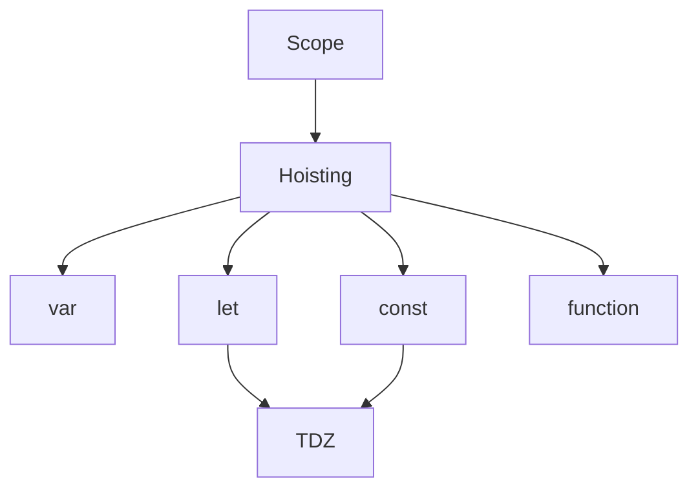

# Область видимості, hoisting, TDZ

## Вступ

Область видимості (scope), hoisting та TDZ — це фундаментальні механізми JavaScript, які визначають, як і коли змінні та функції доступні у коді. Розуміння цих концепцій — ключ до написання безпечного, ефективного та передбачуваного JS.

## Область видимості (Scope)

Scope — це контекст, у якому змінна чи функція доступна для використання.

### Види scope

-   **Глобальний** — доступний у всьому коді
-   **Функціональний** — створюється при виклику функції
-   **Блочний** — створюється через let/const у блоках `{}`

#### Приклад

```js
let a = 1; // глобальний
function foo() {
    let b = 2; // функціональний
    if (true) {
        let c = 3; // блочний
        console.log(a, b, c); // 1, 2, 3
    }
}
foo();
```

### Особливості

-   var — функціональний scope
-   let/const — блочний scope
-   Глобальні змінні — джерело багів

## Hoisting

Hoisting — це "підняття" оголошень змінних та функцій на початок їхнього scope під час фази створення execution context.

### Як працює hoisting

-   var — оголошується, але не ініціалізується (undefined)
-   let/const — оголошується, але не ініціалізується (TDZ)
-   function declaration — піднімається повністю
-   function expression — як змінна (var/let/const)

#### Приклад hoisting

```js
console.log(a); // undefined
var a = 5;

console.log(b); // ReferenceError
let b = 10;

foo(); // 'Hello'
function foo() {
    console.log("Hello");
}
```

### Неочевидний приклад: function expression

```js
bar(); // TypeError: bar is not a function
var bar = function () {
    console.log("Bar");
};
```

## TDZ (Temporal Dead Zone)

TDZ — це період між оголошенням змінної через let/const та її ініціалізацією, коли доступ до змінної призводить до помилки.

#### Приклад TDZ

```js
console.log(x); // ReferenceError
let x = 7;
```

### Особливості TDZ

-   TDZ існує для let/const
-   Доступ до змінної у TDZ — ReferenceError

## Діаграма: hoisting та TDZ



## Неочевидні приклади

### 1. var vs. let/const

```js
if (true) {
    var a = 1;
    let b = 2;
}
console.log(a); // 1
console.log(b); // ReferenceError
```

### 2. TDZ у циклі

```js
for (let i = 0; i < 3; i++) {
    setTimeout(() => console.log(i), 100);
}
// Вивід: 0, 1, 2
```

### 3. Hoisting функцій

```js
foo(); // 'foo'
function foo() {
    console.log("foo");
}

bar(); // TypeError
var bar = function () {
    console.log("bar");
};
```

## Підводні камені

-   var — неочевидна область видимості
-   TDZ — ReferenceError при доступі до let/const до ініціалізації
-   Hoisting — неочікувана поведінка при використанні змінних/функцій
-   Глобальні змінні — конфлікти

## Best practices

-   Використовуйте let/const замість var
-   Оголошуйте змінні на початку блоку
-   Уникайте глобальних змінних
-   Не використовуйте змінні до їх оголошення
-   Документуйте складну логіку scope/hoisting

## Крос-посилання

-   [JS: execution context](./02-execution-context.md)
-   [JS: типи даних](./03-types.md)
-   [JS: best practices](./10-best-practices.md)

## Підсумок

-   Scope, hoisting, TDZ — основа роботи змінних у JS
-   Неочевидні приклади — джерело багів
-   Best practices — let/const, уникнення глобальних змінних, оголошення на початку блоку
