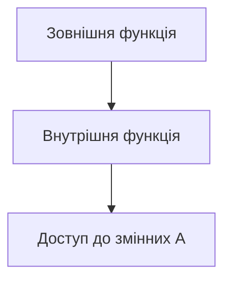
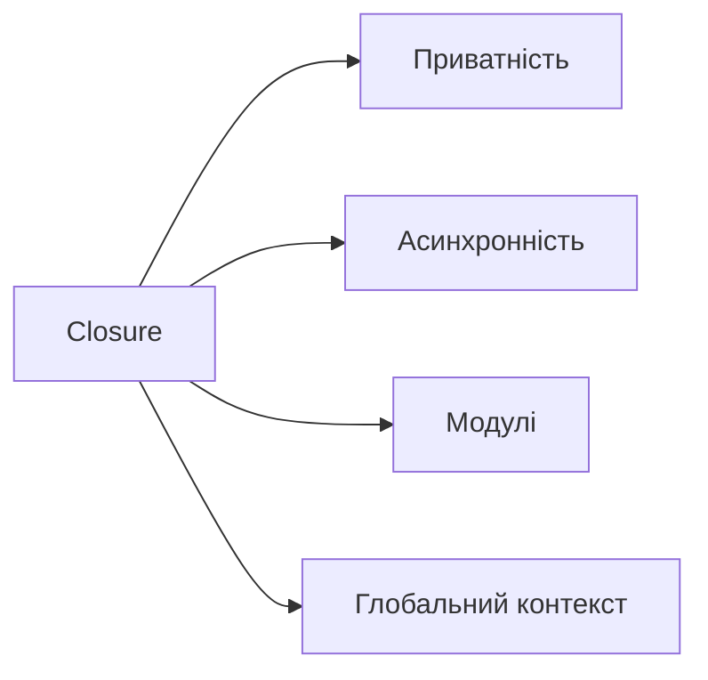

# Замикання (Closure)

## Вступ

Замикання (closure) — це фундаментальний механізм JavaScript, на якому тримається робота рушія, асинхронність, модулі, приватність, колбеки, і навіть глобальний контекст. Closure дозволяє функціям "запам'ятовувати" своє лексичне оточення, що визначає архітектуру та поведінку JS-коду.

## Історія/Походження

Термін closure походить з функціонального програмування (Lisp, Scheme). У JavaScript замикання з'явилися з самого початку, але їх значення стало критичним із розвитком асинхронності, модульності (ES5, ES6), появою промісів, класів, React-хуків.

## Основний матеріал

Closure виникає, коли функція "замикає" доступ до змінних з зовнішнього лексичного оточення, навіть після завершення виконання цієї зовнішньої функції. Це дозволяє:

-   створювати приватні змінні
-   будувати фабрики функцій
-   реалізовувати модулі
-   працювати з асинхронним кодом
-   зберігати стан між викликами

### Як працює замикання

1. Кожна функція створює власний лексичний контекст.
2. Внутрішня функція має доступ до змінних зовнішньої функції.
3. Якщо внутрішня функція повертається або передається далі, вона зберігає доступ до цих змінних.

### Closure — основа рушія JS

Всі глобальні змінні — це closure верхнього рівня. Колбеки, проміси, async/await, event handlers, React hooks — все це працює завдяки closure.

## Приклад коду

### Приватна змінна

```js
function counter() {
    let count = 0; // приватна змінна
    return function () {
        count++;
        return count;
    };
}

const inc = counter();
console.log(inc()); // 1
console.log(inc()); // 2
```

// Функція inc "пам'ятає" змінну count навіть після завершення counter.

### Фабрика функцій

```js
function makeMultiplier(factor) {
    return function (x) {
        return x * factor;
    };
}

const double = makeMultiplier(2);
console.log(double(5)); // 10
```

// double зберігає доступ до factor.

### Асинхронний код

```js
function delayedLog(msg, delay) {
    setTimeout(function () {
        console.log(msg); // msg "замикається"
    }, delay);
}
delayedLog("Hello!", 1000);
```

### Callback у масиві

```js
function makeAdder(x) {
    return function (y) {
        return x + y;
    };
}
const arr = [1, 2, 3].map(makeAdder(5));
console.log(arr); // [6,7,8]
```

### Приватність у класах через closure

```js
function Secret() {
    let secret = "hidden";
    this.getSecret = function () {
        return secret;
    };
}
const s = new Secret();
console.log(s.getSecret()); // 'hidden'
```

### Глобальний контекст — closure

```js
var globalVar = 42;
function showGlobal() {
    console.log(globalVar); // closure верхнього рівня
}
showGlobal();
```

## Пояснення під капотом

JavaScript створює лексичне оточення для кожної функції. Коли внутрішня функція використовує змінні зовнішньої, рушій JS створює closure — структуру, яка зберігає ці змінні у пам'яті. Closure — це не просто інструмент, а основа роботи рушія, що дозволяє JS бути гнучким, асинхронним, модульним.

### Взаємодія з garbage collection

Замкнені змінні не видаляються, поки існує хоча б одна функція, яка їх використовує. Це може призвести до витоків пам'яті, якщо неактуальні closure залишаються у пам'яті.

## Нюанси та підводні камені

-   Замикання може призвести до витоків пам'яті.
-   Помилки при використанні var у циклах (старий патерн):

```js
for (var i = 0; i < 3; i++) {
    setTimeout(function () {
        console.log(i); // завжди 3
    }, 100);
}
```

-   Для вирішення — використовувати let або IIFE:

```js
for (let i = 0; i < 3; i++) {
    setTimeout(function () {
        console.log(i); // 0, 1, 2
    }, 100);
}
```

-   Closure складно дебажити, якщо вкладеність велика.
-   Неочікувана поведінка при створенні приватних змінних у класах.
-   Неочевидні баги при роботі з асинхронністю та замиканнями.

## Діаграми





## Приклад застосування в реальних проєктах

-   Модулі (патерн revealing module)
-   Приватні змінні у компонентах
-   Асинхронні операції (setTimeout, fetch, проміси)
-   Фабрики функцій (наприклад, для створення обробників подій)
-   React hooks
-   Event handlers у DOM
-   Redux middleware

### Кейс: модуль

```js
const Module = (function () {
    let secret = "hidden";
    return {
        getSecret: function () {
            return secret;
        },
    };
})();
console.log(Module.getSecret()); // 'hidden'
```

### Кейс: React hook

```js
function useCounter() {
    let count = 0;
    function inc() {
        count++;
        return count;
    }
    return [() => count, inc];
}
const [get, inc] = useCounter();
console.log(get()); // 0
inc();
console.log(get()); // 1
```

### Кейс: неочевидний баг

```js
function createHandlers() {
    let arr = [];
    for (var i = 0; i < 3; i++) {
        arr.push(function () {
            return i;
        });
    }
    return arr;
}
const handlers = createHandlers();
console.log(handlers[0]()); // 3
console.log(handlers[1]()); // 3
console.log(handlers[2]()); // 3
// closure "замикає" останнє значення var
```

## Крос-посилання

-   [Execution context, Lexical Environment, Scope chain](./02-execution-context.md)
-   [Асинхронність: callback, promise, async/await](./10-async.md)
-   [Advanced patterns](./13-advanced-patterns.md)
-   [Прототипи, наслідування, класи](./08-prototypes-classes.md)

## Підсумок

-   Closure — фундаментальний механізм JS
-   Визначає приватність, асинхронність, модульність, глобальний контекст
-   Використовується у всіх сучасних патернах
-   Може призвести до витоків пам'яті та неочевидних багів
-   Важливо розуміти лексичне оточення та scope chain
-   Closure — основа для роботи рушія JS
