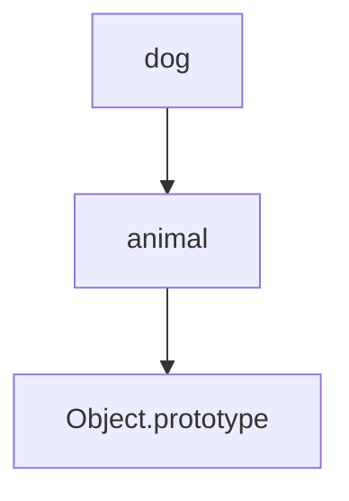
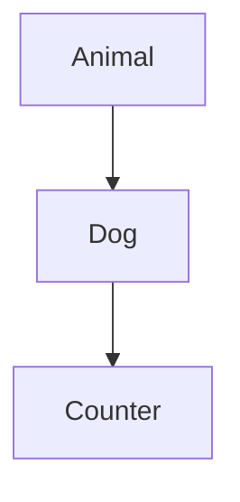

# Прототипи, наслідування, класи

## Вступ

Прототипи, наслідування та класи — це фундаментальні механізми JavaScript, які визначають архітектуру, повторне використання коду, організацію об'єктів та поведінку застосунків. Розуміння цих концепцій — ключ до ефективної роботи з JS.

## Прототипи

JavaScript — прототипно-орієнтована мова. Кожен об'єкт має приховану властивість `[[Prototype]]`, яка вказує на інший об'єкт. Через прототипи реалізується наслідування та спільний доступ до властивостей і методів.

### Як працює прототип

-   При зверненні до властивості, JS шукає її у об'єкті, потім у прототипі, потім у прототипі прототипа і так далі (prototype chain)

#### Приклад

```js
const animal = {
    speak() {
        console.log("...");
    },
};
const dog = Object.create(animal);
dog.speak(); // '...'
```

### Діаграма: prototype chain



## Наслідування

Наслідування — це механізм, який дозволяє одному об'єкту отримувати властивості та методи іншого через прототип.

### Способи наслідування

-   Через Object.create()
-   Через функції-конструктори
-   Через класи (ES6)

#### Приклад через функцію-конструктор

```js
function Animal(name) {
    this.name = name;
}
Animal.prototype.speak = function () {
    console.log(this.name + " makes a sound");
};
const dog = new Animal("Rex");
dog.speak(); // 'Rex makes a sound'
```

#### Приклад через клас (ES6)

```js
class Animal {
    constructor(name) {
        this.name = name;
    }
    speak() {
        console.log(this.name + " makes a sound");
    }
}
class Dog extends Animal {
    speak() {
        console.log(this.name + " barks");
    }
}
const rex = new Dog("Rex");
rex.speak(); // 'Rex barks'
```

## Класи

Класи — це синтаксичний цукор над прототипами, який дозволяє створювати об'єкти, наслідувати властивості та методи, організовувати код у модулі та компоненти.

### Особливості класів

-   constructor — спеціальний метод для ініціалізації
-   extends — наслідування
-   super — виклик методів батьківського класу
-   приватні поля (#field)
-   статичні методи (static)

#### Приклад приватних полів

```js
class Counter {
    #count = 0;
    inc() {
        this.#count++;
    }
    get() {
        return this.#count;
    }
}
const c = new Counter();
c.inc();
console.log(c.get()); // 1
```

### Діаграма: наслідування через класи



## Неочевидні приклади

### 1. Прототипне наслідування через Object.create

```js
const base = { x: 1 };
const child = Object.create(base);
console.log(child.x); // 1
```

### 2. Перевизначення методів

```js
class A {
    foo() {
        return "A";
    }
}
class B extends A {
    foo() {
        return super.foo() + "B";
    }
}
const b = new B();
console.log(b.foo()); // 'AB'
```

### 3. Статичні методи

```js
class MathUtil {
    static sum(a, b) {
        return a + b;
    }
}
console.log(MathUtil.sum(2, 3)); // 5
```

### 4. Приватні поля

```js
class Secret {
    #value = 42;
    getValue() {
        return this.#value;
    }
}
const s = new Secret();
console.log(s.getValue()); // 42
```

## Пояснення під капотом

-   Прототипи — це ланцюжок об'єктів, через який здійснюється пошук властивостей
-   Класи — синтаксичний цукор, який створює функцію-конструктор та прототип
-   Наслідування — копіювання посилання на прототип

## Підводні камені

-   Перевизначення властивостей у прототипі — неочікувана поведінка
-   Зміна прототипу після створення об'єкта — не рекомендується
-   Приватні поля — доступні лише у класі
-   Статичні методи — не доступні у екземплярах
-   Наслідування через Object.create — не підтримує constructor

## Best practices

-   Використовуйте класи для складних структур
-   Не змінюйте прототипи після створення об'єкта
-   Використовуйте приватні поля для інкапсуляції
-   Документуйте ієрархію класів
-   Використовуйте super для доступу до батьківських методів

## Крос-посилання

-   [Closure](./06-closure.md)
-   [Execution context, Lexical Environment, Scope chain](./02-execution-context.md)
-   [Advanced patterns](./13-advanced-patterns.md)

## Підсумок

-   Прототипи — основа наслідування у JS
-   Класи — синтаксичний цукор для організації коду
-   Наслідування — повторне використання та розширення функціоналу
-   Неочевидні приклади — приватні поля, статичні методи, Object.create
-   Best practices — інкапсуляція, документація, використання класів для складних структур
