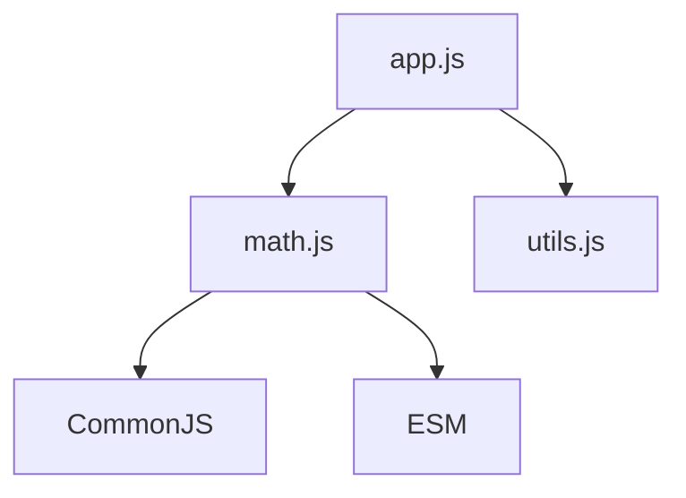

# Модулі: import/export, CommonJS, ESM

## Вступ

Модулі — це фундаментальний механізм JavaScript, який дозволяє організовувати код у незалежні, повторно використовувані частини. Модульність підвищує підтримуваність, масштабованість та безпеку застосунків.

## Історія/Походження

-   **CommonJS** — стандарт для Node.js (2009), синхронний імпорт через require
-   **AMD/UMD** — для браузерів, асинхронний імпорт
-   **ESM (ECMAScript Modules)** — стандарт для браузерів та Node.js (з 2015 року), import/export

## Основний матеріал

### CommonJS

-   Використовується у Node.js
-   Синхронний імпорт
-   Експорт через module.exports

#### Приклад

```js
// math.js
module.exports = {
    sum(a, b) {
        return a + b;
    },
};
// app.js
const math = require("./math");
console.log(math.sum(2, 3)); // 5
```

### ESM (ECMAScript Modules)

-   Використовується у браузерах та Node.js
-   Асинхронний імпорт
-   Експорт через export

#### Приклад

```js
// math.js
export function sum(a, b) {
    return a + b;
}
// app.js
import { sum } from "./math.js";
console.log(sum(2, 3)); // 5
```

### Відмінності CommonJS vs. ESM

| Особливість        | CommonJS       | ESM          |
| ------------------ | -------------- | ------------ |
| Синтаксис імпорту  | require        | import       |
| Синтаксис експорту | module.exports | export       |
| Синхронність       | Синхронний     | Асинхронний  |
| Контекст           | Файл           | Модуль       |
| Кешування          | Кешує модуль   | Кешує модуль |
| Динамічний імпорт  | require()      | import()     |

### Неочевидний приклад: динамічний імпорт

```js
// ESM
async function loadMath() {
    const math = await import("./math.js");
    console.log(math.sum(2, 3));
}
loadMath();
```

### UMD/AMD

-   UMD — універсальний модульний формат для браузерів та Node.js
-   AMD — асинхронний модульний формат для браузерів

## Пояснення під капотом

-   CommonJS — виконується одразу при require, модулі кешуються
-   ESM — імпортується асинхронно, підтримує tree-shaking
-   Модулі ізольовані, не мають доступу до глобального scope

## Діаграми



## Нюанси та підводні камені

-   Неможливо змішувати import/export та require/module.exports у одному файлі
-   CommonJS не підтримує tree-shaking
-   ESM не працює у старих браузерах без транспіляції
-   Відмінності у контексті виконання (this)
-   Кешування модулів — зміни не підтягуються автоматично

## Best practices

-   Використовуйте ESM для сучасних застосунків
-   Для Node.js — переходьте на ESM
-   Уникайте глобальних змінних у модулях
-   Документуйте API модулів
-   Використовуйте динамічний імпорт для оптимізації
-   Тестуйте модулі окремо

## Неочевидні приклади

### 1. Експорт за замовчуванням

```js
// math.js
export default function sum(a, b) {
    return a + b;
}
// app.js
import sum from "./math.js";
console.log(sum(2, 3)); // 5
```

### 2. Імпорт всього модуля

```js
import * as math from "./math.js";
console.log(math.sum(2, 3));
```

### 3. Кешування модулів

```js
// math.js
let counter = 0;
export function inc() {
    counter++;
    return counter;
}
// app.js
import { inc } from "./math.js";
console.log(inc()); // 1
console.log(inc()); // 2
```

## Крос-посилання

-   [Closure](./06-closure.md)
-   [Advanced patterns](./13-advanced-patterns.md)
-   [Best practices](./10-best-practices.md)

## Підсумок

-   Модулі — основа організації коду у JS
-   CommonJS — для Node.js, ESM — для браузерів та Node.js
-   Неочевидні приклади — динамічний імпорт, кешування, експорт за замовчуванням
-   Best practices — ESM, ізоляція, документація, тестування
