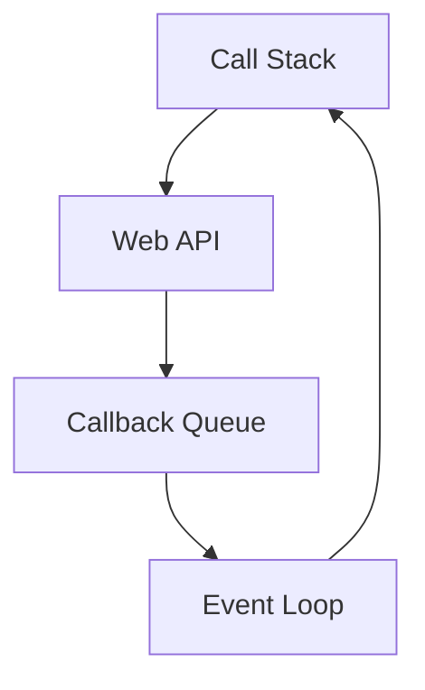

# Асинхронність: callback, promise, async/await

## Вступ

Асинхронність — фундаментальний механізм JavaScript, який дозволяє виконувати операції без блокування основного потоку. Вона лежить в основі роботи з мережевими запитами, таймерами, обробниками подій, файловими системами та багатьма сучасними архітектурними патернами.

## Історія/Походження

-   **Callback** — перший підхід до асинхронності у JS (з 1995 року)
-   **Promise** — з’явилися у ES6 (2015), вирішують проблему callback hell
-   **async/await** — з’явилися у ES8 (2017), роблять асинхронний код схожим на синхронний

## Основний матеріал

### Callback

-   Функція, яка викликається після завершення асинхронної операції
-   Проблема: callback hell, складність читання та підтримки

#### Приклад

```js
setTimeout(function () {
    console.log("Done!");
}, 1000);
```

### Callback hell

```js
setTimeout(function () {
    setTimeout(function () {
        setTimeout(function () {
            console.log("Too deep!");
        }, 1000);
    }, 1000);
}, 1000);
```

### Promise

-   Об’єкт, який представляє завершення або помилку асинхронної операції
-   Методи: then, catch, finally

#### Приклад

```js
function asyncSum(a, b) {
    return new Promise((resolve, reject) => {
        setTimeout(() => {
            if (typeof a === "number" && typeof b === "number") {
                resolve(a + b);
            } else {
                reject("Invalid arguments");
            }
        }, 1000);
    });
}
asyncSum(2, 3)
    .then((result) => console.log(result))
    .catch((err) => console.error(err));
```

### Promise chaining

```js
asyncSum(1, 2)
    .then((r1) => asyncSum(r1, 3))
    .then((r2) => console.log(r2)); // 6
```

### async/await

-   Синтаксичний цукор над Promise
-   Дозволяє писати асинхронний код як синхронний

#### Приклад

```js
async function run() {
    try {
        const r1 = await asyncSum(1, 2);
        const r2 = await asyncSum(r1, 3);
        console.log(r2); // 6
    } catch (e) {
        console.error(e);
    }
}
run();
```

### Неочевидний приклад: паралельне виконання

```js
async function parallel() {
    const [a, b] = await Promise.all([asyncSum(1, 2), asyncSum(3, 4)]);
    console.log(a, b); // 3, 7
}
parallel();
```

## Пояснення під капотом

-   Callback — функція, яка передається як аргумент, викликається після завершення операції
-   Promise — об’єкт, який зберігає стан (pending, fulfilled, rejected)
-   async/await — синтаксичний цукор, який дозволяє "зупинити" виконання до завершення Promise
-   Event loop — механізм, який керує асинхронністю у JS

### Діаграма: event loop



## Нюанси та підводні камені

-   Callback hell — важко читати та підтримувати
-   Promise — не завжди зручно дебажити
-   async/await — не можна використовувати поза async-функцією
-   Помилки — потрібно обробляти через try/catch або catch
-   Event loop — неочевидна поведінка при великій кількості асинхронних задач

## Best practices

-   Використовуйте Promise та async/await замість callback
-   Обробляйте помилки через catch або try/catch
-   Не змішуйте callback та Promise
-   Використовуйте Promise.all для паралельних задач
-   Документуйте асинхронний код
-   Тестуйте edge cases

## Неочевидні приклади

### 1. Promise.allSettled

```js
Promise.allSettled([asyncSum(1, 2), asyncSum("a", 3)]).then((results) =>
    console.log(results)
);
```

### 2. async/await у циклі

```js
async function loop() {
    for (let i = 0; i < 3; i++) {
        await asyncSum(i, i);
        console.log(i);
    }
}
loop();
```

### 3. Обробка помилок

```js
async function safeRun() {
    try {
        await asyncSum("a", 2);
    } catch (e) {
        console.error("Error:", e);
    }
}
safeRun();
```

## Крос-посилання

-   [Closure](./06-closure.md)
-   [Event loop](./04-event-loop.md)
-   [Advanced patterns](./13-advanced-patterns.md)
-   [Best practices](./10-best-practices.md)

## Підсумок

-   Асинхронність — основа сучасного JS
-   Callback — перший механізм, але має недоліки
-   Promise — вирішує проблему callback hell
-   async/await — робить асинхронний код читабельним
-   Event loop — керує виконанням асинхронних задач
-   Best practices — обробка помилок, паралельне виконання, документація
