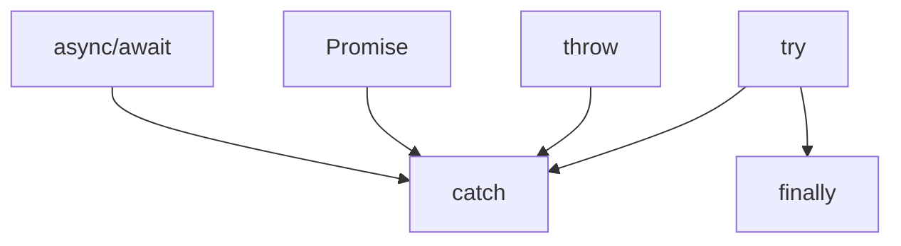

# Error handling, custom errors

## Вступ

Обробка помилок — фундаментальний механізм JavaScript, який забезпечує стабільність, безпеку та передбачуваність роботи застосунків. Вміння правильно обробляти помилки — ключ до якісного коду.

## Історія/Походження

-   **try/catch/finally** — з’явилися у ES3 (1999)
-   **throw** — механізм генерації помилок
-   **Custom errors** — можливість створювати власні типи помилок
-   **Promise rejection** — обробка асинхронних помилок

## Основний матеріал

### try/catch/finally

-   try — блок для коду, який може викликати помилку
-   catch — блок для обробки помилки
-   finally — виконується завжди, незалежно від помилки

#### Приклад

```js
try {
    throw new Error("Something went wrong");
} catch (e) {
    console.error(e.message);
} finally {
    console.log("Always runs");
}
```

### throw

-   Використовується для генерації помилок

#### Приклад

```js
function divide(a, b) {
    if (b === 0) {
        throw new Error("Division by zero");
    }
    return a / b;
}
try {
    divide(1, 0);
} catch (e) {
    console.error(e.message);
}
```

### Custom errors

-   Можна створювати власні класи помилок

#### Приклад

```js
class ValidationError extends Error {
    constructor(message) {
        super(message);
        this.name = "ValidationError";
    }
}
function validate(x) {
    if (typeof x !== "number") {
        throw new ValidationError("Not a number");
    }
}
try {
    validate("abc");
} catch (e) {
    if (e instanceof ValidationError) {
        console.error("Validation:", e.message);
    } else {
        console.error("Other:", e.message);
    }
}
```

### Promise rejection

-   Асинхронні помилки обробляються через catch

#### Приклад

```js
Promise.reject(new Error("Async error")).catch((e) => console.error(e.message));
```

### async/await error handling

```js
async function run() {
    try {
        await Promise.reject(new Error("Async error"));
    } catch (e) {
        console.error(e.message);
    }
}
run();
```

## Неочевидні приклади

### 1. finally для очищення ресурсів

```js
try {
    // open file
} catch (e) {
    // handle error
} finally {
    // close file
}
```

### 2. Error stack trace

```js
try {
    throw new Error("Stack trace");
} catch (e) {
    console.log(e.stack);
}
```

### 3. Перехоплення помилок у window

```js
window.onerror = function (msg, url, line) {
    console.error("Global error:", msg);
};
```

### 4. Promise.allSettled для масиву помилок

```js
Promise.allSettled([
    Promise.resolve(1),
    Promise.reject(new Error("fail")),
]).then((results) => console.log(results));
```

## Пояснення під капотом

-   try/catch — створює новий execution context для обробки помилки
-   throw — генерує об’єкт помилки, який "спливає" по стеку викликів
-   finally — виконується завжди, навіть при return у try/catch
-   Custom errors — розширюють клас Error

## Підводні камені

-   Не всі помилки можна перехопити (наприклад, синтаксичні)
-   finally — може "перекрити" return з try/catch
-   Promise rejection без catch — UnhandledPromiseRejection
-   Глобальні обробники — не завжди безпечні
-   Надмірна генерація помилок — складний дебаг

## Best practices

-   Завжди обробляйте помилки у асинхронному коді
-   Використовуйте власні класи помилок для специфічних ситуацій
-   Документуйте типи помилок
-   Очищайте ресурси у finally
-   Не приховуйте помилки — логування
-   Використовуйте Error.stack для дебагу

## Діаграма: обробка помилок



## Крос-посилання

-   [Асинхронність: callback, promise, async/await](./10-async.md)
-   [Advanced patterns](./13-advanced-patterns.md)
-   [Best practices](./10-best-practices.md)

## Підсумок

-   Error handling — основа стабільності JS
-   try/catch/finally — базовий механізм
-   Custom errors — для специфічних ситуацій
-   Promise rejection — для асинхронних помилок
-   Best practices — обробка, документація, очищення ресурсів
