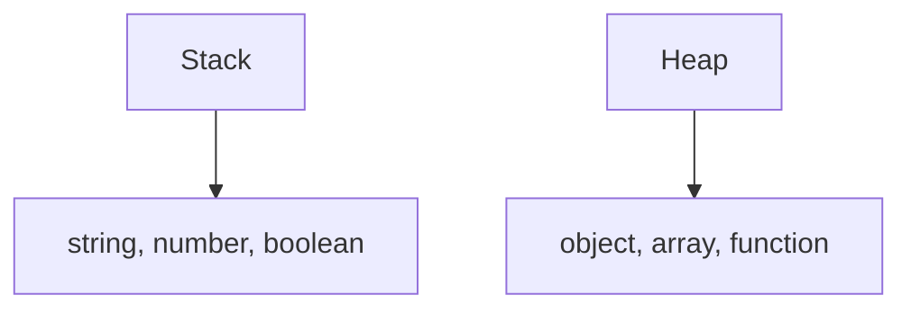
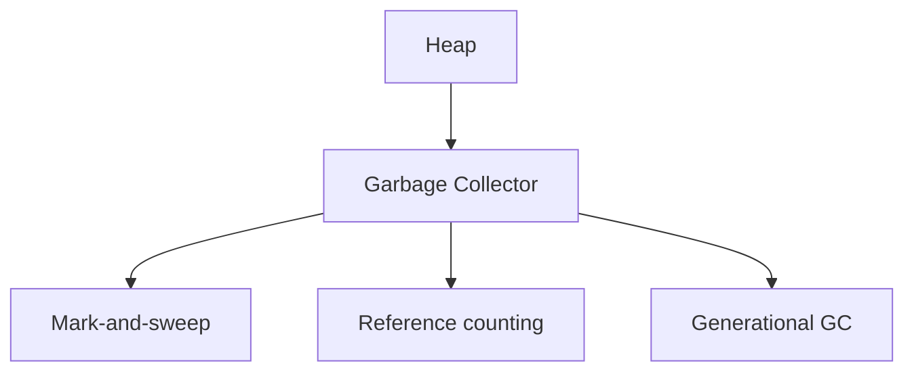

# Memory model, garbage collection

## Вступ

Модель пам’яті та garbage collection — фундаментальні механізми JavaScript, які визначають ефективність, стабільність та продуктивність застосунків. Розуміння цих концепцій дозволяє уникати витоків пам’яті, оптимізувати роботу коду та забезпечити надійність.

## Модель пам’яті JS

JavaScript використовує дві основні області пам’яті:

-   **Stack** — для примітивних типів, швидкий доступ
-   **Heap** — для об’єктів, масивів, функцій

### Stack

-   Зберігає локальні змінні, параметри функцій
-   Операції — push/pop
-   Швидкий доступ, обмежений розмір

### Heap

-   Зберігає об’єкти, масиви, функції
-   Динамічний розмір
-   Доступ через посилання

#### Діаграма: модель пам’яті



## Garbage collection

Garbage collection (GC) — це автоматичне очищення пам’яті, яку більше не використовує програма. JS-рушії (V8, SpiderMonkey) реалізують різні алгоритми GC.

### Основні алгоритми GC

-   **Mark-and-sweep** — позначає та видаляє непотрібні об’єкти
-   **Reference counting** — видаляє об’єкти без посилань
-   **Generational GC** — розділяє об’єкти на "молоді" та "старі"

#### Як працює GC

1. Визначає, які об’єкти більше не доступні
2. Очищає пам’ять, видаляючи ці об’єкти
3. Оптимізує розподіл пам’яті для нових об’єктів

### Неочевидний приклад: циклічні посилання

```js
let a = {};
let b = {};
a.ref = b;
b.ref = a;
// GC може не одразу видалити a та b
```

## Витоки пам’яті (memory leaks)

Витоки пам’яті виникають, коли об’єкти залишаються у heap, хоча більше не потрібні.

### Причини витоків

-   Глобальні змінні
-   Замикання, які зберігають посилання на неактуальні об’єкти
-   Неочищені таймери, обробники подій
-   Циклічні посилання

#### Приклад витоку через closure

```js
function createLeak() {
    let big = new Array(1000000).fill("leak");
    return function () {
        return big;
    };
}
const leaker = createLeak();
// big не видаляється з пам’яті
```

## Best practices

-   Очищуйте таймери та обробники подій
-   Уникайте глобальних змінних
-   Використовуйте слабкі структури даних (WeakMap, WeakSet)
-   Документуйте місця, де можливі витоки
-   Тестуйте пам’ять у великих застосунках

### Неочевидний приклад: WeakMap

```js
let wm = new WeakMap();
let obj = {};
wm.set(obj, "data");
obj = null; // об’єкт буде видалено GC
```

## Пояснення під капотом

-   Stack — швидкий, обмежений, для примітивів
-   Heap — динамічний, для об’єктів
-   GC — автоматичний, але не миттєвий
-   WeakMap/WeakSet — не перешкоджають GC

## Підводні камені

-   GC не гарантує миттєвого очищення
-   Витоки через closure, глобальні змінні, таймери
-   Циклічні посилання — складно виявити
-   WeakMap/WeakSet — не ітеруються

## Діаграма: garbage collection



## Крос-посилання

-   [Closure](./06-closure.md)
-   [Асинхронність: callback, promise, async/await](./10-async.md)
-   [Best practices](./10-best-practices.md)

## Підсумок

-   Модель пам’яті — stack та heap
-   Garbage collection — автоматичне очищення пам’яті
-   Витоки пам’яті — через closure, глобальні змінні, таймери
-   Best practices — очищення, слабкі структури, тестування
-   GC — не миттєвий, але критично важливий для стабільності JS
