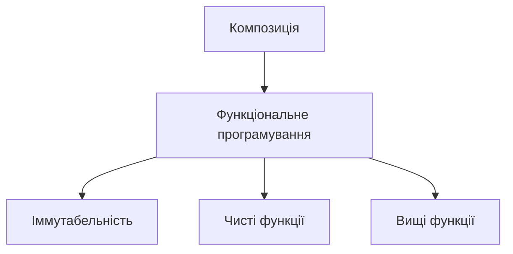

# Advanced patterns: композиція, іммутабельність, функціональне програмування

## Вступ

Advanced patterns — це набір архітектурних та стилістичних підходів, які дозволяють писати гнучкий, масштабований, підтримуваний JavaScript-код. Композиція, іммутабельність та функціональне програмування — ключові концепції сучасних фреймворків, бібліотек і великих проєктів.

## Композиція

Композиція — це побудова складних об’єктів або функцій з простіших, замість жорсткого наслідування. Вона дозволяє гнучко комбінувати поведінку, розширювати функціонал без зміни базового коду.

### Приклад композиції функцій

```js
function add(x) {
    return x + 1;
}
function double(x) {
    return x * 2;
}
function compose(f, g) {
    return function (x) {
        return f(g(x));
    };
}
const addThenDouble = compose(double, add);
console.log(addThenDouble(3)); // 8
```

### Композиція об’єктів

```js
const canFly = {
    fly() {
        console.log("Flying");
    },
};
const canSwim = {
    swim() {
        console.log("Swimming");
    },
};
function createDuck() {
    return Object.assign({}, canFly, canSwim);
}
const duck = createDuck();
duck.fly();
duck.swim();
```

## Іммутабельність

Іммутабельність — це принцип, за яким дані не змінюються після створення. Замість зміни — створюється новий об’єкт. Це підвищує передбачуваність, спрощує дебаг, зменшує кількість багів.

### Приклад іммутабельності

```js
const arr = [1, 2, 3];
const newArr = arr.concat(4); // [1,2,3,4]
// arr не змінюється
```

### Іммутабельність об’єктів

```js
const user = { name: "Alice", age: 30 };
const updated = { ...user, age: 31 };
// user не змінюється
```

### Object.freeze

```js
const obj = Object.freeze({ x: 1 });
obj.x = 2; // не зміниться
```

## Функціональне програмування

Функціональне програмування (FP) — це стиль, у якому основна одиниця — функція. FP базується на композиції, іммутабельності, чистих функціях, відсутності побічних ефектів.

### Основні принципи FP

-   Чисті функції (pure functions)
-   Іммутабельність
-   Композиція
-   Відсутність побічних ефектів
-   Вища функція (higher-order function)

### Приклад чистої функції

```js
function sum(a, b) {
    return a + b;
}
```

### Вища функція

```js
function map(arr, fn) {
    const result = [];
    for (let i = 0; i < arr.length; i++) {
        result.push(fn(arr[i]));
    }
    return result;
}
console.log(map([1, 2, 3], (x) => x * 2)); // [2,4,6]
```

### Неочевидний приклад: каррінг

```js
function curry(f) {
    return function (a) {
        return function (b) {
            return f(a, b);
        };
    };
}
const add = (a, b) => a + b;
const curriedAdd = curry(add);
console.log(curriedAdd(2)(3)); // 5
```

### Неочевидний приклад: reduce

```js
const arr = [1, 2, 3, 4];
const sum = arr.reduce((acc, x) => acc + x, 0);
console.log(sum); // 10
```

## Пояснення під капотом

-   Композиція — замість наслідування, комбінування поведінки
-   Іммутабельність — нові об’єкти, відсутність змін
-   FP — чисті функції, композиція, іммутабельність

## Підводні камені

-   Надмірна композиція — складний дебаг
-   Іммутабельність — може знижувати продуктивність при великих об’єктах
-   FP — складно читати код без досвіду
-   Побічні ефекти — важко контролювати у складних системах

## Best practices

-   Використовуйте композицію замість наслідування
-   Дотримуйтесь іммутабельності для state
-   Пишіть чисті функції
-   Документуйте складні композиції
-   Використовуйте бібліотеки (Ramda, Lodash FP)
-   Тестуйте edge cases

## Діаграми



## Неочевидні приклади

### 1. Композиція React-компонентів

```js
function withLogger(Component) {
    return function (props) {
        console.log("Props:", props);
        return Component(props);
    };
}
function Button(props) {
    return `<button>${props.label}</button>`;
}
const LoggedButton = withLogger(Button);
console.log(LoggedButton({ label: "Click" }));
```

### 2. Іммутабельність у Redux

```js
function reducer(state, action) {
    switch (action.type) {
        case "INC":
            return { ...state, count: state.count + 1 };
        default:
            return state;
    }
}
```

## Крос-посилання

-   [Closure](./06-closure.md)
-   [Прототипи, класи](./08-prototypes-classes.md)
-   [Best practices](./10-best-practices.md)

## Підсумок

-   Композиція, іммутабельність, FP — основа сучасного JS
-   Неочевидні приклади — каррінг, reduce, HOF, React-композиція
-   Best practices — чисті функції, іммутабельність, композиція, документація
