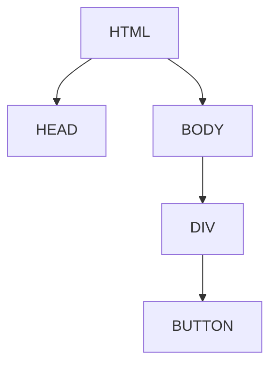
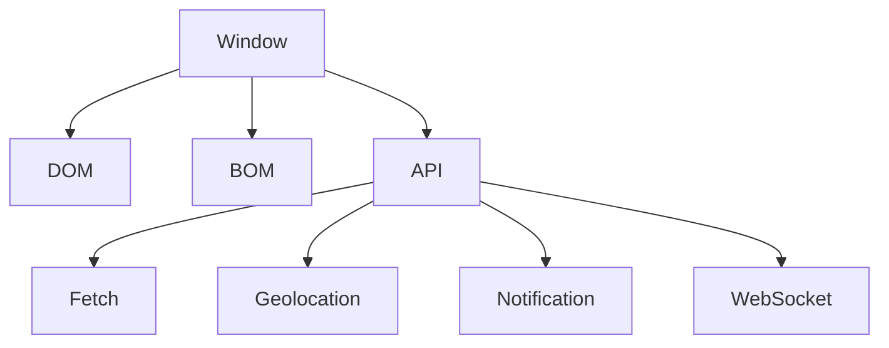

# Робота з DOM, BOM, браузерні API

## Вступ

DOM, BOM та браузерні API — це фундаментальні механізми, які дозволяють JavaScript взаємодіяти з веб-сторінкою, браузером та зовнішнім світом. Від їх розуміння залежить інтерактивність, безпека та функціональність сучасних застосунків.

## DOM (Document Object Model)

DOM — це ієрархічна структура, яка представляє HTML-документ у вигляді дерева об’єктів. JS може змінювати, додавати, видаляти елементи, атрибути, стилі.

### Основні операції з DOM

-   Вибір елементів: `getElementById`, `querySelector`, `getElementsByClassName`
-   Зміна контенту: `textContent`, `innerHTML`
-   Зміна стилів: `style`
-   Додавання/видалення елементів: `appendChild`, `removeChild`, `createElement`
-   Обробка подій: `addEventListener`, `removeEventListener`

#### Приклад

```js
const btn = document.getElementById("myBtn");
btn.textContent = "Click me!";
btn.style.background = "red";
btn.addEventListener("click", () => alert("Clicked!"));
```

### Діаграма: дерево DOM



## BOM (Browser Object Model)

BOM — це об’єкти, які надає браузер для роботи з вікном, історією, навігацією, cookie, localStorage.

### Основні об’єкти BOM

-   window — головний об’єкт
-   navigator — інформація про браузер
-   location — URL сторінки
-   history — історія переходів
-   screen — розміри екрану
-   localStorage/sessionStorage — збереження даних

#### Приклад

```js
console.log(window.location.href);
console.log(navigator.userAgent);
localStorage.setItem("key", "value");
console.log(localStorage.getItem("key"));
```

## Браузерні API

Браузер надає багато API для роботи з зовнішнім світом:

-   Fetch API — мережеві запити
-   Geolocation API — визначення місцезнаходження
-   Notification API — сповіщення
-   Web Storage API — збереження даних
-   Canvas API — малювання
-   WebSocket API — двосторонній зв’язок

#### Приклад: Fetch API

```js
fetch("https://api.example.com/data")
    .then((res) => res.json())
    .then((data) => console.log(data));
```

#### Приклад: Geolocation API

```js
navigator.geolocation.getCurrentPosition((pos) => {
    console.log(pos.coords.latitude, pos.coords.longitude);
});
```

#### Приклад: Notification API

```js
Notification.requestPermission().then(function (result) {
    if (result === "granted") {
        new Notification("Hello!");
    }
});
```

## Неочевидні приклади

### 1. Делегування подій

```js
document.body.addEventListener("click", function (e) {
    if (e.target.matches(".btn")) {
        console.log("Button clicked");
    }
});
```

### 2. Динамічне створення елементів

```js
const div = document.createElement("div");
div.textContent = "New div";
document.body.appendChild(div);
```

### 3. Робота з localStorage

```js
localStorage.setItem("theme", "dark");
const theme = localStorage.getItem("theme");
```

### 4. Веб-сокети

```js
const ws = new WebSocket("wss://echo.websocket.org");
ws.onopen = () => ws.send("Hello!");
ws.onmessage = (e) => console.log(e.data);
```

## Пояснення під капотом

-   DOM — дерево об’єктів, доступне через JS
-   BOM — об’єкти браузера, доступні через window
-   API — інтерфейси для взаємодії з браузером та зовнішнім світом

## Підводні камені

-   Маніпуляції з DOM — можуть бути повільними
-   localStorage — синхронний, блокує потік
-   Веб-сокети — потребують обробки помилок
-   Geolocation — потребує дозволу користувача
-   Notification — залежить від політики браузера

## Best practices

-   Використовуйте делегування подій для оптимізації
-   Очищуйте обробники подій при видаленні елементів
-   Перевіряйте доступність API
-   Не зберігайте чутливі дані у localStorage
-   Тестуйте у різних браузерах

## Діаграми



## Крос-посилання

-   [Асинхронність: callback, promise, async/await](./10-async.md)
-   [Closure](./06-closure.md)
-   [Best practices](./10-best-practices.md)

## Підсумок

-   DOM — дерево HTML, доступне через JS
-   BOM — об’єкти браузера для роботи з вікном, історією, storage
-   API — інтерфейси для мережі, геолокації, сповіщень, сокетів
-   Best practices — делегування, очищення, перевірка доступності, безпека
