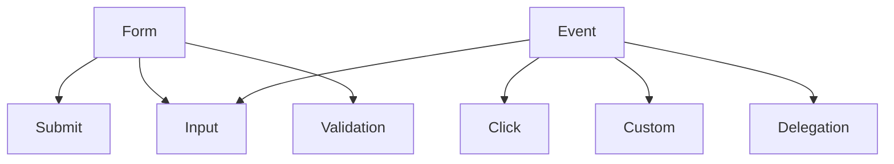

# Робота з формами та подіями

## Вступ

Робота з формами та подіями — фундаментальні механізми JavaScript для створення інтерактивних, динамічних веб-застосунків. Від їх розуміння залежить UX, валідація, обробка даних та безпека.

## Форми у JS

Форми — основний спосіб взаємодії користувача з сайтом. JS дозволяє обробляти введення, валідувати дані, надсилати запити без перезавантаження сторінки.

### Основні операції з формами

-   Вибір елементів: `document.forms`, `getElementById`, `querySelector`
-   Отримання/зміна значень: `value`, `checked`, `selected`
-   Валідація: перевірка даних перед надсиланням
-   Надсилання: `submit`, AJAX, fetch

#### Приклад: отримання даних з форми

```js
const form = document.getElementById("myForm");
form.addEventListener("submit", function (e) {
    e.preventDefault();
    const name = form.elements["name"].value;
    console.log("Name:", name);
});
```

### Валідація форми

```js
form.addEventListener("submit", function (e) {
    e.preventDefault();
    const email = form.elements["email"].value;
    if (!email.includes("@")) {
        alert("Invalid email");
        return;
    }
    // Надсилання даних
});
```

### AJAX-надсилання

```js
form.addEventListener("submit", function (e) {
    e.preventDefault();
    const data = new FormData(form);
    fetch("/api", {
        method: "POST",
        body: data,
    })
        .then((res) => res.json())
        .then((result) => console.log(result));
});
```

## Події у JS

Події — це сигнали про дії користувача чи зміни у DOM. JS дозволяє реагувати на кліки, введення, фокус, зміну, завантаження тощо.

### Основні події

-   click, input, change, submit, focus, blur, keydown, keyup, mouseover, mouseout

### Обробка подій

-   `addEventListener`, `removeEventListener`
-   Делегування подій
-   Зупинка поширення: `stopPropagation`, `preventDefault`

#### Приклад: делегування подій

```js
document.body.addEventListener("click", function (e) {
    if (e.target.matches(".btn")) {
        console.log("Button clicked");
    }
});
```

### Зупинка поширення

```js
form.addEventListener("submit", function (e) {
    e.preventDefault(); // зупиняє стандартну поведінку
});
```

### Неочевидний приклад: custom event

```js
const event = new Event("myCustom");
document.dispatchEvent(event);
document.addEventListener("myCustom", () => console.log("Custom event!"));
```

### Неочевидний приклад: input event

```js
const input = document.getElementById("myInput");
input.addEventListener("input", function (e) {
    console.log("Value:", e.target.value);
});
```

## Пояснення під капотом

-   Форми — елементи DOM, доступні через JS
-   Події — об’єкти, які містять інформацію про дію
-   Event loop — керує обробкою подій
-   Делегування — оптимізує обробку багатьох елементів

## Підводні камені

-   Забута зупинка поширення — дублювання обробки
-   Валідація лише на клієнті — небезпечно
-   Неочищені обробники — витоки пам’яті
-   Некоректна робота з FormData — втрати даних
-   Події input vs. change — різна поведінка

## Best practices

-   Завжди зупиняйте стандартну поведінку при custom-обробці
-   Валідуйте дані і на сервері
-   Очищуйте обробники при видаленні елементів
-   Використовуйте делегування для списків
-   Документуйте custom events
-   Тестуйте edge cases

## Діаграми



## Неочевидні приклади

### 1. Валідація через pattern

```html
<input type="text" pattern="[A-Za-z]{3,}" required />
```

### 2. Відміна події через return false

```js
form.onsubmit = function () {
    return false; // зупиняє надсилання
};
```

### 3. Динамічне додавання обробника

```js
const btn = document.createElement("button");
btn.textContent = "Click";
btn.addEventListener("click", () => alert("Clicked!"));
document.body.appendChild(btn);
```

## Крос-посилання

-   [DOM, BOM, API](./14-dom-bom.md)
-   [Асинхронність: callback, promise, async/await](./10-async.md)
-   [Best practices](./10-best-practices.md)

## Підсумок

-   Форми — основа взаємодії користувача з сайтом
-   Події — механізм реагування на дії
-   Best practices — делегування, очищення, валідація, документація
-   Підводні камені — поширення, витоки, некоректна валідація
