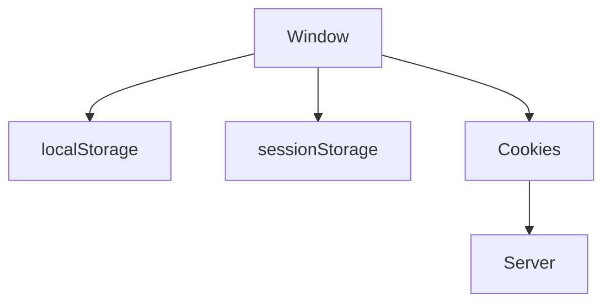

# Робота з localStorage, sessionStorage, cookies

## Вступ

Збереження даних у браузері — фундаментальний механізм для створення інтерактивних, персоналізованих та безпечних веб-застосунків. localStorage, sessionStorage та cookies — основні інструменти для роботи з даними на клієнті.

## localStorage

localStorage — це API для збереження пар "ключ-значення" у браузері. Дані зберігаються безстроково, навіть після закриття вкладки чи браузера.

### Основні операції

-   setItem(key, value) — зберегти
-   getItem(key) — отримати
-   removeItem(key) — видалити
-   clear() — очистити все

#### Приклад

```js
localStorage.setItem("theme", "dark");
const theme = localStorage.getItem("theme");
localStorage.removeItem("theme");
localStorage.clear();
```

### Особливості

-   Дані зберігаються у вигляді рядків
-   Обмеження на розмір (5-10 МБ)
-   Доступно у всіх сучасних браузерах

## sessionStorage

sessionStorage — API для збереження даних на час сесії (поки вкладка відкрита).

### Основні операції

-   Аналогічні localStorage
-   Дані видаляються після закриття вкладки

#### Приклад

```js
sessionStorage.setItem("token", "abc123");
const token = sessionStorage.getItem("token");
sessionStorage.removeItem("token");
sessionStorage.clear();
```

### Особливості

-   Дані ізольовані для кожної вкладки
-   Не зберігаються після закриття

## Cookies

Cookies — це невеликі фрагменти даних, які браузер зберігає та надсилає на сервер при кожному запиті.

### Основні операції

-   document.cookie — доступ до cookies
-   Встановлення: document.cookie = "key=value; expires=...; path=/"
-   Читання: парсинг document.cookie

#### Приклад

```js
document.cookie = "user=Alice; expires=Fri, 31 Dec 2025 23:59:59 GMT; path=/";
console.log(document.cookie);
```

### Особливості

-   Обмеження на розмір (4 КБ)
-   Надсилаються на сервер при кожному запиті
-   Можуть бути доступні лише для певного шляху/домену
-   Можна встановити httpOnly, secure, SameSite

## Неочевидні приклади

### 1. Збереження об’єкта у localStorage

```js
const user = { name: "Alice", age: 30 };
localStorage.setItem("user", JSON.stringify(user));
const saved = JSON.parse(localStorage.getItem("user"));
```

### 2. Встановлення cookie з додатковими параметрами

```js
document.cookie = "token=abc; Secure; SameSite=Strict; path=/";
```

### 3. Видалення cookie

```js
document.cookie = "user=; expires=Thu, 01 Jan 1970 00:00:00 GMT; path=/";
```

### 4. Перевірка підтримки storage

```js
if (typeof Storage !== "undefined") {
    // storage доступний
}
```

## Пояснення під капотом

-   localStorage/sessionStorage — частина BOM, зберігають дані у браузері
-   Cookies — зберігаються браузером, надсилаються на сервер
-   Дані у storage — лише для поточного домену

## Підводні камені

-   localStorage/sessionStorage — синхронні, можуть блокувати потік
-   Cookies — обмеження на розмір, безпека (XSS, CSRF)
-   Збереження чутливих даних — небезпечно
-   JSON.stringify/parse — потрібні для складних структур
-   Видалення cookie — через встановлення старої дати

## Best practices

-   Не зберігайте паролі, токени у localStorage/cookies
-   Використовуйте secure, httpOnly, SameSite для cookies
-   Очищуйте storage при виході користувача
-   Документуйте структуру даних
-   Тестуйте у різних браузерах

## Діаграми



## Крос-посилання

-   [DOM, BOM, API](./14-dom-bom.md)
-   [Best practices](./10-best-practices.md)
-   [Error handling](./11-error-handling.md)

## Підсумок

-   localStorage — довготривале збереження даних
-   sessionStorage — збереження на час сесії
-   Cookies — для передачі даних на сервер
-   Best practices — безпека, очищення, документація
-   Підводні камені — синхронність, обмеження, безпека
