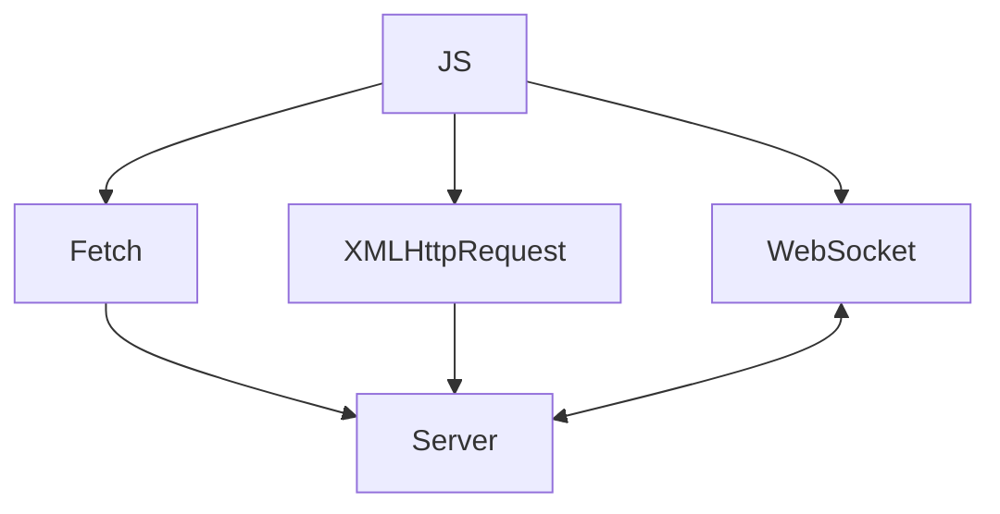

# Робота з network: fetch, XMLHttpRequest, WebSocket

## Вступ

Робота з мережею — фундаментальний механізм JavaScript для взаємодії із сервером, отримання та надсилання даних, створення реального часу та інтерактивності. fetch, XMLHttpRequest та WebSocket — основні інструменти для роботи з HTTP та двостороннім зв’язком.

## fetch API

fetch — сучасний API для виконання HTTP-запитів. Підтримує проміси, асинхронність, простий синтаксис.

### Основні операції

-   GET, POST, PUT, DELETE
-   Відправка та отримання JSON
-   Обробка статусу, заголовків, помилок

#### Приклад: GET-запит

```js
fetch("https://api.example.com/data")
    .then((res) => res.json())
    .then((data) => console.log(data))
    .catch((err) => console.error(err));
```

#### Приклад: POST-запит

```js
fetch("/api", {
    method: "POST",
    headers: { "Content-Type": "application/json" },
    body: JSON.stringify({ name: "Alice" }),
})
    .then((res) => res.json())
    .then((data) => console.log(data));
```

### Особливості fetch

-   Повертає проміс
-   Не кидає помилку при HTTP-статусі 404/500 — потрібно перевіряти res.ok
-   Підтримує CORS
-   Не підтримує прогрес/аборт напряму (AbortController)

#### Приклад: AbortController

```js
const controller = new AbortController();
fetch("/api", { signal: controller.signal });
controller.abort(); // скасовує запит
```

## XMLHttpRequest

XMLHttpRequest — старий API для HTTP-запитів, підтримується у всіх браузерах.

### Основні операції

-   Відправка GET/POST-запитів
-   Обробка прогресу, аборту
-   Підтримка синхронних/асинхронних запитів

#### Приклад

```js
const xhr = new XMLHttpRequest();
xhr.open("GET", "/api");
xhr.onload = function () {
    if (xhr.status === 200) {
        console.log(xhr.responseText);
    }
};
xhr.send();
```

### Особливості

-   Callback-based API
-   Підтримка прогресу (xhr.onprogress)
-   Складніший синтаксис, ніж fetch

## WebSocket

WebSocket — API для двостороннього зв’язку у реальному часі. Використовується для чатів, ігор, стрімінгу.

### Основні операції

-   Встановлення з’єднання
-   Надсилання/отримання повідомлень
-   Обробка подій: open, message, close, error

#### Приклад

```js
const ws = new WebSocket("wss://echo.websocket.org");
ws.onopen = () => ws.send("Hello!");
ws.onmessage = (e) => console.log(e.data);
ws.onclose = () => console.log("Closed");
ws.onerror = (e) => console.error("Error:", e);
```

### Особливості

-   Працює поверх TCP
-   Не підтримує HTTP-заголовки напряму
-   Потрібна обробка reconnection, помилок

## Неочевидні приклади

### 1. fetch з FormData

```js
const form = document.getElementById("myForm");
const data = new FormData(form);
fetch("/api", { method: "POST", body: data });
```

### 2. XMLHttpRequest прогрес

```js
xhr.onprogress = function (e) {
    if (e.lengthComputable) {
        console.log("Progress:", e.loaded / e.total);
    }
};
```

### 3. WebSocket reconnection

```js
function connect() {
    const ws = new WebSocket("wss://echo.websocket.org");
    ws.onclose = () => setTimeout(connect, 1000);
}
connect();
```

## Пояснення під капотом

-   fetch — проміс, асинхронний, простий синтаксис
-   XMLHttpRequest — callback, підтримка прогресу
-   WebSocket — двосторонній зв’язок, події

## Підводні камені

-   fetch — не кидає помилку при HTTP-статусі
-   XMLHttpRequest — складний синтаксис, callback hell
-   WebSocket — reconnection, безпека, обробка помилок
-   CORS — обмеження на запити між доменами
-   Безпека — XSS, CSRF, data validation

## Best practices

-   Використовуйте fetch для сучасних застосунків
-   Обробляйте помилки та статуси
-   Використовуйте AbortController для скасування
-   Для реального часу — WebSocket з reconnection
-   Документуйте API-запити
-   Тестуйте edge cases

## Діаграми



## Крос-посилання

-   [Асинхронність: callback, promise, async/await](./10-async.md)
-   [Error handling](./11-error-handling.md)
-   [Best practices](./10-best-practices.md)

## Підсумок

-   fetch — сучасний API для HTTP-запитів
-   XMLHttpRequest — старий, підтримує прогрес
-   WebSocket — двосторонній зв’язок у реальному часі
-   Best practices — обробка помилок, reconnection, документація
-   Підводні камені — CORS, безпека, callback hell
