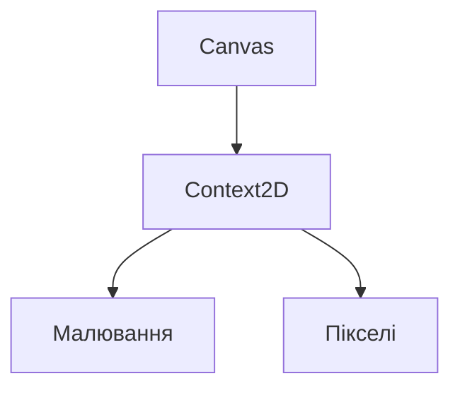
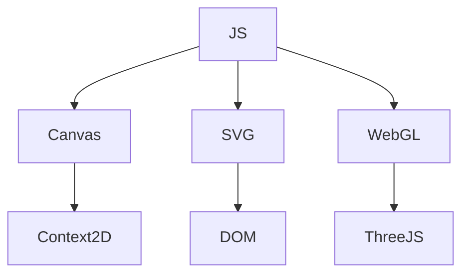

# Робота з графікою: Canvas, SVG, WebGL

## Вступ

Графіка у JavaScript — це потужний інструмент для створення інтерактивних, візуальних та мультимедійних застосунків. Canvas, SVG та WebGL — основні технології для роботи з 2D та 3D графікою у браузері.

## Canvas

Canvas — це елемент HTML5 для малювання 2D-графіки через JS. Підходить для ігор, візуалізацій, графічних редакторів.

### Основні операції

-   Створення елемента `<canvas>`
-   Отримання контексту: `getContext('2d')`
-   Малювання фігур: `fillRect`, `arc`, `lineTo`, `stroke`
-   Робота з пікселями: `getImageData`, `putImageData`

#### Приклад

```html
<canvas id="myCanvas" width="200" height="100"></canvas>
```

```js
const canvas = document.getElementById("myCanvas");
const ctx = canvas.getContext("2d");
ctx.fillStyle = "red";
ctx.fillRect(10, 10, 100, 50);
```

### Діаграма: Canvas API



## SVG

SVG (Scalable Vector Graphics) — це XML-формат для опису векторної графіки. Підходить для іконок, діаграм, графіків, анімацій.

### Основні операції

-   Створення елементів `<svg>`, `<circle>`, `<rect>`, `<path>`
-   Зміна атрибутів через JS: `setAttribute`, `getAttribute`
-   Анімація через CSS або JS

#### Приклад

```html
<svg width="100" height="100">
    <circle cx="50" cy="50" r="40" fill="blue" />
</svg>
```

```js
const circle = document.querySelector("circle");
circle.setAttribute("fill", "red");
```

### Особливості SVG

-   Векторна графіка — не втрачає якість при масштабуванні
-   Можна стилізувати через CSS
-   Підтримує анімацію

## WebGL

WebGL — це API для рендерингу 2D та 3D графіки через GPU. Використовується для ігор, 3D-візуалізацій, VR/AR.

### Основні операції

-   Створення `<canvas>` з контекстом `webgl`
-   Робота з шейдерами, буферами, текстурами
-   Використання бібліотек: Three.js, Babylon.js

#### Приклад

```html
<canvas id="glCanvas" width="300" height="150"></canvas>
```

```js
const gl = document.getElementById("glCanvas").getContext("webgl");
console.log(gl);
```

### Неочевидний приклад: Three.js

```js
import * as THREE from "three";
const scene = new THREE.Scene();
const camera = new THREE.PerspectiveCamera(
    75,
    window.innerWidth / window.innerHeight,
    0.1,
    1000
);
const renderer = new THREE.WebGLRenderer();
document.body.appendChild(renderer.domElement);
```

## Пояснення під капотом

-   Canvas — растрова графіка, малювання через JS
-   SVG — векторна графіка, елементи DOM
-   WebGL — доступ до GPU, низькорівнева робота з графікою

## Підводні камені

-   Canvas — не масштабований, складно стилізувати
-   SVG — складна анімація для великих сцен
-   WebGL — складний API, потрібні бібліотеки
-   Продуктивність — великі сцени можуть "гальмувати"
-   Кросбраузерність — не всі API підтримуються однаково

## Best practices

-   Для простих іконок — SVG
-   Для складних візуалізацій — Canvas
-   Для 3D — WebGL з бібліотеками
-   Використовуйте requestAnimationFrame для анімації
-   Тестуйте продуктивність
-   Документуйте структуру графіки

## Неочевидні приклади

### 1. Анімація через requestAnimationFrame

```js
function animate() {
    ctx.clearRect(0, 0, canvas.width, canvas.height);
    // малювання
    requestAnimationFrame(animate);
}
animate();
```

### 2. Динамічне створення SVG через JS

```js
const svg = document.createElementNS("http://www.w3.org/2000/svg", "svg");
svg.setAttribute("width", 100);
svg.setAttribute("height", 100);
document.body.appendChild(svg);
```

### 3. Взаємодія Canvas та SVG

-   Можна конвертувати SVG у Canvas через drawImage

### 4. WebGL з Three.js

```js
const geometry = new THREE.BoxGeometry();
const material = new THREE.MeshBasicMaterial({ color: 0x00ff00 });
const cube = new THREE.Mesh(geometry, material);
scene.add(cube);
renderer.render(scene, camera);
```

## Діаграми



## Крос-посилання

-   [DOM, BOM, API](./14-dom-bom.md)
-   [Best practices](./10-best-practices.md)
-   [Advanced patterns](./13-advanced-patterns.md)

## Підсумок

-   Canvas — для растрової графіки, ігор, візуалізацій
-   SVG — для векторної графіки, іконок, діаграм
-   WebGL — для 3D, складних сцен, ігор
-   Best practices — вибір технології, requestAnimationFrame, продуктивність
-   Підводні камені — продуктивність, складність, кросбраузерність
