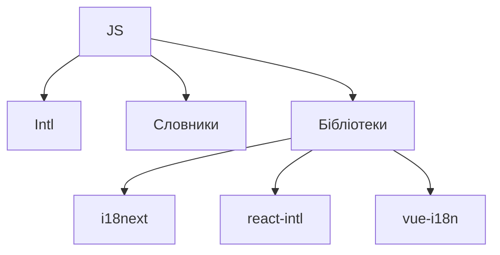

# Інтернаціоналізація, локалізація

## Вступ

Інтернаціоналізація (i18n) та локалізація (l10n) — це фундаментальні механізми для створення багатомовних, культурно адаптованих веб-застосунків. Від їх реалізації залежить доступність, охоплення аудиторії та якість UX.

## Основні поняття

-   **Інтернаціоналізація (i18n)** — підготовка застосунку до підтримки різних мов, форматів дат, чисел, валют, текстових напрямків.
-   **Локалізація (l10n)** — адаптація застосунку під конкретну мову, культуру, регіон.

## Механізми i18n у JavaScript

### 1. Форматування дат, чисел, валют

-   Intl.DateTimeFormat
-   Intl.NumberFormat
-   Intl.RelativeTimeFormat
-   Intl.PluralRules

#### Приклад: форматування дати

```js
const date = new Date();
const formatter = new Intl.DateTimeFormat("uk-UA", { dateStyle: "full" });
console.log(formatter.format(date));
```

#### Приклад: форматування числа

```js
const number = 1234567.89;
const nf = new Intl.NumberFormat("de-DE", {
    style: "currency",
    currency: "EUR",
});
console.log(nf.format(number)); // "1.234.567,89 €"
```

### 2. Переклади тексту

-   Використання словників (JSON, PO, YAML)
-   Бібліотеки: i18next, react-intl, vue-i18n

#### Приклад: простий словник

```js
const dict = {
    en: { hello: "Hello" },
    uk: { hello: "Привіт" },
};
function t(key, lang = "en") {
    return dict[lang][key] || key;
}
console.log(t("hello", "uk")); // 'Привіт'
```

### 3. Динамічна зміна мови

-   Зберігання вибору мови у localStorage, cookie
-   Перезавантаження інтерфейсу при зміні мови

#### Приклад

```js
localStorage.setItem("lang", "uk");
const lang = localStorage.getItem("lang");
console.log(t("hello", lang));
```

### 4. Форматування тексту з параметрами

```js
function greet(name, lang = "en") {
    const templates = {
        en: `Hello, ${name}!`,
        uk: `Привіт, ${name}!`,
    };
    return templates[lang];
}
console.log(greet("Олексій", "uk"));
```

## Неочевидні приклади

### 1. Визначення мови браузера

```js
const userLang = navigator.language || navigator.userLanguage;
console.log(userLang); // 'uk-UA', 'en-US', ...
```

### 2. Форматування відносного часу

```js
const rtf = new Intl.RelativeTimeFormat("uk", { numeric: "auto" });
console.log(rtf.format(-1, "day")); // "вчора"
```

### 3. Плюралізація

```js
const pr = new Intl.PluralRules("uk-UA");
console.log(pr.select(1)); // 'one'
console.log(pr.select(2)); // 'few'
```

### 4. Локалізація дат у React

```js
import { FormattedDate } from "react-intl";
<FormattedDate value={new Date()} year="numeric" month="long" day="2-digit" />;
```

## Пояснення під капотом

-   Intl API — вбудовані механізми для форматування
-   Словники — об’єкти для зберігання перекладів
-   Бібліотеки — автоматизують вибір мови, плюралізацію, форматування

## Підводні камені

-   Відсутність перекладу — fallback на ключ
-   Форматування дат/чисел — різна поведінка у різних локалях
-   Плюралізація — складна для деяких мов
-   Динамічна зміна мови — потребує перезавантаження компонентів
-   Зберігання вибору мови — безпека, синхронізація

## Best practices

-   Використовуйте Intl API для форматування
-   Зберігайте переклади у окремих файлах
-   Використовуйте бібліотеки для складних кейсів
-   Документуйте структуру словників
-   Тестуйте у різних локалях
-   Забезпечуйте fallback для відсутніх перекладів

## Діаграми



## Крос-посилання

-   [Best practices](./10-best-practices.md)
-   [Error handling](./11-error-handling.md)
-   [Advanced patterns](./13-advanced-patterns.md)

## Підсумок

-   i18n — підготовка до багатомовності
-   l10n — адаптація під конкретну мову/регіон
-   Intl API, словники, бібліотеки — основні інструменти
-   Best practices — форматування, fallback, тестування, документація
-   Підводні камені — плюралізація, форматування, динамічна зміна мови
