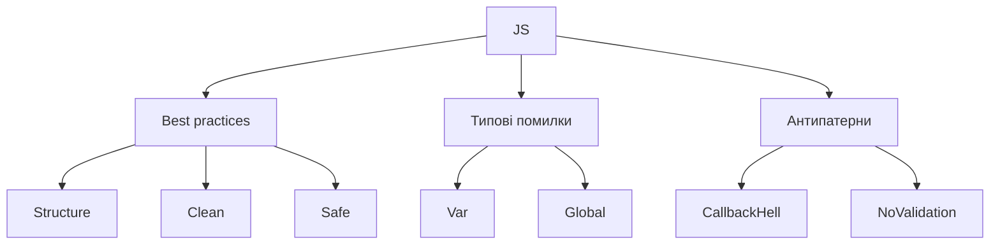

# Best practices, типові помилки, антипатерни

## Вступ

Best practices, типові помилки та антипатерни — це основа якісного, підтримуваного та безпечного JavaScript-коду. Дотримання рекомендацій дозволяє уникати багів, підвищувати продуктивність і масштабованість застосунків.

## Best practices

### 1. Структуруйте код

-   Використовуйте модулі (ESM)
-   Групуйте логіку у функції, класи, компоненти
-   Документуйте структуру проєкту

### 2. Використовуйте сучасний синтаксис

-   let/const замість var
-   Стрілочні функції
-   Деструктуризація
-   Шаблонні рядки

### 3. Обробляйте помилки

-   try/catch/finally
-   Custom errors
-   Promise rejection
-   Логування помилок

### 4. Валідуйте дані

-   Перевіряйте типи, структуру, обов’язкові поля
-   Використовуйте бібліотеки для валідації (Yup, Joi)

### 5. Пишіть чисті функції

-   Без побічних ефектів
-   Іммутабельність
-   Композиція

### 6. Тестуйте код

-   Unit, integration, e2e тести
-   Використовуйте Jest, Mocha, Cypress

### 7. Оптимізуйте продуктивність

-   Уникайте зайвих операцій з DOM
-   Використовуйте делегування подій
-   Профілюйте пам’ять, час виконання

### 8. Дотримуйтесь безпеки

-   Уникайте XSS, CSRF
-   Не зберігайте чутливі дані у localStorage/cookies
-   Використовуйте HTTPS

### 9. Дотримуйтесь стилю коду

-   Використовуйте ESLint, Prettier
-   Дотримуйтесь naming conventions
-   Документуйте складну логіку

## Типові помилки

### 1. Використання var

-   Неочевидна область видимості, hoisting

### 2. Відсутність обробки помилок

-   Promise rejection без catch
-   try/catch лише для синхронного коду

### 3. Дублювання коду

-   Відсутність функцій, міксінів, компонентів

### 4. Глобальні змінні

-   Конфлікти, витоки пам’яті

### 5. Відсутність валідації

-   Некоректні дані, баги

### 6. Побічні ефекти у функціях

-   Складний дебаг, неочікувана поведінка

### 7. Некоректна робота з асинхронністю

-   Callback hell, race conditions

### 8. Відсутність тестів

-   Баги у продакшн

## Антипатерни

### 1. Callback hell

-   Вкладені callback-и, складний код

### 2. Глобальні змінні

-   Втрата контролю, конфлікти

### 3. Дублювання логіки

-   Відсутність DRY

### 4. Відсутність модульності

-   Весь код в одному файлі

### 5. Відсутність обробки помилок

-   Критичні баги

### 6. Змішування sync/async

-   Race conditions

### 7. Відсутність документації

-   Складна підтримка

## Неочевидні приклади

### 1. Promise rejection без catch

```js
Promise.reject("fail"); // UnhandledPromiseRejection
```

### 2. Побічні ефекти у функціях

```js
let x = 1;
function inc() {
    x++;
}
inc(); // x змінено
```

### 3. Callback hell

```js
setTimeout(() => {
    setTimeout(() => {
        setTimeout(() => {
            console.log("Too deep!");
        }, 100);
    }, 100);
}, 100);
```

### 4. Відсутність валідації

```js
function sum(a, b) {
    return a + b;
}
sum("1", 2); // '12'
```

## Пояснення під капотом

-   Best practices — структурований, чистий, безпечний код
-   Типові помилки — джерело багів, складної підтримки
-   Антипатерни — шаблони, яких слід уникати

## Підводні камені

-   Відсутність тестів — баги у продакшн
-   Глобальні змінні — витоки пам’яті
-   Callback hell — складний дебаг
-   Відсутність обробки помилок — критичні баги
-   Некоректна робота з асинхронністю — race conditions

## Best practices (таблиця)

| Best Practice   | Антипатерн                   |
| --------------- | ---------------------------- |
| Модульність     | Весь код в одному файлі      |
| Чисті функції   | Побічні ефекти               |
| Валідація       | Відсутність перевірок        |
| Обробка помилок | Відсутність catch            |
| Тестування      | Відсутність тестів           |
| Безпека         | Зберігання паролів у storage |

## Діаграми



## Крос-посилання

-   [Error handling](./11-error-handling.md)
-   [Advanced patterns](./13-advanced-patterns.md)
-   [DOM, BOM, API](./14-dom-bom.md)
-   [Асинхронність: callback, promise, async/await](./10-async.md)

## Підсумок

-   Best practices — основа якісного JS
-   Типові помилки — джерело багів
-   Антипатерни — шаблони, яких слід уникати
-   Документуйте, тестуйте, структуруйте, обробляйте помилки
-   Дотримуйтесь безпеки, оптимізуйте продуктивність
