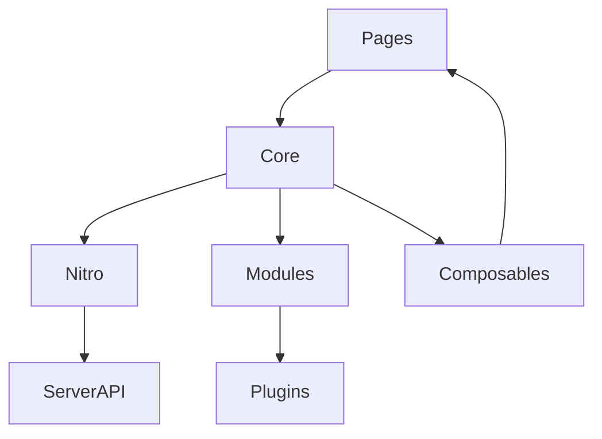

# Вступ: історія, філософія, архітектура

## Історія Nuxt

Nuxt.js з’явився у 2016 році як фреймворк для створення універсальних (SSR) додатків на основі Vue.js. Основна мета — спростити розробку SEO-friendly, продуктивних, масштабованих SPA та SSR-додатків. З виходом Nuxt3 (2022) фреймворк отримав підтримку Vue3, Composition API, Vite, Nitro, TypeScript, модульну архітектуру.

---

## Філософія Nuxt

-   Convention over configuration: більшість налаштувань автоматизовано.
-   Modular: все — модулі, плагіни, middleware, composables.
-   Fullstack: інтеграція frontend і backend через Nitro.
-   DX (Developer Experience): швидкий старт, hot reload, автоматичний роутинг, API, middleware.

---

## Архітектура Nuxt3

Nuxt3 — це багаторівнева система:

-   **Core**: ядро, яке керує lifecycle, SSR, hydration.
-   **Nitro**: серверний рушій для API, SSR, edge-функцій.
-   **Modules**: розширення функціоналу (auth, i18n, image, PWA).
-   **Pages/Layouts**: автоматичний роутинг, шаблони.
-   **Composables**: повторна логіка через useX.
-   **Plugins**: інтеграція сторонніх бібліотек.

---

## Ключові концепти

-   **File-based routing**: сторінки створюються у папці pages.
-   **Auto imports**: composables, utils, компоненти імпортуються автоматично.
-   **Server API**: endpoints у папці server/api.
-   **Universal rendering**: SSR, SSG, SPA — вибір режиму для кожної сторінки.
-   **TypeScript-first**: повна типізація.
-   **Vite**: швидка збірка, HMR.

---

## Advanced: Nitro, Edge, Hybrid rendering

-   **Nitro**: серверний рушій, який працює на будь-якому хостингу (Node, serverless, edge).
-   **Edge rendering**: SSR на CDN, мінімальні затримки.
-   **Hybrid rendering**: поєднання SSR, SSG, SPA для різних сторінок.

---

## Best practices Nuxt3

-   Використовуйте file-based routing для простоти.
-   Впроваджуйте composables для повторної логіки.
-   Використовуйте modules для розширення.
-   Інтегруйте TypeScript для типізації.
-   Використовуйте server/api для backend-логіки.
-   Оновлюйте залежності регулярно.
-   Тестуйте SSR/SSG через automated tests.

---

## Типові помилки та антипатерни

-   Мутація state у компонентах замість store.
-   Відсутність типізації API.
-   Змішування логіки та UI у компонентах.
-   Відсутність обробки помилок у endpoints.
-   Відсутність lazy loading для великих модулів.

---

## Таблиця: порівняння Nuxt2 vs Nuxt3

| Функція      | Nuxt2        | Nuxt3            |
| ------------ | ------------ | ---------------- |
| Vue версія   | Vue2         | Vue3             |
| SSR рушій    | Node         | Nitro            |
| TypeScript   | Partial      | Full             |
| Vite         | Через плагін | За замовчуванням |
| Auto imports | Немає        | Є                |
| Edge support | Немає        | Є                |

---

## Діаграма: архітектура Nuxt3

---

## Практичні кейси

-   Міграція з Nuxt2 на Nuxt3: перепишіть компоненти на Composition API, інтегруйте Nitro.
-   Впровадження SSR/SSG для SEO.
-   Інтеграція TypeScript у весь проєкт.
-   Використання server/api для backend-логіки.
-   Оптимізація білду через Vite.

---

## FAQ по Nuxt3

-   Чи потрібен сервер для Nuxt3? — Nitro працює на будь-якому хостингу, навіть serverless.
-   Як інтегрувати API? — Створіть endpoints у server/api.
-   Чи можна використовувати Vue2-компоненти? — Потрібна міграція на Vue3.
-   Як працює SSR/SSG? — SSR рендерить сторінку на сервері, SSG — статично.

---

## Додаткові ресурси

-   [Nuxt3 Documentation](https://nuxt.com/docs)
-   [Nitro Engine](https://nitro.unjs.io/)
-   [Nuxt3 Migration Guide](https://nuxt.com/docs/guide/migration)
-   [Nuxt3 Modules](https://nuxt.com/modules)

---

## Підсумок

Nuxt3 — це сучасний fullstack-фреймворк для Vue3, який поєднує простоту, продуктивність, модульність та універсальність. Вивчайте архітектуру, впроваджуйте best practices, і ваш проєкт буде готовий до будь-яких викликів.
