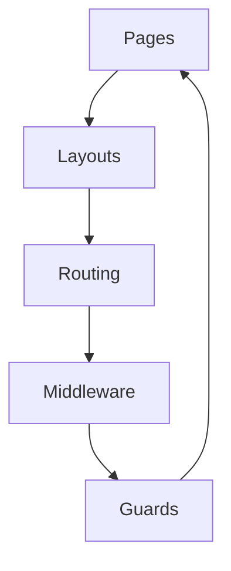

# Основи Nuxt 3: pages, layouts, routing

## Фундаментальні механізми Nuxt3: pages, layouts, routing

Nuxt3 автоматизує створення сторінок, шаблонів та маршрутизації через file-based routing. Це дозволяє швидко будувати SPA, SSR, SSG-додатки з чіткою структурою.

---

## Pages: створення сторінок

-   Кожен файл у папці `pages/` — це окрема сторінка.
-   Підтримка вкладених папок для вкладених маршрутів.
-   Динамічні сторінки через `[param].vue`.
-   Async data через useAsyncData, fetch.

#### Приклад:

```
pages/
  index.vue        // /
  about.vue        // /about
  blog/
    [id].vue       // /blog/123
```

---

## Layouts: шаблони сторінок

-   Layout — це загальна структура для групи сторінок (header, footer, sidebar).
-   Файли у папці `layouts/`.
-   За замовчуванням використовується `default.vue`.
-   Можна створювати custom layouts (admin, auth).

#### Приклад:

```
layouts/
  default.vue
  admin.vue
```

Використання layout у сторінці:

```vue
<script setup>
definePageMeta({ layout: "admin" });
</script>
```

---

## Routing: маршрутизація

-   Автоматичний роутинг на основі структури папки `pages/`.
-   Підтримка динамічних, вкладених, catch-all маршрутів.
-   Можливість налаштування middleware, guards.
-   Параметри маршруту доступні через useRoute.

#### Приклад динамічного маршруту:

```vue
<script setup>
import { useRoute } from "vue-router";
const route = useRoute();
const id = route.params.id;
</script>
```

---

## Advanced: middleware, guards, transitions

-   Middleware — функції для перевірки доступу, автентифікації.
-   Guards — захист маршрутів (beforeEnter).
-   Transitions — анімація переходів між сторінками.

#### Приклад middleware:

```js
export default defineNuxtRouteMiddleware((to, from) => {
    if (!useAuth().isLoggedIn) return "/login";
});
```

---

## Best practices

-   Дробіть сторінки на дрібні компоненти.
-   Використовуйте layouts для повторної структури.
-   Впроваджуйте middleware для захисту.
-   Використовуйте named layouts для різних секцій.
-   Документуйте структуру сторінок.
-   Використовуйте transitions для UX.
-   Валідуйте параметри маршруту.

---

## Типові помилки та антипатерни

-   Відсутність layout — дублювання коду.
-   Мутація route params у компонентах.
-   Відсутність перевірки доступу до сторінок.
-   Змішування логіки маршрутизації та UI.
-   Відсутність обробки помилок у динамічних маршрутах.

---

## Таблиця: порівняння pages, layouts, routing

| Концепт | Призначення       | Best Practice        | Антипатерн     |
| ------- | ----------------- | -------------------- | -------------- |
| Pages   | Контент, логіка   | Дробити, async data  | God page       |
| Layouts | Структура, шаблон | Reuse, named layouts | Дублювання     |
| Routing | Навігація         | Middleware, guards   | Мутація params |

---

## Діаграма: flow архітектури сторінок у Nuxt3



---

## Практичні кейси

-   Впровадження admin layout для захищених сторінок.
-   Динамічний роутинг для блогу через [id].vue.
-   Middleware для перевірки автентифікації.
-   Анімація переходів через transitions.
-   Валідація параметрів маршруту через yup/zod.

---

## FAQ по pages/layouts/routing у Nuxt3

-   Як створити динамічну сторінку? — Через [param].vue у pages.
-   Як змінити layout для сторінки? — Через definePageMeta.
-   Як захистити маршрут? — Через middleware, guards.
-   Як отримати параметри маршруту? — Через useRoute().

---

## Додаткові ресурси

-   [Nuxt3 Pages & Routing](https://nuxt.com/docs/guide/directory-structure/pages)
-   [Nuxt3 Layouts](https://nuxt.com/docs/guide/directory-structure/layouts)
-   [Nuxt3 Middleware](https://nuxt.com/docs/guide/directory-structure/middleware)
-   [Vue Router](https://router.vuejs.org/)

---

## Підсумок

Pages, layouts, routing — це основа архітектури Nuxt3. Використовуйте best practices, уникайте антипатернів, впроваджуйте middleware та transitions для якісного UX і підтримуваності.
