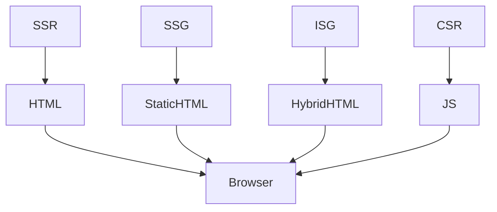

# SSR, SSG, ISG, CSR

## Фундаментальні механізми рендерингу у Nuxt3

Nuxt3 підтримує чотири основні режими рендерингу: SSR (Server-Side Rendering), SSG (Static Site Generation), ISG (Incremental Static Generation), CSR (Client-Side Rendering). Кожен режим має свої переваги, недоліки та сценарії використання.

---

## SSR (Server-Side Rendering)

SSR — це рендеринг сторінки на сервері перед відправкою клієнту. HTML генерується на сервері, що покращує SEO, швидкість першого рендеру, доступність.

### Як працює SSR у Nuxt3?

-   Кожен запит до сторінки — новий рендер на сервері.
-   Дані отримуються через asyncData, useAsyncData.
-   SSR реалізовано через Nitro (універсальний сервер).

#### Приклад SSR:

```vue
<script setup>
const { data } = await useAsyncData("posts", () => $fetch("/api/posts"));
</script>
```

---

## SSG (Static Site Generation)

SSG — це генерація статичних HTML-файлів під час білду. Сторінки не рендеряться на сервері, а віддаються як статичні файли.

### Як працює SSG у Nuxt3?

-   Під час білду Nuxt генерує HTML для кожної сторінки.
-   Дані отримуються на етапі білду.
-   Ідеально для блогів, документації, landing pages.

#### Приклад SSG:

```js
// nuxt.config.ts
export default defineNuxtConfig({
    nitro: {
        prerender: {
            routes: ["/blog/1", "/blog/2"],
        },
    },
});
```

---

## ISG (Incremental Static Generation)

ISG — це гібридний підхід: сторінки генеруються статично, але можуть оновлюватися/догенеруватися на сервері при запиті.

### Як працює ISG у Nuxt3?

-   Частина сторінок генерується під час білду, частина — при першому запиті.
-   Можна налаштувати revalidate для оновлення сторінок.
-   Підходить для великих сайтів з динамічним контентом.

#### Приклад ISG:

```js
// nuxt.config.ts
export default defineNuxtConfig({
    nitro: {
        prerender: {
            crawlLinks: true,
            routes: ["/blog/1", "/blog/2"],
            dynamicRoutes: ["/blog/:id"],
        },
    },
});
```

---

## CSR (Client-Side Rendering)

CSR — це рендеринг сторінки повністю на клієнті. Весь JavaScript завантажується у браузер, HTML генерується на клієнті.

### Як працює CSR у Nuxt3?

-   Весь рендеринг — у браузері.
-   Дані отримуються через fetch у mounted/setup.
-   Підходить для SPA, dashboard, приватних додатків.

#### Приклад CSR:

```vue
<script setup>
import { ref, onMounted } from "vue";
const posts = ref([]);
onMounted(async () => {
    posts.value = await $fetch("/api/posts");
});
</script>
```

---

## Advanced: Hybrid, Edge, Revalidation

-   Hybrid rendering: поєднання SSR, SSG, CSR для різних сторінок.
-   Edge rendering: SSR на CDN для мінімальних затримок.
-   Revalidation: автоматичне оновлення статичних сторінок.

---

## Best practices

-   Вибирайте режим рендерингу для кожної сторінки залежно від задачі.
-   Використовуйте SSR для SEO-критичних сторінок.
-   SSG — для статичного контенту.
-   ISG — для великих сайтів з динамікою.
-   CSR — для приватних, інтерактивних додатків.
-   Використовуйте asyncData/useAsyncData для SSR/SSG.
-   Валідуйте дані перед рендером.
-   Тестуйте всі режими рендерингу.

---

## Типові помилки та антипатерни

-   Використання CSR для SEO-критичних сторінок.
-   Відсутність revalidation для динамічного контенту у SSG/ISG.
-   Змішування логіки SSR/CSR у одному компоненті.
-   Відсутність обробки помилок у asyncData.
-   Відсутність fallback для динамічних маршрутів.

---

## Таблиця: порівняння SSR, SSG, ISG, CSR

| Режим | SEO | Швидкість | Динаміка | Складність | Коли використовувати   |
| ----- | --- | --------- | -------- | ---------- | ---------------------- |
| SSR   | +++ | ++        | ++       | ++         | Блоги, маркетплейси    |
| SSG   | ++  | +++       | -        | +          | Документація, лендінги |
| ISG   | ++  | ++        | ++       | +++        | Великі сайти, каталоги |
| CSR   | -   | ++        | +++      | +          | SPA, dashboard         |

---

## Діаграма: flow рендерингу у Nuxt3



---

## Практичні кейси

-   Міграція блогу на SSR для SEO.
-   Генерація документації через SSG.
-   Каталог товарів через ISG з revalidation.
-   Dashboard через CSR для інтерактивності.
-   Edge SSR для глобальних користувачів.

---

## FAQ по SSR, SSG, ISG, CSR у Nuxt3

-   Як вибрати режим рендерингу? — Залежить від SEO, динаміки, швидкості.
-   Чи можна комбінувати режими? — Так, hybrid rendering.
-   Як працює revalidation? — Через налаштування prerender у Nitro.
-   Чи впливає режим на SEO? — SSR/SSG/ISG — позитивно, CSR — негативно.

---

## Додаткові ресурси

-   [Nuxt3 Rendering Guide](https://nuxt.com/docs/guide/rendering)
-   [Nitro Engine](https://nitro.unjs.io/)
-   [Edge Rendering](https://nuxt.com/docs/guide/deploy/edge)
-   [Incremental Static Regeneration](https://vercel.com/docs/concepts/next.js/incremental-static-regeneration)

---

## Підсумок

SSR, SSG, ISG, CSR — це гнучкі режими рендерингу у Nuxt3. Вибирайте оптимальний для задачі, комбінуйте режими, впроваджуйте best practices для продуктивності, SEO та масштабованості.
