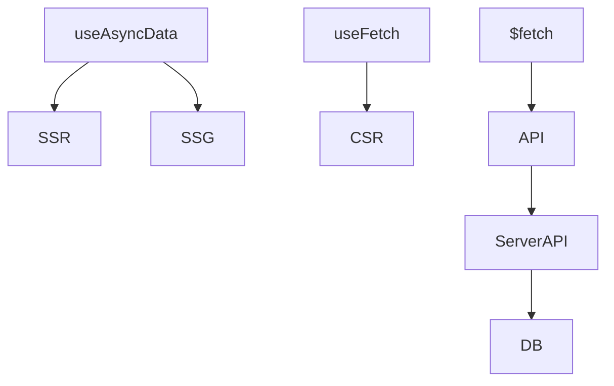

# Data fetching: useAsyncData, useFetch

## Фундаментальні механізми data fetching у Nuxt3

Nuxt3 надає потужні інструменти для отримання даних: useAsyncData, useFetch, $fetch, server/api. Вони дозволяють отримувати дані на сервері (SSR), під час білду (SSG), на клієнті (CSR), а також комбінувати режими для гібридних додатків.

---

## useAsyncData

useAsyncData — це composable для асинхронного отримання даних у setup-функції компонента. Підтримує SSR, SSG, CSR, кешування, revalidation.

### Як працює useAsyncData?

-   Викликається у <script setup>.
-   Повертає data, pending, error.
-   Підтримує ключ для кешування.

#### Приклад:

```vue
<script setup>
const { data, pending, error } = await useAsyncData("posts", () =>
    $fetch("/api/posts")
);
</script>
```

---

## useFetch

useFetch — це composable для отримання даних з API, підтримує SSR, SSG, CSR, автоматичне кешування, reactivity.

### Як працює useFetch?

-   Викликається у <script setup>.
-   Повертає data, pending, error, refresh.
-   Підтримує SSR/SSG/CSR.

#### Приклад:

```vue
<script setup>
const { data, pending, error, refresh } = await useFetch("/api/posts");
</script>
```

---

## $fetch

$fetch — це універсальний HTTP-клієнт, який працює на сервері та клієнті. Підтримує JSON, FormData, error handling.

#### Приклад:

```js
const posts = await $fetch("/api/posts");
```

---

## Server API

Nuxt3 дозволяє створювати endpoints у папці server/api для backend-логіки, отримання даних, обробки запитів.

#### Приклад endpoint:

```js
// server/api/posts.get.js
export default defineEventHandler(async (event) => {
    return await fetchPostsFromDB();
});
```

---

## Advanced: кешування, revalidation, error boundaries

-   Кешуйте запити через ключ у useAsyncData/useFetch.
-   Використовуйте revalidation для оновлення даних у SSG/ISG.
-   Впроваджуйте error boundaries для обробки помилок.
-   Використовуйте composables для повторного використання логіки.

---

## Best practices

-   Використовуйте useAsyncData для SSR/SSG, useFetch для CSR.
-   Кешуйте запити для продуктивності.
-   Валідуйте дані перед рендером.
-   Обробляйте помилки через error boundaries.
-   Використовуйте server/api для backend-логіки.
-   Документуйте структуру запитів.
-   Оновлюйте дані через refresh/revalidate.

---

## Типові помилки та антипатерни

-   Відсутність обробки помилок у запитах.
-   Змішування логіки отримання даних та UI.
-   Відсутність кешування для повторних запитів.
-   Відсутність валідації даних.
-   Відсутність revalidation для динамічного контенту.

---

## Таблиця: порівняння useAsyncData, useFetch, $fetch

| Інструмент   | SSR | SSG | CSR | Кешування | Error handling | Коли використовувати |
| ------------ | --- | --- | --- | --------- | -------------- | -------------------- |
| useAsyncData | +++ | +++ | ++  | +++       | +++            | SSR/SSG, гібрид      |
| useFetch     | ++  | ++  | +++ | ++        | ++             | CSR, SSR             |
| $fetch       | +   | +   | +++ | -         | +              | API, server/client   |

---

## Діаграма: flow отримання даних у Nuxt3



---

## Практичні кейси

-   Кешування запитів через ключ у useAsyncData.
-   Оновлення даних через revalidate у SSG/ISG.
-   Обробка помилок через error boundaries.
-   Створення composable для повторного використання логіки запитів.
-   Валідація даних через yup/zod.

---

## FAQ по data fetching у Nuxt3

-   Як вибрати useAsyncData чи useFetch? — useAsyncData для SSR/SSG, useFetch для CSR.
-   Як кешувати запити? — Через ключ у useAsyncData/useFetch.
-   Як обробити помилки? — Через error boundaries, try/catch.
-   Як оновити дані? — Через refresh/revalidate.

---

## Додаткові ресурси

-   [Nuxt3 Data Fetching Guide](https://nuxt.com/docs/guide/data-fetching)
-   [useAsyncData](https://nuxt.com/docs/api/composables/use-async-data)
-   [useFetch](https://nuxt.com/docs/api/composables/use-fetch)
-   [Nuxt Server API](https://nuxt.com/docs/guide/directory-structure/server)

---

## Підсумок

Data fetching у Nuxt3 — це гнучка система для отримання, кешування, оновлення та обробки даних. Використовуйте best practices, комбінуйте інструменти для продуктивності, безпеки та масштабованості.
