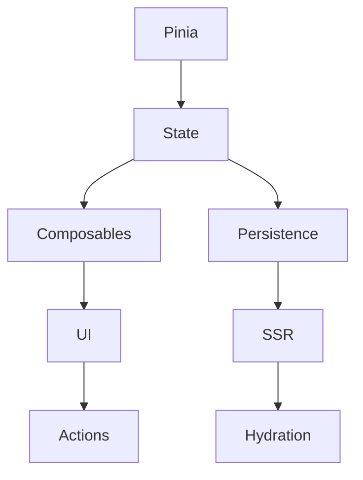

# State management: Pinia, composables

## Фундаментальні механізми state management у Nuxt3

State management — це організація та контроль стану додатку. У Nuxt3 основні інструменти: Pinia (офіційний store), composables (повторна логіка), reactive/ref, provide/inject.

---

## Pinia: сучасний store для Vue/Nuxt

Pinia — це легкий, типізований, реактивний store для глобального state.

### Як працює Pinia?

-   Створює глобальні stores для state, getters, actions.
-   Підтримує SSR, SSG, CSR.
-   Повна інтеграція з TypeScript.

#### Приклад store:

```ts
// stores/counter.ts
import { defineStore } from "pinia";
export const useCounterStore = defineStore("counter", {
    state: () => ({ count: 0 }),
    getters: {
        double: (state) => state.count * 2,
    },
    actions: {
        increment() {
            this.count++;
        },
    },
});
```

---

## Composables: повторна логіка

Composables — це функції, які інкапсулюють логіку state, API, UI, і можуть використовуватись у будь-якому компоненті.

#### Приклад composable:

```ts
// composables/useTheme.ts
import { ref } from "vue";
export function useTheme() {
    const theme = ref("light");
    function toggle() {
        theme.value = theme.value === "light" ? "dark" : "light";
    }
    return { theme, toggle };
}
```

---

## Reactive, ref, provide/inject

-   reactive — для складних об’єктів.
-   ref — для простих значень.
-   provide/inject — для передачі state між компонентами.

#### Приклад:

```ts
// provide
provide("user", ref({ name: "Anna" }));
// inject
const user = inject("user");
```

---

## Advanced: SSR/SSG, persistence, modules

-   SSR/SSG: Pinia підтримує серверний рендеринг, гідрацію state.
-   Persistence: зберігання state у localStorage, cookies.
-   Модульність: розділення store на дрібні модулі.

#### Приклад SSR:

```ts
// nuxt.config.ts
export default defineNuxtConfig({
    modules: ["@pinia/nuxt"],
});
```

---

## Best practices

-   Дробіть state на дрібні stores.
-   Використовуйте composables для повторної логіки.
-   Типізуйте state, getters, actions.
-   Не мутуйте state напряму у компонентах.
-   Використовуйте persistence для auth, settings.
-   Оновлюйте state через actions.
-   Документуйте структуру store.
-   Валідуйте дані у state.

---

## Типові помилки та антипатерни

-   Мутація state напряму у компонентах.
-   Відсутність типізації state.
-   Змішування логіки store та UI.
-   Відсутність розділення store на модулі.
-   Відсутність persistence для auth.
-   Відсутність обробки помилок у actions.

---

## Таблиця: порівняння Pinia, composables, provide/inject

| Інструмент     | Глобальний | Локальний | SSR/SSG | Типізація | Коли використовувати |
| -------------- | ---------- | --------- | ------- | --------- | -------------------- |
| Pinia          | +++        | +         | +++     | +++       | Глобальний state     |
| Composables    | ++         | +++       | ++      | ++        | Повторна логіка      |
| provide/inject | +          | ++        | +       | +         | Передача state       |

---

## Діаграма: flow state management у Nuxt3



---

## Практичні кейси

-   Впровадження Pinia для глобального state.
-   Створення composable для теми, авторизації.
-   SSR/SSG state management для SEO.
-   Persistence state для auth через cookies/localStorage.
-   Розділення store на модулі для масштабованості.

---

## FAQ по state management у Nuxt3

-   Як інтегрувати Pinia? — Через модуль @pinia/nuxt у nuxt.config.ts.
-   Як типізувати state? — Через TypeScript, інтерфейси.
-   Як зберігати state між сесіями? — Через persistence (localStorage, cookies).
-   Як розділити store? — Створіть окремі файли для кожного store.

---

## Додаткові ресурси

-   [Pinia Documentation](https://pinia.vuejs.org/)
-   [Nuxt3 State Management](https://nuxt.com/docs/guide/directory-structure/stores)
-   [Composables Guide](https://vuejs.org/guide/reusability/composables.html)
-   [SSR/SSG State](https://nuxt.com/docs/guide/going-further/ssr-ssg)

---

## Підсумок

State management у Nuxt3 — це гнучка система для організації, контролю та масштабування стану додатку. Використовуйте Pinia, composables, persistence, SSR/SSG для продуктивності, безпеки та підтримуваності.
