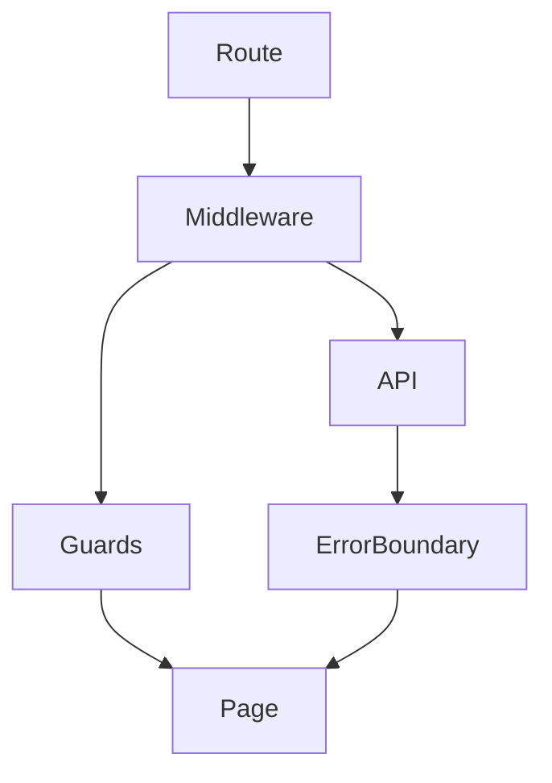

# Middleware, guards

## Фундаментальні механізми middleware та guards у Nuxt3

Middleware та guards — це функції для контролю доступу, перевірки стану, обробки логіки перед рендером сторінки чи виконанням API. Вони дозволяють впроваджувати автентифікацію, авторизацію, редиректи, валідацію, логування.

---

## Middleware у Nuxt3

Middleware — це функції, які виконуються перед рендером сторінки або маршруту. Можуть бути глобальними, сторінковими, API.

### Як працює middleware?

-   Створюється у папці `middleware/`.
-   Викликається автоматично для сторінки або через defineNuxtRouteMiddleware.
-   Може повертати редирект, помилку, логіку.

#### Приклад middleware:

```js
// middleware/auth.js
export default defineNuxtRouteMiddleware((to, from) => {
    if (!useAuth().isLoggedIn) return "/login";
});
```

---

## Guards у Nuxt3

Guards — це функції для захисту маршруту, перевірки доступу, валідації параметрів. Можуть бути beforeEnter, afterEach, beforeRouteUpdate.

### Як працюють guards?

-   Викликаються у router або компоненті.
-   Можуть зупинити навігацію, змінити маршрут, показати помилку.

#### Приклад guard:

```js
// pages/admin.vue
<script setup>
definePageMeta({
  middleware: ['auth']
});
</script>
```

---

## Advanced: глобальні, API, error boundaries

-   Глобальні middleware — для всіх сторінок.
-   Middleware для API — перевірка токенів, rate limiting.
-   Error boundaries — обробка помилок у guards/middleware.
-   Логування, аналітика, A/B тестування через middleware.

---

## Best practices

-   Використовуйте middleware для автентифікації, авторизації.
-   Валідуйте параметри маршруту через guards.
-   Розділяйте middleware на дрібні функції.
-   Документуйте логіку middleware/guards.
-   Використовуйте error boundaries для обробки помилок.
-   Тестуйте middleware через automated tests.
-   Використовуйте named middleware для різних секцій.

---

## Типові помилки та антипатерни

-   Відсутність перевірки доступу до захищених сторінок.
-   Змішування логіки middleware та UI.
-   Відсутність обробки помилок у middleware.
-   Відсутність валідації параметрів у guards.
-   Відсутність логування у критичних middleware.

---

## Таблиця: порівняння middleware та guards

| Концепт    | Призначення       | Best Practice               | Антипатерн            |
| ---------- | ----------------- | --------------------------- | --------------------- |
| Middleware | Контроль доступу  | Автентифікація, логіка      | Змішування з UI       |
| Guards     | Валідація, захист | Валідація, error boundaries | Відсутність перевірки |

---

## Діаграма: flow middleware та guards у Nuxt3



---

## Практичні кейси

-   Впровадження auth middleware для захисту сторінок.
-   Rate limiting для API через middleware.
-   Валідація параметрів маршруту через guards.
-   Логування переходів через глобальний middleware.
-   Error boundaries для обробки помилок у guards.

---

## FAQ по middleware та guards у Nuxt3

-   Як створити middleware? — У папці middleware/, через defineNuxtRouteMiddleware.
-   Як підключити middleware до сторінки? — Через definePageMeta.
-   Як працюють guards? — Через beforeEnter, валідацію параметрів.
-   Як обробити помилки у middleware? — Через error boundaries, try/catch.

---

## Додаткові ресурси

-   [Nuxt3 Middleware Guide](https://nuxt.com/docs/guide/directory-structure/middleware)
-   [Vue Router Guards](https://router.vuejs.org/guide/advanced/navigation-guards.html)
-   [Nuxt3 Error Boundaries](https://nuxt.com/docs/guide/going-further/error-handling)

---

## Підсумок

Middleware та guards — це основа безпеки, контролю доступу та валідації у Nuxt3. Використовуйте best practices, розділяйте логіку, впроваджуйте error boundaries для якісного UX та підтримуваності.
