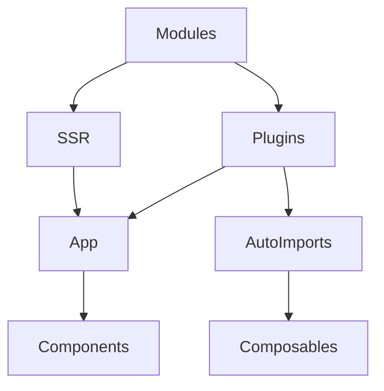

# Модулі та плагіни

## Фундаментальні механізми модулів та плагінів у Nuxt3

Модулі та плагіни — це основа розширення функціоналу Nuxt3. Вони дозволяють інтегрувати сторонні бібліотеки, додавати нові можливості, оптимізувати архітектуру, автоматизувати процеси.

---

## Модулі у Nuxt3

Модулі — це пакети, які додають функціонал на рівні всього додатку: auth, i18n, image, PWA, SEO, analytics.

### Як працюють модулі?

-   Підключаються у nuxt.config.ts через масив modules.
-   Можуть змінювати конфігурацію, додавати плагіни, middleware, компоненти.
-   Підтримують налаштування через options.

#### Приклад підключення модуля:

```ts
// nuxt.config.ts
export default defineNuxtConfig({
    modules: ["@nuxt/image", "@nuxtjs/i18n", "@nuxtjs/auth-next"],
});
```

---

## Плагіни у Nuxt3

Плагіни — це файли, які виконуються до рендеру додатку, дозволяють реєструвати глобальні компоненти, інжектити функції, налаштовувати бібліотеки.

### Як працюють плагіни?

-   Створюються у папці plugins/.
-   Викликаються автоматично або через nuxt.config.ts.
-   Можуть інжектити функції у context, app, компоненти.

#### Приклад плагіна:

```js
// plugins/axios.js
import axios from "axios";
export default defineNuxtPlugin((nuxtApp) => {
    nuxtApp.provide("axios", axios);
});
```

Використання у компоненті:

```js
const axios = useNuxtApp().$axios;
```

---

## Advanced: custom modules, dynamic plugins, auto imports

-   Створення власних модулів для специфічних задач.
-   Динамічне підключення плагінів залежно від середовища.
-   Auto imports для composables, компонентів, утиліт.
-   Інтеграція модулів з SSR/SSG/CSR.

---

## Best practices

-   Використовуйте офіційні модулі для типових задач.
-   Документуйте всі підключені модулі та плагіни.
-   Розділяйте плагіни за призначенням (API, UI, auth).
-   Використовуйте auto imports для зручності.
-   Оновлюйте модулі та плагіни регулярно.
-   Тестуйте інтеграцію модулів у CI/CD.
-   Використовуйте options для налаштування модулів.

---

## Типові помилки та антипатерни

-   Змішування логіки плагінів та компонентів.
-   Відсутність документації для модулів.
-   Відсутність оновлення модулів — застарілі залежності.
-   Відсутність розділення плагінів за призначенням.
-   Відсутність тестування інтеграції.

---

## Таблиця: порівняння модулів та плагінів

| Концепт | Призначення            | Best Practice            | Антипатерн            |
| ------- | ---------------------- | ------------------------ | --------------------- |
| Модулі  | Глобальний функціонал  | Офіційні, документовані  | Застарілі, без тестів |
| Плагіни | Інжекція, налаштування | Розділення, auto imports | Змішування з UI       |

---

## Діаграма: flow інтеграції модулів та плагінів у Nuxt3



---

## Практичні кейси

-   Впровадження i18n через офіційний модуль.
-   Інтеграція axios через плагін.
-   Створення custom модуля для аналітики.
-   Динамічне підключення плагінів для різних середовищ.
-   Auto imports для composables.

---

## FAQ по модулях та плагінах у Nuxt3

-   Як підключити модуль? — Через масив modules у nuxt.config.ts.
-   Як створити плагін? — У папці plugins/, через defineNuxtPlugin.
-   Як інжектити функцію у компонент? — Через nuxtApp.provide.
-   Як оновлювати модулі? — Регулярно перевіряйте залежності.

---

## Додаткові ресурси

-   [Nuxt3 Modules Guide](https://nuxt.com/docs/guide/directory-structure/modules)
-   [Nuxt3 Plugins Guide](https://nuxt.com/docs/guide/directory-structure/plugins)
-   [Auto Imports](https://nuxt.com/docs/guide/going-further/auto-imports)
-   [Nuxt3 Community Modules](https://nuxt.com/modules)

---

## Підсумок

Модулі та плагіни — це основа масштабованості, розширюваності та продуктивності Nuxt3. Використовуйте best practices, документуйте інтеграції, тестуйте та оновлюйте залежності для якісного проєкту.
