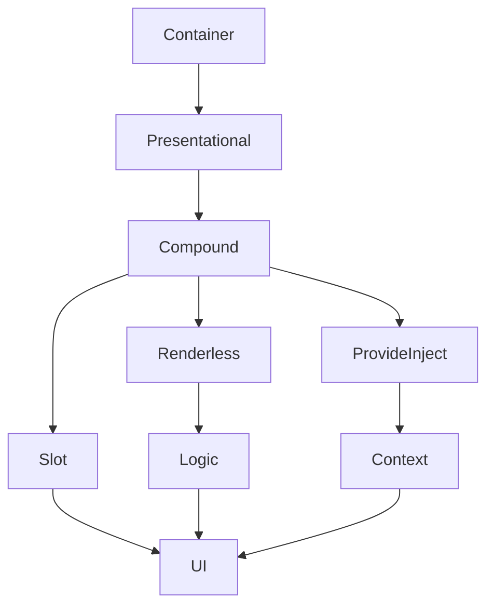

# Робота з шаблонами та компонування

## Фундаментальні механізми шаблонів та компонування у Nuxt3

Nuxt3 використовує Vue3 для роботи з шаблонами та компонуванням. Це дозволяє створювати гнучкі, масштабовані, повторно використовувані UI через компоненти, слоти, директиви, шаблонні функції.

---

## Шаблони у Nuxt3

-   Використовуйте <template> для опису UI.
-   Підтримка директив (v-if, v-for, v-slot, v-model).
-   Можливість вкладених шаблонів, умовного рендерингу.

#### Приклад шаблону:

```vue
<template>
    <div>
        <h1>{{ title }}</h1>
        <ul>
            <li v-for="item in items" :key="item.id">{{ item.name }}</li>
        </ul>
    </div>
</template>
```

---

## Компонування: компоненти, слоти, директиви

-   Компоненти — основа UI, ізольовані, повторно використовувані.
-   Слоти — для передачі контенту у компоненти.
-   Директиви — для реактивної поведінки (v-if, v-for, v-model).

#### Приклад компонента зі слотами:

```vue
<template>
    <button>
        <slot>Default</slot>
    </button>
</template>
```

Використання:

```vue
<MyButton>OK</MyButton>
```

---

## Advanced: шаблонні функції, scoped slots, render-функції, DI

-   **Шаблонні функції** — функції, які повертають шаблон для компонента, дозволяють створювати гнучкі UI.
-   **Scoped slots** — слоти з доступом до даних компонента:

```vue
<template #default="{ item }">
    <div>{{ item.name }}</div>
</template>
```

-   **Render-функції** — створення компонентів через JS:

```js
export default {
    render() {
        return h("button", {}, this.$slots.default());
    },
};
```

-   **Dependency Injection (DI)** — через provide/inject для складних структур:

```js
// provide
provide("theme", ref("dark"));
// inject
const theme = inject("theme");
```

-   **Template refs** — доступ до DOM-елементів:

```vue
<input ref="search" />
onMounted(() => { search.value.focus(); });
```

---

## Accessibility та performance у шаблонах

-   Використовуйте aria-атрибути для доступності.
-   Забезпечуйте фокус через tabindex, ref.
-   Уникайте зайвого рендерингу через v-if/v-show.
-   Використовуйте v-memo для оптимізації.
-   Lazy loading компонентів через dynamic imports.

---

## Архітектурні патерни компонування

-   **Container/Presentational** — розділення логіки та UI.
-   **Compound Components** — компоненти, які працюють разом через слоти/props.
-   **Renderless Components** — компоненти, які повертають лише логіку через slots.
-   **Functional Components** — легкі, без state.

#### Приклад compound:

```vue
<Tabs>
  <Tab title="A">...</Tab>
  <Tab title="B">...</Tab>
</Tabs>
```

---

## Порівняння підходів компонування (розширена таблиця)

| Підхід              | Плюси           | Мінуси                | Advanced use |
| ------------------- | --------------- | --------------------- | ------------ |
| Компоненти          | Ізоляція, reuse | God component         | Compound     |
| Слоти               | Гнучкість       | Відсутність типізації | Scoped       |
| Директиви           | Реактивність    | Змішування логіки     | Custom       |
| Render-функції      | Гнучкість       | Складність            | Renderless   |
| Provide/Inject (DI) | DI, sharing     | Debugging             | Context      |

---

## Діаграма: архітектура складного UI



---

## Практичні кейси (розширено)

-   Створення бібліотеки UI-компонентів зі scoped slots та DI.
-   Впровадження renderless компонентів для логіки drag&drop.
-   Динамічне рендеринг компонентів через <component :is> та lazy loading.
-   Тестування accessibility через axe, Lighthouse.
-   Документування API компонентів через JSDoc/TypeScript.
-   Оптимізація рендеру через v-memo, shallowRef.

---

## FAQ по шаблонах та компонуванню у Nuxt3 (розширено)

-   Як створити compound component? — Через слоти, props, контекст.
-   Як типізувати scoped slots? — Через TypeScript, SlotProps.
-   Як впровадити renderless компонент? — Повертаючи лише slots з логікою.
-   Як забезпечити accessibility? — Через aria, tabindex, фокус.
-   Як оптимізувати рендер? — v-memo, lazy loading, shallowRef.

---

## Додаткові ресурси (розширено)

-   [Vue3 Templates Guide](https://vuejs.org/guide/essentials/template-syntax.html)
-   [Nuxt3 Components](https://nuxt.com/docs/guide/directory-structure/components)
-   [Slots & Composition](https://vuejs.org/guide/components/slots.html)
-   [Provide/Inject](https://vuejs.org/guide/components/provide-inject.html)
-   [Render Functions](https://vuejs.org/guide/extras/render-function.html)
-   [Accessibility in Vue](https://vuejs.org/guide/best-practices/accessibility.html)
-   [Testing Accessibility](https://www.deque.com/axe/)

---

## Підсумок (розширено)

Шаблони та компонування у Nuxt3 — це не лише про <template> і компоненти, а про архітектурні патерни, accessibility, performance, DI, advanced slots, renderless логіку. Впроваджуйте best practices, тестуйте, документуйте, оптимізуйте — і ваш UI буде гнучким, масштабованим та доступним.
