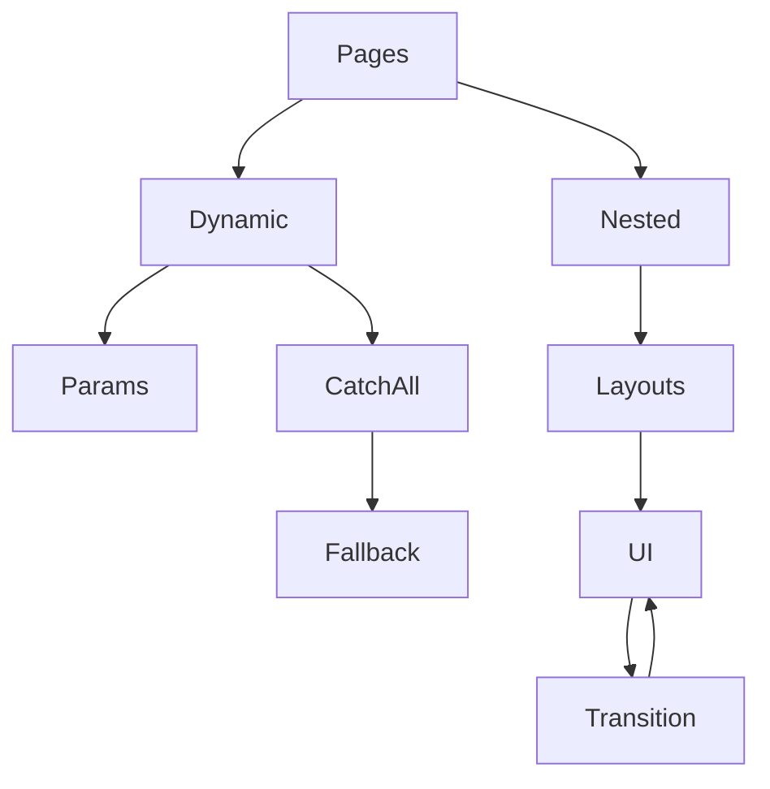

# Dynamic routes, nested routes

## Фундаментальні механізми dynamic та nested routes у Nuxt3

Nuxt3 використовує file-based routing, що дозволяє створювати динамічні та вкладені маршрути через структуру папки pages. Це спрощує навігацію, SEO, організацію коду та масштабування додатку.

---

## Dynamic routes (динамічні маршрути)

-   Динамічні маршрути створюються через файли з іменем у квадратних дужках: `[id].vue`, `[slug].vue`.
-   Параметри маршруту доступні через useRoute().
-   Підтримка catch-all: `[...all].vue` для гнучких сценаріїв.

#### Приклад:

```
pages/
  blog/
    [id].vue        // /blog/123
    [...all].vue     // /blog/anything/else
```

Використання параметра:

```vue
<script setup>
import { useRoute } from "vue-router";
const route = useRoute();
const id = route.params.id;
</script>
```

---

## Nested routes (вкладені маршрути)

-   Вкладені маршрути створюються через вкладені папки у pages.
-   Можна створювати багаторівневу структуру: /user/profile/settings.
-   Layouts дозволяють задавати різну структуру для вкладених сторінок.

#### Приклад:

```
pages/
  user/
    profile.vue     // /user/profile
    settings.vue    // /user/settings
```

---

## Advanced: dynamic layouts, route guards, transitions

-   Динамічний вибір layout через definePageMeta.
-   Route guards для захисту вкладених маршрутів.
-   Анімація переходів через <transition>.

#### Приклад dynamic layout:

```vue
<script setup>
definePageMeta({ layout: "admin" });
</script>
```

---

## Best practices

-   Використовуйте file-based routing для простоти.
-   Валідуйте параметри маршруту.
-   Використовуйте layouts для вкладених сторінок.
-   Документуйте структуру маршрутів.
-   Використовуйте catch-all для гнучких сценаріїв.
-   Тестуйте навігацію через automated tests.

---

## Типові помилки та антипатерни

-   Відсутність key у v-for при рендерингу списків маршрутів.
-   Відсутність перевірки параметрів маршруту.
-   Змішування логіки маршрутизації та UI.
-   Відсутність документації для вкладених маршрутів.
-   Відсутність обробки помилок у динамічних маршрутах.

---

## Таблиця: порівняння підходів маршрутизації

| Підхід    | Плюси     | Мінуси     | Advanced use   |
| --------- | --------- | ---------- | -------------- |
| Dynamic   | Гнучкість | Валідація  | Catch-all      |
| Nested    | Структура | Складність | Dynamic layout |
| Catch-all | Гнучкість | SEO, debug | 404, fallback  |

---

## Діаграма: flow dynamic та nested routes у Nuxt3



---

## Практичні кейси

-   Створення блогу з динамічними сторінками через [id].vue.
-   Впровадження вкладених маршрутів для профілю користувача.
-   Використання catch-all для 404 та fallback.
-   Динамічний layout для адмін-панелі.
-   Тестування навігації через unit/integration тести.

---

## FAQ по dynamic та nested routes у Nuxt3

-   Як створити динамічний маршрут? — Через [param].vue у pages.
-   Як отримати параметри маршруту? — Через useRoute().
-   Як створити вкладений маршрут? — Через вкладені папки у pages.
-   Як задати layout для вкладеної сторінки? — Через definePageMeta.
-   Як обробити 404? — Через catch-all [...all].vue.

---

## Додаткові ресурси

-   [Nuxt3 Routing Guide](https://nuxt.com/docs/guide/directory-structure/pages)
-   [Vue Router](https://router.vuejs.org/)
-   [Nuxt3 Layouts](https://nuxt.com/docs/guide/directory-structure/layouts)

---

## Підсумок

Dynamic та nested routes у Nuxt3 — це гнучка система для організації навігації, структури та SEO. Використовуйте best practices, тестуйте, документуйте маршрути для якісного, масштабованого додатку.
