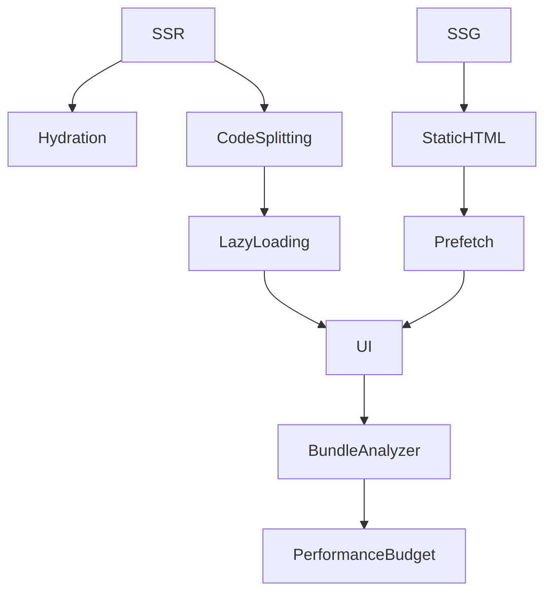

# Performance: оптимізація, code splitting

## Фундаментальні механізми оптимізації у Nuxt3

Nuxt3 використовує сучасні підходи до оптимізації продуктивності: code splitting, lazy loading, SSR/SSG, кешування, оптимізацію ресурсів, tree-shaking, prefetching, hydration.

---

## Code splitting

Code splitting — це розділення коду на частини, які завантажуються лише при потребі. Це зменшує час першого рендеру, покращує UX.

-   Динамічний імпорт компонентів:

```js
const MyComponent = defineAsyncComponent(() => import("./MyComponent.vue"));
```

-   Вкладені маршрути — окремі чанки для кожної сторінки.
-   Lazy loading зображень, ресурсів.

---

## SSR/SSG та кешування

-   SSR — рендеринг на сервері, швидкий перший рендер.
-   SSG — статичний HTML, миттєве завантаження.
-   Кешування API, сторінок, ресурсів через CDN, HTTP cache.
-   Використання revalidate для оновлення статичних сторінок.

---

## Tree-shaking та оптимізація залежностей

-   Tree-shaking — видалення невикористаного коду під час білду.
-   Оновлення залежностей, видалення legacy-коду.
-   Використання сучасних бібліотек (ESM, lightweight).

---

## Prefetching, hydration, lazy loading

-   Prefetching — попереднє завантаження ресурсів для швидких переходів.
-   Hydration — активація реактивності після SSR.
-   Lazy loading — завантаження компонентів, зображень, даних лише при потребі.

#### Приклад lazy loading зображення:

```vue

```

---

## Advanced: performance budgets, Lighthouse, bundle analyzer

-   Встановлення performance budgets для розміру чанків.
-   Аналіз bundle через vite-plugin-visualizer, webpack-bundle-analyzer.
-   Тестування продуктивності через Lighthouse, WebPageTest.
-   Оптимізація критичного рендеру через preload, prefetch.

---

## Best practices

-   Використовуйте dynamic imports для компонентів.
-   Lazy loading для зображень, heavy компонентів.
-   Оновлюйте залежності регулярно.
-   Використовуйте SSR/SSG для SEO та швидкості.
-   Кешуйте API та сторінки через CDN.
-   Аналізуйте bundle перед релізом.
-   Встановлюйте performance budgets.
-   Використовуйте prefetch/preload для критичних ресурсів.

---

## Типові помилки та антипатерни

-   Відсутність code splitting — великий initial bundle.
-   Змішування логіки та heavy UI у одному компоненті.
-   Відсутність lazy loading для зображень.
-   Відсутність кешування API.
-   Відсутність аналізу bundle.
-   Використання legacy-залежностей.

---

## Таблиця: порівняння підходів оптимізації

| Підхід         | Плюси            | Мінуси     | Advanced use |
| -------------- | ---------------- | ---------- | ------------ |
| Code splitting | Швидкість, UX    | Складність | Dynamic      |
| Lazy loading   | Зменшення bundle | SEO, UX    | Heavy UI     |
| SSR/SSG        | SEO, швидкість   | Складність | Revalidate   |
| Tree-shaking   | Чистий код       | Legacy     | ESM          |
| Prefetching    | UX, швидкість    | Overhead   | Critical     |

---

## Діаграма: flow оптимізації у Nuxt3



---

## Практичні кейси

-   Впровадження dynamic imports для heavy компонентів.
-   Lazy loading зображень через v-lazy.
-   Аналіз bundle через vite-plugin-visualizer.
-   Кешування API через CDN.
-   Встановлення performance budgets для проекту.
-   Оптимізація SSR/SSG для SEO.

---

## FAQ по performance у Nuxt3

-   Як впровадити code splitting? — Через dynamic imports, структуру pages.
-   Як оптимізувати SSR/SSG? — Кешування, revalidate, CDN.
-   Як аналізувати bundle? — Через vite-plugin-visualizer, webpack-bundle-analyzer.
-   Як впровадити lazy loading? — Через dynamic imports, v-lazy.
-   Як встановити performance budgets? — Через налаштування білду.

---

## Додаткові ресурси

-   [Nuxt3 Performance Guide](https://nuxt.com/docs/guide/going-further/performance)
-   [Lighthouse](https://developer.chrome.com/docs/lighthouse/performance/)
-   [Vite Plugin Visualizer](https://github.com/btd/vite-plugin-visualizer)
-   [Webpack Bundle Analyzer](https://github.com/webpack-contrib/webpack-bundle-analyzer)
-   [WebPageTest](https://www.webpagetest.org/)

---

## Підсумок

Performance у Nuxt3 — це комплексний підхід: code splitting, lazy loading, SSR/SSG, кешування, аналіз bundle, performance budgets. Впроваджуйте best practices, тестуйте, оптимізуйте — і ваш додаток буде швидким, масштабованим та ефективним.
