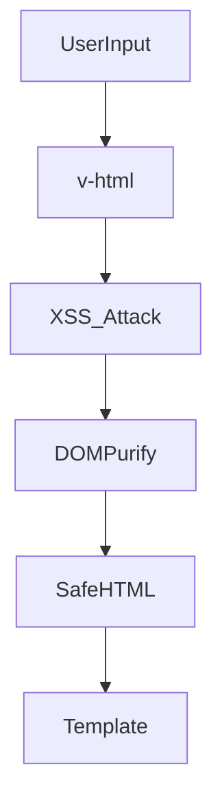

# Security: safe templates, v-html

## Фундаментальні механізми безпеки у Nuxt3

Nuxt3, як і Vue3, має багаторівневу систему безпеки: захист шаблонів, API, даних, інтеграція з серверними механізмами. Основна увага — безпечний рендеринг, захист від XSS, CSRF, Clickjacking, ін’єкцій, контроль доступу.

---

## Safe templates та v-html

-   Використовуйте інтерполяцію (`{{ }}`) для рендерингу даних — автоматичний ескейпінг.
-   v-html — рендерить raw HTML, небезпечно для неперевірених даних.
-   Санітизація через DOMPurify, перевірка даних перед рендером.

#### Приклад:

```vue
<template>
    <div v-html="safeHTML"></div>
</template>
<script setup>
import DOMPurify from "dompurify";
const safeHTML = DOMPurify.sanitize(userInput);
</script>
```

---

## XSS (Cross-Site Scripting)

-   Вставка шкідливого JS через userInput, v-html, незахищені API.
-   Захист: ескейпінг, санітизація, CSP.

#### Приклад атаки:

```html
<input value="<script>alert('XSS')</script>" />
```

---

## CSRF (Cross-Site Request Forgery)

-   Атака через підроблений запит від імені користувача.
-   Захист: CSRF-токени, SameSite cookies, перевірка origin.

#### Приклад CSRF-токена:

```html
<input type="hidden" name="csrf" :value="csrfToken" />
```

---

## CSP (Content Security Policy)

-   CSP — політика, яка обмежує виконання скриптів, стилів, фреймів.
-   Додається у <meta> або HTTP-заголовок.
-   Блокує inline-скрипти, eval, зовнішні ресурси.

#### Приклад:

```html
<meta
    http-equiv="Content-Security-Policy"
    content="default-src 'self'; script-src 'self'"
/>
```

---

## Advanced: audit, WebSockets, OAuth, SSO

-   Інтеграція Snyk, OWASP ZAP для автоматичного тестування.
-   Захист WebSockets: автентифікація, перевірка origin.
-   OAuth/SSO: використовуйте перевірені бібліотеки, не зберігайте токени у localStorage.

---

## Best practices

-   Не використовуйте v-html для неперевірених даних.
-   Всі дані з API — через санітизацію.
-   Використовуйте HTTPS для всіх запитів.
-   Зберігайте токени у httpOnly cookies.
-   Валідуйте дані на клієнті та сервері.
-   Встановлюйте CSP, helmet, X-Frame-Options.
-   Регулярно оновлюйте залежності.
-   Інтегруйте автоматичне тестування безпеки у CI/CD.

---

## Типові помилки та антипатерни

-   Вставка неперевірених даних через v-html.
-   Відсутність CSP.
-   Відсутність CSRF-токенів у формах.
-   Зберігання токенів у localStorage.
-   Відсутність audit залежностей.
-   Відсутність обробки помилок у API.

---

## Таблиця: порівняння методів захисту

| Метод      | Захист від        | Плюси      | Мінуси                        |
| ---------- | ----------------- | ---------- | ----------------------------- |
| CSP        | XSS, Clickjacking | Гнучкість  | Може блокувати легітимний код |
| DOMPurify  | XSS               | Простота   | Не захищає API                |
| CSRF-токен | CSRF              | Надійність | Потрібна інтеграція           |
| HTTPS      | MITM, витік       | Стандарт   | Потрібен сертифікат           |

---

## Діаграма: flow атаки XSS і захисту



---

## Практичні кейси

-   Тестування безпеки через OWASP ZAP.
-   Інтеграція Snyk у CI/CD для audit залежностей.
-   Використання helmet для налаштування HTTP-заголовків.
-   Валідація даних через yup/zod.

---

## FAQ по security у Nuxt3

-   Чи можна використовувати v-html? — Тільки для довірених, санітизованих даних.
-   Як захистити API? — Валідація, HTTPS, CORS, токени.
-   Як тестувати XSS? — OWASP ZAP, ручне введення скриптів.
-   Де зберігати токени? — httpOnly cookies, не localStorage.

---

## Додаткові ресурси

-   [OWASP Top 10](https://owasp.org/www-project-top-ten/)
-   [DOMPurify](https://github.com/cure53/DOMPurify)
-   [Nuxt Security Guide](https://nuxt.com/docs/guide/going-further/security)
-   [Snyk](https://snyk.io/)
-   [OWASP ZAP](https://www.zaproxy.org/)

---

## Підсумок

Безпека у Nuxt3 — це комплексний підхід: санітизація, політики, audit, best practices. Використовуйте сучасні інструменти, тестуйте додаток, оновлюйте залежності та не ігноруйте навіть дрібні ризики.
