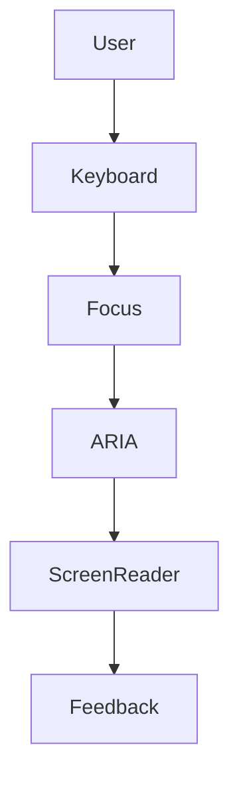

# Accessibility: aria, focus

## Фундаментальні механізми accessibility у Nuxt3

Accessibility — це набір практик, які дозволяють людям з різними можливостями користуватися додатком. Nuxt3 надає інструменти для створення доступних компонентів: aria-атрибути, керування фокусом, навігація з клавіатури, семантична розмітка.

---

## ARIA-атрибути у Nuxt3

ARIA — набір атрибутів для опису ролей, станів, властивостей елементів.

-   `aria-label`, `aria-labelledby`, `aria-describedby` — описують елемент для скрінрідерів.
-   `aria-live`, `aria-atomic` — для динамічного контенту.
-   `role` — визначає тип елемента (button, dialog, alert).

#### Приклад:

```vue
<button aria-label="Закрити" @click="close">✖</button>
```

---

## Керування фокусом

Фокус — це активний елемент, який отримує події клавіатури. Доступність вимагає правильного керування фокусом, особливо у діалогах, модальних вікнах, формах.

-   Використовуйте ref для встановлення фокусу.
-   Переміщайте фокус при відкритті/закритті діалогів.
-   Використовуйте tabindex для керування порядком фокусу.

#### Приклад:

```vue
<input ref="search" tabindex="0" aria-label="Пошук" />
```

---

## Навігація з клавіатури

Всі інтерактивні елементи мають бути доступні з клавіатури:

-   Використовуйте @keydown, @keyup для обробки подій.
-   Не блокуйте стандартні комбінації клавіш.
-   Всі кнопки, посилання, форми — з tabindex та aria.

#### Приклад:

```vue
<button @keydown.enter="submit" tabindex="0">OK</button>
```

---

## Семантична розмітка

-   Використовуйте HTML5-елементи: <nav>, <main>, <header>, <footer>, <form>, <button>.
-   Уникайте div-обгорток для інтерактивних елементів.

---

## Advanced: динамічний контент, діалоги, списки

-   Динамічний контент — використовуйте aria-live для повідомлень.
-   Діалоги — керуйте фокусом, aria-modal, role="dialog".
-   Списки — role="list", aria-labelledby.

---

## Accessibility та performance

-   Використовуйте aria-атрибути для доступності.
-   Забезпечуйте фокус через tabindex, ref.
-   Уникайте зайвого рендерингу через v-if/v-show.
-   Lazy loading для heavy UI.

---

## Best practices

-   Всі інтерактивні елементи — з aria-атрибутами.
-   Перевіряйте доступність через Lighthouse, axe, NVDA.
-   Тестуйте навігацію з клавіатури.
-   Використовуйте семантичну розмітку.
-   Не приховуйте важливий контент через CSS.
-   Додавайте альтернативний текст для зображень.
-   Використовуйте контрастні кольори.
-   Оголошуйте помилки у формах через aria-live.

---

## Типові помилки та антипатерни

-   Відсутність aria-атрибутів.
-   Відсутність tabindex для інтерактивних елементів.
-   Відсутність семантики у розмітці.
-   Відсутність тестування доступності.
-   Прихований контент через CSS без aria-hidden.

---

## Таблиця: порівняння атрибутів aria

| Атрибут          | Призначення          | Приклад використання            |
| ---------------- | -------------------- | ------------------------------- |
| aria-label       | Опис елемента        | <button aria-label="Закрити">   |
| aria-labelledby  | Зв’язок з елементом  | <div aria-labelledby="title">   |
| aria-describedby | Опис для скрінрідера | <input aria-describedby="desc"> |
| aria-live        | Оновлення контенту   | <div aria-live="polite">        |

---

## Діаграма: flow доступності у компоненті



---

## Практичні кейси

-   Діалогове вікно з керуванням фокусом та aria.
-   Динамічне повідомлення про помилку у формі через aria-live.
-   Список з role="list" та aria-labelledby для групування.
-   Тестування accessibility через axe, Lighthouse.

---

## FAQ по accessibility у Nuxt3

-   Як перевірити доступність? — Lighthouse, axe, NVDA.
-   Чи потрібні aria-атрибути для всіх елементів? — Для інтерактивних та динамічних — обов’язково.
-   Як керувати фокусом у діалозі? — Через ref, tabindex, aria-modal.
-   Як зробити форму доступною? — Семантична розмітка, aria, повідомлення про помилки.

---

## Додаткові ресурси

-   [WAI-ARIA Authoring Practices](https://www.w3.org/WAI/ARIA/apg/)
-   [Nuxt Accessibility Guide](https://nuxt.com/docs/guide/going-further/accessibility)
-   [axe-core](https://github.com/dequelabs/axe-core)
-   [Lighthouse](https://developer.chrome.com/docs/lighthouse/accessibility/)
-   [NVDA Screen Reader](https://www.nvaccess.org/)

---

## Підсумок

Accessibility у Nuxt3 — це не лише про aria, а про комплексний підхід: семантика, фокус, навігація, тестування. Доступний додаток — це якісний продукт для всіх користувачів.
