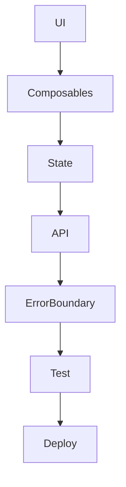

# Best practices, типові помилки, антипатерни

## Фундаментальні принципи розробки у Nuxt3

Best practices — це набір перевірених підходів, які допомагають створювати якісний, підтримуваний, безпечний та продуктивний код. Антипатерни — це типові помилки, яких слід уникати.

---

## Best practices у Nuxt3

-   Використовуйте file-based routing для простоти.
-   Дробіть великі компоненти на дрібні, ізольовані.
-   Використовуйте props для передачі даних, emits для подій.
-   Типізуйте все через TypeScript.
-   Використовуйте Pinia для state management.
-   Всі API-запити — через окремі сервіси.
-   Використовуйте slots для гнучких компонентів.
-   Оголошуйте всі залежності у package.json.
-   Інтегруйте ESLint, Prettier, тести у CI/CD.
-   Документуйте компоненти через JSDoc або TS.
-   Використовуйте семантичну розмітку та accessibility.
-   Оновлюйте залежності регулярно.
-   Використовуйте error boundaries для критичних компонентів.
-   Валідуйте дані на клієнті та сервері.
-   Lazy loading для heavy компонентів та зображень.
-   Використовуйте dynamic imports для оптимізації білду.

---

## Типові помилки у Nuxt3

-   Мутація props у дочірньому компоненті.
-   Відсутність key у v-for.
-   Відсутність типізації props/emits.
-   Вставка неперевірених даних через v-html.
-   Відсутність обробки помилок у API-запитах.
-   Зберігання токенів у localStorage замість httpOnly cookies.
-   Відсутність accessibility-атрибутів.
-   Відсутність тестів для критичних компонентів.
-   Змішування логіки та UI у компонентах.
-   Відсутність debounce/throttle для input/scroll.
-   Відсутність оптимізації білду (tree-shaking, code splitting).

---

## Антипатерни у Nuxt3

-   God component — компонент, який містить всю логіку та UI.
-   Tight coupling — компоненти сильно залежать один від одного.
-   Magic values — використання "магічних" чисел/рядків без констант.
-   Side effects у computed — зміна state у computed властивостях.
-   Відсутність реактивності — використання звичайних об’єктів замість ref/reactive.
-   Відсутність cleanup у lifecycle (setInterval, event listeners).
-   Відсутність memoization для важких обчислень.
-   Відсутність розділення concerns (data, UI, logic).

---

## Advanced: патерни, оптимізація, error boundaries

-   Використовуйте composables для повторної логіки.
-   Впроваджуйте error boundaries через Suspense.
-   Оптимізуйте рендер через v-memo, shallowRef.
-   Використовуйте dynamic imports для модулів.
-   SSR/SSG для SEO та продуктивності.
-   Використовуйте watcher для складних реакцій.

---

## Best practices для тестування

-   Тестуйте всі критичні компоненти.
-   Використовуйте unit, integration, e2e тести.
-   Інтегруйте coverage report у CI/CD.
-   Використовуйте mock для API.

---

## Таблиця: порівняння best practices та антипатернів

| Підхід           | Best Practice      | Антипатерн                      |
| ---------------- | ------------------ | ------------------------------- |
| State management | Pinia, composables | Мутація props, глобальний state |
| API              | Сервіси, типізація | Логіка у компонентах            |
| UI               | Семантика, slots   | God component                   |
| Error handling   | Error boundaries   | Відсутність обробки             |

---

## Діаграма: flow якісної архітектури у Nuxt3

---

## Практичні кейси

-   Міграція з Vue2/Nuxt2 на Nuxt3: розділіть компоненти, впровадьте Composition API.
-   Впровадження Pinia: замініть Vuex, типізуйте state.
-   Оптимізація білду: dynamic imports, tree-shaking.
-   Впровадження error boundaries для критичних компонентів.
-   Валідація даних через yup/zod.

---

## FAQ по best practices у Nuxt3

-   Як уникати god component? — Дробіть логіку на composables, UI на дрібні компоненти.
-   Як типізувати props/emits? — Через TypeScript, PropType.
-   Як впровадити error boundaries? — Через Suspense, try/catch у async setup.
-   Як оптимізувати білд? — Dynamic imports, code splitting, tree-shaking.

---

## Додаткові ресурси

-   [Nuxt Style Guide](https://nuxt.com/docs/guide/reusability/style-guide)
-   [Pinia Documentation](https://pinia.vuejs.org/)
-   [Nuxt Testing Guide](https://nuxt.com/docs/guide/going-further/testing)
-   [Nuxt3 Best Practices](https://nuxt.com/docs/guide/best-practices/)

---

## Підсумок

Best practices — це основа якісного проєкту у Nuxt3. Уникайте антипатернів, впроваджуйте сучасні патерни, тестуйте та оптимізуйте код. Це гарантія підтримуваності, продуктивності та безпеки.
