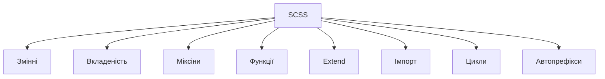

# Вступ: роль SCSS, переваги над CSS

## Вступ

SCSS (Sassy CSS) — це потужний препроцесор для CSS, який розширює можливості стандартних стилів. Він дозволяє писати більш структурований, гнучкий, підтримуваний код, автоматизувати рутинні задачі, створювати складні дизайн-системи.

## Історія/Походження

Перші версії CSS були обмежені у функціональності. У 2006 році з’явився Sass, а згодом SCSS — більш знайомий синтаксис, сумісний із CSS. SCSS став стандартом для великих проєктів, фреймворків, дизайн-систем.

### Віхи розвитку SCSS

-   **2006:** Sass (індентований синтаксис)
-   **2009:** SCSS (CSS-like синтаксис)
-   **2015+:** підтримка у фреймворках, автоматизація, модульність

## Роль SCSS у сучасній розробці

-   Модульність, вкладеність, змінні, міксіни, функції
-   Автоматизація рутинних задач (color, layout, темізація)
-   Легке масштабування стилів
-   Підтримка великих командних проєктів
-   Інтеграція з build-системами (Webpack, Gulp)
-   Кросбраузерність через автопрефіксери

## Основні переваги SCSS над CSS

-   Змінні: централізоване керування кольорами, розмірами
-   Вкладеність: логічна структура стилів
-   Міксіни: повторне використання фрагментів коду
-   Функції: обчислення, генерація стилів
-   Імпорт: розбиття на модулі
-   Extend: наслідування стилів
-   Умови, цикли: динамічний CSS
-   Автоматичне додавання вендорних префіксів

#### Приклад SCSS-коду

```scss
$main-color: #0077cc;
$padding: 16px;

@mixin card {
    padding: $padding;
    border-radius: 8px;
    background: $main-color;
}

.card {
    @include card;
    color: #fff;
}
```

### Неочевидний приклад: вкладеність

```scss
.nav {
    ul {
        margin: 0;
        li {
            list-style: none;
            a {
                color: $main-color;
            }
        }
    }
}
```

### Неочевидний приклад: функції

```scss
@function px-to-rem($px) {
    @return $px / 16 * 1rem;
}
.title {
    font-size: px-to-rem(24);
}
```

### Неочевидний приклад: extend

```scss
%button-base {
    padding: 8px 16px;
    border-radius: 4px;
}
.button {
    @extend %button-base;
    background: $main-color;
}
```

### Неочевидний приклад: цикли

```scss
@for $i from 1 through 5 {
    .m-#{$i} {
        margin: $i * 4px;
    }
}
```

## Пояснення під капотом

SCSS компілюється у звичайний CSS через build-систему. Препроцесор обробляє змінні, вкладеність, міксіни, функції, генерує оптимізований CSS-код для браузера.

### Як працює SCSS у рушії

SCSS-файли проходять компіляцію, інтегруються з build-процесом, забезпечують модульність, автоматизацію, оптимізацію стилів.

## Нюанси та підводні камені

-   Відсутність компіляції — SCSS не працює у браузері напряму
-   Надмірна вкладеність — складний CSS
-   Відсутність структури — важко підтримувати
-   Відсутність змінних — складна темізація
-   Відсутність міксінів — дублювання коду
-   Відсутність автопрефіксів — проблеми у старих браузерах

## Діаграми



## Приклад застосування в реальних проєктах

-   Дизайн-системи — змінні, міксіни, модулі
-   Корпоративні сайти — автоматизація, extend, функції
-   SPA — вкладеність, імпорт, цикли
-   E-commerce — темізація, оптимізація стилів
-   Блоги — структурування, міксіни, автопрефікси

### Кейс: масштабування

SCSS дозволяє легко розширювати стилі, додавати нові компоненти.

### Кейс: продуктивність

Автоматизація, оптимізація, build-процес.

## Крос-посилання

-   [CSS: змінні](../CSS/07-custom-properties.md)
-   [CSS: методології](../CSS/09-methodologies-scoping.md)
-   [Best practices](../HTML/10-best-practices.md)
-   [HTML: семантичні теги](../HTML/03-semantic-tags.md)

## Підсумок

-   SCSS — основа сучасної CSS-розробки
-   Змінні, вкладеність, міксіни, функції — ключові переваги
-   Неочевидні приклади — для автоматизації, масштабування, оптимізації
