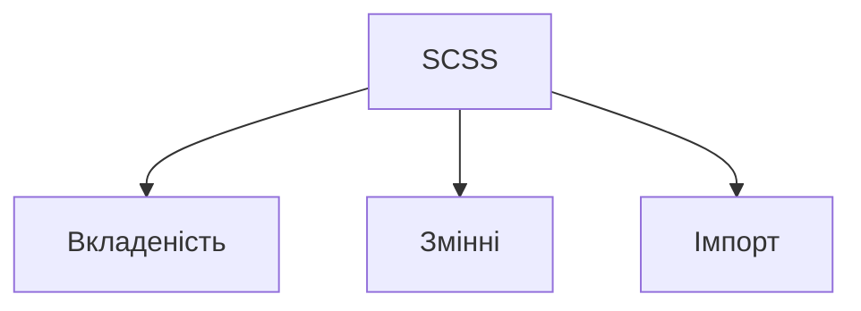

# Синтаксис SCSS: вкладеність, змінні, імпорт

## Вступ

SCSS — це надбудова над CSS, яка дозволяє використовувати розширений синтаксис для створення більш гнучких, структурованих та підтримуваних стилів. Основні механізми SCSS — вкладеність, змінні, імпорт — є фундаментом для побудови складних дизайн-систем.

## Вкладеність

Вкладеність дозволяє писати стилі у вигляді ієрархії, що відповідає структурі HTML. Це робить код більш читабельним та логічним.

### Приклад вкладеності

```scss
.header {
    background: #f5f5f5;
    nav {
        ul {
            list-style: none;
            li {
                display: inline-block;
                a {
                    color: #0077cc;
                    &:hover {
                        color: #005fa3;
                    }
                }
            }
        }
    }
}
```

#### Пояснення механізму

SCSS трансформує вкладеність у плоский CSS, комбінуючи селектори. Це дозволяє уникати дублювання та помилок у складних структурах.

#### Неочевидний приклад вкладеності

```scss
.form {
    input[type="text"] {
        &:focus {
            border-color: #0077cc;
        }
    }
    .error {
        color: red;
        input {
            border-color: red;
        }
    }
}
```

## Змінні

Змінні — це ключовий механізм для централізованого керування стилями. Вони дозволяють зберігати значення кольорів, розмірів, шрифтів тощо.

### Приклад використання змінних

```scss
$primary-color: #0077cc;
$border-radius: 8px;

.button {
    background: $primary-color;
    border-radius: $border-radius;
}
```

#### Пояснення механізму

Змінні оголошуються через `$`, доступні у всіх SCSS-файлах (з урахуванням області видимості). Це спрощує темізацію та рефакторинг.

#### Неочевидний приклад: змінні для темізації

```scss
$theme-light: (
    bg: #fff,
    text: #222,
);
$theme-dark: (
    bg: #222,
    text: #fff,
);

body {
    background: map-get($theme-light, bg);
    color: map-get($theme-light, text);
}
```

## Імпорт

Імпорт дозволяє розбивати стилі на модулі, що підвищує підтримуваність та масштабованість проєкту.

### Приклад імпорту

```scss
// _variables.scss
$main-color: #0077cc;

// _mixins.scss
@mixin flex-center {
    display: flex;
    justify-content: center;
    align-items: center;
}

// styles.scss
@import "variables";
@import "mixins";

.header {
    background: $main-color;
    @include flex-center;
}
```

#### Пояснення механізму

SCSS обробляє директиву `@import` на етапі компіляції, об'єднуючи всі файли у фінальний CSS. З 2020 року рекомендується використовувати `@use` та `@forward` для кращої ізоляції модулів.

#### Неочевидний приклад: імпорт з параметрами

```scss
// _theme.scss
$theme: light !default;

@if $theme == light {
    $bg: #fff;
} @else {
    $bg: #222;
}

// styles.scss
@import "theme";
body {
    background: $bg;
}
```

## Таблиця: Порівняння механізмів

| Механізм    | CSS     | SCSS         |
| ----------- | ------- | ------------ |
| Вкладеність | Немає   | Є            |
| Змінні      | :root   | $variable    |
| Імпорт      | @import | @import/@use |

## Діаграма



## Підводні камені та best practices

-   Надмірна вкладеність ускладнює CSS
-   Змінні слід групувати у окремих файлах
-   Імпорт слід використовувати для модульності
-   Використовуйте `@use` замість `@import` для ізоляції
-   Уникайте глобальних змінних без потреби

## Крос-посилання

-   [SCSS: міксіни та функції](./03-mixins-functions.md)
-   [CSS: змінні](../CSS/07-custom-properties.md)
-   [CSS: методології](../CSS/09-methodologies-scoping.md)

## Підсумок

-   Вкладеність, змінні, імпорт — основа SCSS
-   Неочевидні приклади — для складних кейсів
-   SCSS дозволяє створювати масштабовані, підтримувані стилі
