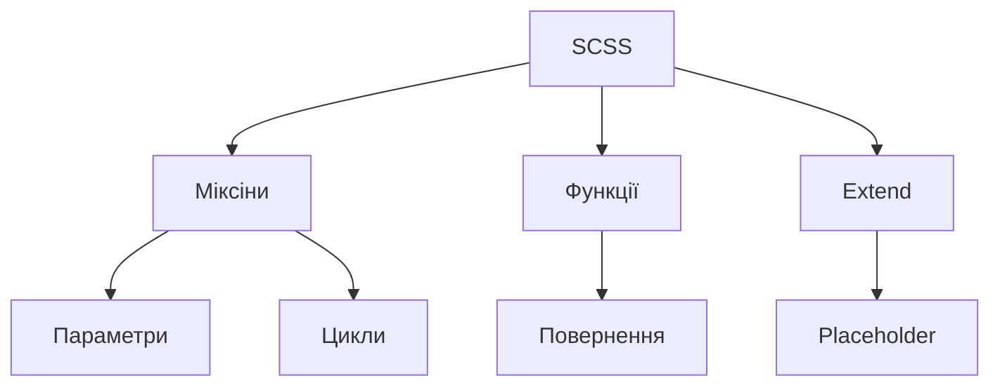

# Міксіни, функції, extends

## Вступ

Міксіни, функції та extends — це фундаментальні механізми SCSS, які дозволяють створювати гнучкі, масштабовані та повторно використовувані стилі. Вони автоматизують рутинні задачі, зменшують дублювання коду та підвищують підтримуваність проєкту.

## Міксіни

Міксіни — це блоки стилів, які можна багаторазово використовувати у різних класах чи елементах. Вони можуть приймати параметри, що робить їх надзвичайно гнучкими.

### Приклад простого міксіна

```scss
@mixin rounded($radius) {
    border-radius: $radius;
}

.button {
    @include rounded(8px);
}
```

#### Пояснення механізму

Міксін оголошується через `@mixin`, а використовується через `@include`. Параметри дозволяють налаштовувати поведінку міксіна для різних компонентів.

### Неочевидний приклад: міксін з умовами

```scss
@mixin theme($mode) {
    @if $mode == "dark" {
        background: #222;
        color: #fff;
    } @else {
        background: #fff;
        color: #222;
    }
}

.card {
    @include theme("dark");
}
```

### Неочевидний приклад: міксін з циклом

```scss
@mixin spacing($property, $steps) {
    @for $i from 1 through $steps {
        .#{$property}-#{$i} {
            #{$property}: $i * 4px;
        }
    }
}

@include spacing(margin, 5);
```

## Функції

Функції в SCSS дозволяють виконувати обчислення, генерувати значення, працювати з картами, списками, кольорами тощо. Вони повертають результат, який можна використовувати у стилях.

### Приклад функції

```scss
@function px-to-rem($px) {
    @return $px / 16 * 1rem;
}

.title {
    font-size: px-to-rem(24);
}
```

#### Пояснення механізму

Функція оголошується через `@function`, повертає значення через `@return`. Можна використовувати у будь-якому місці SCSS-коду.

### Неочевидний приклад: функція для роботи з картами

```scss
$theme: (
    bg: #fff,
    text: #222,
);

@function theme-color($key) {
    @return map-get($theme, $key);
}

body {
    background: theme-color(bg);
    color: theme-color(text);
}
```

### Неочевидний приклад: функція для генерації кольору

```scss
@function shade($color, $percent) {
    @return mix(black, $color, $percent);
}

.button {
    background: shade(#0077cc, 20%);
}
```

## Extend

Extend (`@extend`) дозволяє наслідувати стилі від інших селекторів або placeholder-класів (`%`). Це зменшує дублювання та забезпечує консистентність стилів.

### Приклад extend

```scss
%button-base {
    padding: 8px 16px;
    border-radius: 4px;
    font-weight: bold;
}

.button {
    @extend %button-base;
    background: #0077cc;
    color: #fff;
}
```

#### Пояснення механізму

Extend об'єднує стилі у фінальному CSS, дозволяючи використовувати спільні властивості у різних класах.

### Неочевидний приклад: extend для складних компонентів

```scss
%card-base {
    box-shadow: 0 2px 8px rgba(0, 0, 0, 0.1);
    border-radius: 8px;
}

.card-primary {
    @extend %card-base;
    background: #0077cc;
    color: #fff;
}

.card-secondary {
    @extend %card-base;
    background: #f5f5f5;
    color: #222;
}
```

## Під капотом: як працюють міксіни, функції, extends

-   **Міксіни**: вставляють код у місце використання, можуть приймати параметри, виконувати цикли, умови
-   **Функції**: повертають значення, використовуються для обчислень, генерації стилів
-   **Extend**: об'єднує селектори, зменшує дублювання

## Діаграма



## Best practices

-   Використовуйте міксіни для повторюваних фрагментів
-   Функції — для обчислень, генерації значень
-   Extend — для спільних стилів, але уникайте надмірного extend (може ускладнити CSS)
-   Групуйте міксіни, функції, placeholder-и у окремих файлах
-   Використовуйте параметри для гнучкості
-   Уникайте глобальних міксінів без потреби

## Підводні камені

-   Надмірне extend може призвести до складного CSS
-   Міксіни з великою кількістю параметрів — важко підтримувати
-   Функції з побічними ефектами — неочікувана поведінка
-   Extend не працює з медіа-запитами

## Крос-посилання

-   [SCSS: синтаксис](./02-syntax.md)
-   [SCSS: цикли та умови](./04-loops-conditions.md)
-   [CSS: методології](../CSS/09-methodologies-scoping.md)

## Підсумок

-   Міксіни, функції, extends — основа гнучкості SCSS
-   Неочевидні приклади — для автоматизації, генерації, масштабування
-   Best practices — групування, параметризація, уникнення надмірного extend
