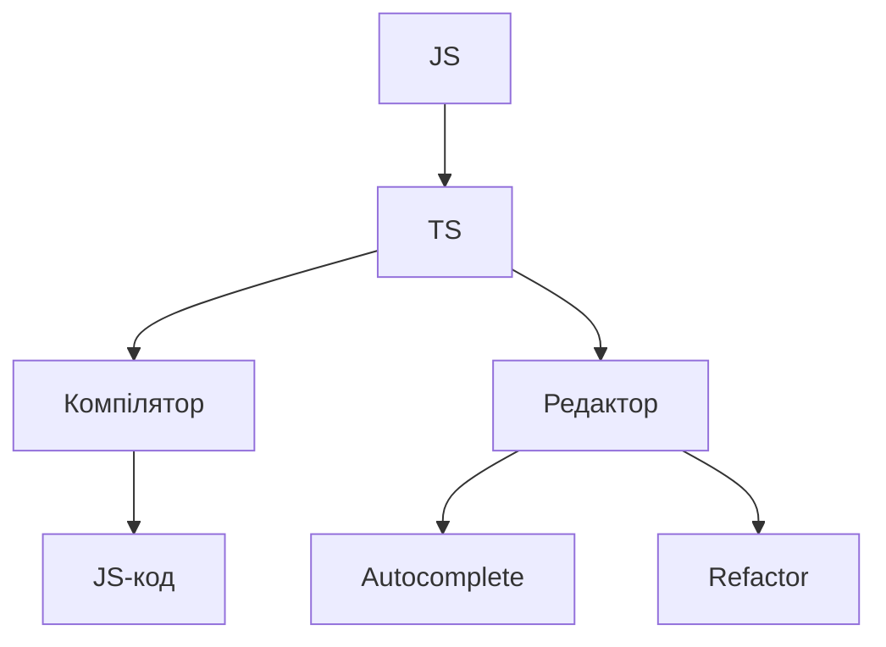

# Вступ: історія, роль TypeScript, інтеграція з JS

## Вступ

TypeScript — це надбудова над JavaScript, яка додає статичну типізацію, розширює можливості розробки та підвищує якість коду. TS став стандартом для великих проєктів, фреймворків, бібліотек і корпоративних застосунків.

## Історія/Походження

-   **2012:** Microsoft презентує TypeScript як відповідь на складність масштабування JS-проєктів
-   **2014+:** Підтримка у популярних фреймворках (Angular, React, Vue)
-   **2016+:** TypeScript стає стандартом для корпоративних застосунків
-   **2020+:** TS інтегрується у build-системи, редактори, CI/CD

### Віхи розвитку

-   Від простого препроцесора до повноцінної мови
-   Від ручної типізації до автоматичного виведення типів
-   Від окремих проєктів до інтеграції у екосистему JS

## Роль TypeScript у сучасній розробці

-   Статична типізація — виявлення помилок на етапі компіляції
-   Автоматичне виведення типів — зменшення кількості ручної роботи
-   Інтеграція з редакторами — автодоповнення, рефакторинг
-   Підтримка сучасного синтаксису JS
-   Модульність, масштабованість, підтримуваність
-   Інтеграція з фреймворками, бібліотеками, build-системами

## Інтеграція з JavaScript

TypeScript повністю сумісний з JS:

-   Можна поступово мігрувати код
-   TS-код компілюється у чистий JS
-   Підтримка всіх стандартів ECMAScript
-   Можна використовувати JS-бібліотеки через типи (DefinitelyTyped)

### Приклад інтеграції

```ts
// JS-код
function sum(a, b) {
    return a + b;
}
// TS-код
function sum(a: number, b: number): number {
    return a + b;
}
```

### Використання JS-бібліотек у TS

```ts
import _ from "lodash";
const arr: number[] = [1, 2, 3];
console.log(_.shuffle(arr));
```

## Неочевидні приклади

### 1. Поступова міграція

```ts
// Файл .js
function greet(name) {
    return "Hello, " + name;
}
// Файл .ts
function greet(name: string): string {
    return "Hello, " + name;
}
```

### 2. Використання any для legacy-коду

```ts
function process(data: any) {
    // ...
}
```

### 3. Додавання типів через JSDoc

```js
/**
 * @param {number} a
 * @param {number} b
 * @returns {number}
 */
function sum(a, b) {
    return a + b;
}
```

## Пояснення під капотом

-   TS — компілюється у JS через tsc
-   Типи — лише для розробки, не потрапляють у фінальний код
-   Інтеграція з JS — поступова, без втрати функціоналу

## Підводні камені

-   Надмірне використання any — втрата переваг TS
-   Legacy-код — складна міграція
-   Відмінності у типах між JS та TS
-   Не всі JS-бібліотеки мають типи

## Best practices

-   Міграція — поступова, через jsdoc, any, типи
-   Використовуйте типи для API, компонентів, моделей
-   Документуйте типи
-   Використовуйте редактор з підтримкою TS
-   Тестуйте інтеграцію з JS-бібліотеками

## Діаграми



## Крос-посилання

-   [Типи, інтерфейси, generics](./02-types-interfaces.md)
-   [Best practices](./10-best-practices.md)
-   [JavaScript: історія, роль](../JavaScript/01-intro.md)

## Підсумок

-   TypeScript — надбудова над JS для типізації та масштабованості
-   Поступова інтеграція — ключ до успішної міграції
-   Best practices — типи, документація, редактор, тестування
-   Підводні камені — any, legacy, типи бібліотек
