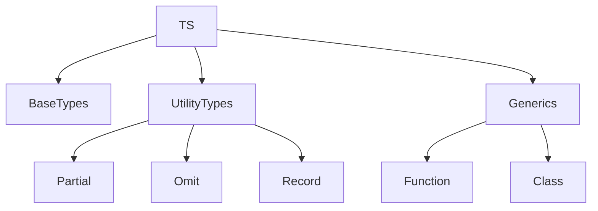

# Типізація: базові типи, utility types, generics

## Вступ

Типізація — фундаментальний механізм TypeScript, який забезпечує безпеку, передбачуваність та підтримуваність коду. TS дозволяє використовувати базові типи, utility types та generics для створення гнучких, масштабованих застосунків.

## Базові типи

TypeScript підтримує всі типи JavaScript, а також додає власні:

-   string
-   number
-   boolean
-   null
-   undefined
-   any
-   unknown
-   never
-   void
-   object
-   array
-   tuple
-   enum

### Приклад

```ts
let str: string = "Hello";
let num: number = 42;
let arr: number[] = [1, 2, 3];
let tup: [string, number] = ["age", 30];
enum Color {
    Red,
    Green,
    Blue,
}
let c: Color = Color.Green;
```

### Особливості

-   any — відсутність типізації
-   unknown — тип, який потрібно уточнити
-   never — функція, яка не повертає значення
-   void — функція, яка нічого не повертає

## Utility types

Utility types — це вбудовані типи для трансформації, комбінування та уточнення типів.

### Основні utility types

-   Partial<T>
-   Required<T>
-   Readonly<T>
-   Pick<T, K>
-   Omit<T, K>
-   Record<K, T>
-   Exclude<T, U>
-   Extract<T, U>
-   ReturnType<T>
-   Parameters<T>

#### Приклад

```ts
interface User {
    name: string;
    age: number;
}
const partialUser: Partial<User> = { name: "Alice" };
const readonlyUser: Readonly<User> = { name: "Bob", age: 25 };
```

### Неочевидний приклад: Omit

```ts
type UserNoAge = Omit<User, "age">;
const user: UserNoAge = { name: "Alice" };
```

### Неочевидний приклад: Record

```ts
type Scores = Record<string, number>;
const scores: Scores = { math: 90, physics: 85 };
```

## Generics

Generics — це механізм для створення гнучких, типобезпечних функцій, класів, інтерфейсів.

### Основи

-   <T> — параметр типу
-   Можна обмежувати типи через extends

#### Приклад

```ts
function identity<T>(value: T): T {
    return value;
}
const str = identity<string>("Hello");
const num = identity<number>(42);
```

### Неочевидний приклад: обмеження типу

```ts
function getLength<T extends { length: number }>(item: T): number {
    return item.length;
}
console.log(getLength("Hello"));
console.log(getLength([1, 2, 3]));
```

### Неочевидний приклад: generic клас

```ts
class Box<T> {
    value: T;
    constructor(value: T) {
        this.value = value;
    }
}
const box = new Box<number>(123);
```

## Пояснення під капотом

-   Типи — лише для розробки, не потрапляють у JS
-   Utility types — трансформують типи на етапі компіляції
-   Generics — дозволяють створювати універсальні структури

## Підводні камені

-   any — втрата переваг типізації
-   never — складно дебажити
-   Generics — складна типова логіка
-   Utility types — можуть ускладнити читання коду

## Best practices

-   Використовуйте типи для всіх змінних, параметрів, повернень
-   Уникайте any, використовуйте unknown
-   Документуйте складні utility types та generics
-   Тестуйте типову логіку
-   Використовуйте utility types для DRY

## Діаграми



## Крос-посилання

-   [Вступ: історія, роль TypeScript](./01-intro.md)
-   [Інтерфейси, типи, generics](./03-interfaces.md)
-   [Best practices](./10-best-practices.md)

## Підсумок

-   Типізація — основа безпеки та підтримуваності TS
-   Utility types — для трансформації типів
-   Generics — для гнучкості та універсальності
-   Best practices — типи, документація, тестування
-   Підводні камені — any, складна типова логіка
