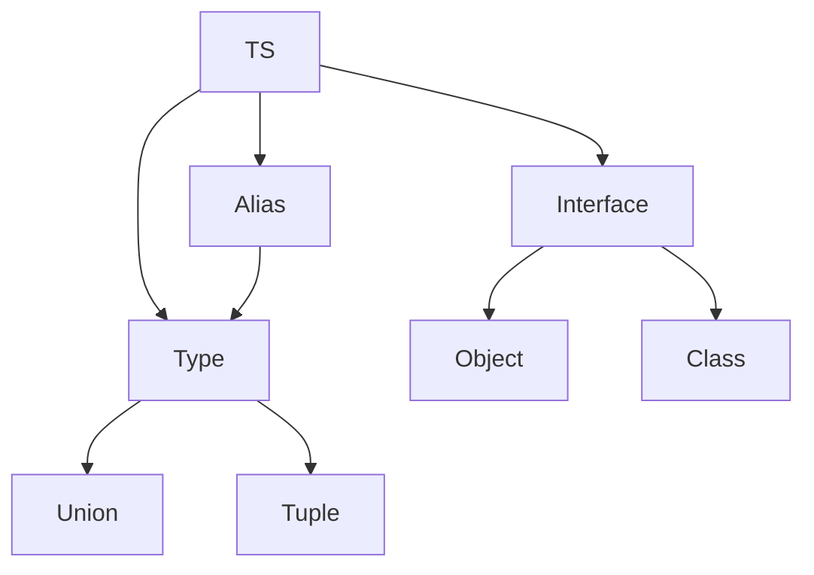

# Інтерфейси, типи, alias

## Вступ

Інтерфейси, типи та alias — це фундаментальні механізми TypeScript для опису структури даних, контрактів між компонентами та гнучкої типізації. Від їх правильного використання залежить підтримуваність, масштабованість та безпека коду.

## Інтерфейси (interface)

Інтерфейс — це контракт, який описує структуру об’єкта, класу чи функції. Інтерфейси дозволяють створювати гнучкі, розширювані типи.

### Основи

```ts
interface User {
    name: string;
    age: number;
}
const u: User = { name: "Alice", age: 30 };
```

### Розширення інтерфейсів

```ts
interface Person {
    name: string;
}
interface Employee extends Person {
    position: string;
}
const e: Employee = { name: "Bob", position: "dev" };
```

### Інтерфейси для функцій

```ts
interface Logger {
    (msg: string): void;
}
const log: Logger = (msg) => console.log(msg);
```

## Типи (type)

type — це alias для будь-якої структури: об’єкта, union, intersection, tuple, функції.

### Основи

```ts
type Point = { x: number; y: number };
const p: Point = { x: 1, y: 2 };
```

### Union та intersection

```ts
type Status = "active" | "inactive";
type UserStatus = User & { status: Status };
```

### Tuple

```ts
type Pair = [string, number];
const pair: Pair = ["age", 30];
```

## Alias

Alias — це альтернативна назва для типу чи інтерфейсу. Дозволяє скорочувати, комбінувати, уточнювати типи.

### Приклад alias

```ts
type ID = string | number;
function getUser(id: ID) {
    /* ... */
}
```

## Відмінності interface vs type

| Особливість        | interface         | type     |
| ------------------ | ----------------- | -------- |
| Опис структури     | Так               | Так      |
| Union/Intersection | Ні                | Так      |
| Tuple              | Ні                | Так      |
| Розширення         | extends           | &        |
| Декларативність    | Можна розширювати | Не можна |

## Неочевидні приклади

### 1. Розширення через type

```ts
type A = { x: number };
type B = A & { y: number };
const b: B = { x: 1, y: 2 };
```

### 2. Інтерфейс для класу

```ts
interface Service {
    start(): void;
    stop(): void;
}
class MyService implements Service {
    start() {}
    stop() {}
}
```

### 3. Тип для функції

```ts
type Callback = (msg: string) => void;
const cb: Callback = (m) => console.log(m);
```

### 4. Alias для union

```ts
type Result = "success" | "error";
```

## Пояснення під капотом

-   Інтерфейси — декларативні, розширювані, для об’єктів, класів
-   Типи — універсальні, для будь-яких структур
-   Alias — скорочення, комбінування типів

## Підводні камені

-   Надмірне використання type — складна типова логіка
-   Інтерфейси не підтримують union/tuple
-   Alias — може ускладнити читання коду
-   Розширення через & — не завжди очевидне

## Best practices

-   Використовуйте interface для об’єктів, класів
-   Використовуйте type для union, tuple, alias
-   Документуйте складні типи
-   Уникайте дублювання типів
-   Тестуйте типову логіку

## Діаграми



## Крос-посилання

-   [Типізація: базові типи, utility types, generics](./02-types.md)
-   [Best practices](./10-best-practices.md)
-   [Advanced patterns](../JavaScript/13-advanced-patterns.md)

## Підсумок

-   Інтерфейси — для контрактів, об’єктів, класів
-   Типи — для alias, union, tuple, функцій
-   Alias — для скорочення, комбінування
-   Best practices — документація, тестування, уникнення дублювання
-   Підводні камені — складна типова логіка, неочевидне розширення
