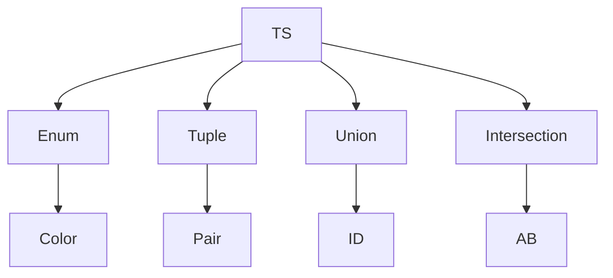

# Enum, tuple, union, intersection

## Вступ

Enum, tuple, union та intersection — це фундаментальні механізми TypeScript для опису складних типів, структур даних та гнучкої типізації. Вони дозволяють створювати безпечний, масштабований та читабельний код.

## Enum

Enum — це перелік іменованих констант, який дозволяє описувати фіксовані множини значень.

### Основи

```ts
enum Color {
    Red,
    Green,
    Blue,
}
const c: Color = Color.Green;
```

### Неочевидний приклад: string enum

```ts
enum Status {
    Active = "active",
    Inactive = "inactive",
}
const s: Status = Status.Active;
```

### Особливості

-   Можна використовувати як тип
-   Підтримка числових та рядкових значень
-   Reverse mapping для числових enum

## Tuple

Tuple — це масив з фіксованою кількістю елементів, кожен з яких має свій тип.

### Основи

```ts
type Pair = [string, number];
const p: Pair = ["age", 30];
```

### Неочевидний приклад: tuple з optional

```ts
type Triple = [string, number?, boolean?];
const t: Triple = ["x"];
```

### Особливості

-   Доступ до елементів через індекс
-   Можна використовувати для параметрів функцій

## Union

Union — це тип, який може приймати кілька варіантів значень.

### Основи

```ts
type ID = string | number;
let id: ID = "abc";
id = 123;
```

### Неочевидний приклад: union для функцій

```ts
function print(val: string | number) {
    console.log(val);
}
```

### Особливості

-   Перевірка типу через typeof, instanceof
-   Можна комбінувати з alias

## Intersection

Intersection — це тип, який поєднує властивості кількох типів.

### Основи

```ts
type A = { x: number };
type B = { y: number };
type AB = A & B;
const ab: AB = { x: 1, y: 2 };
```

### Неочевидний приклад: intersection для розширення

```ts
type Person = { name: string };
type Employee = Person & { position: string };
const e: Employee = { name: "Bob", position: "dev" };
```

### Особливості

-   Поєднує всі властивості типів
-   Можна використовувати для складних структур

## Пояснення під капотом

-   Enum — компілюється у об’єкт JS
-   Tuple — масив з фіксованою структурою
-   Union — перевірка типу під час виконання
-   Intersection — об’єднання властивостей

## Підводні камені

-   Enum — reverse mapping лише для числових
-   Tuple — складна робота з optional
-   Union — складна логіка перевірки типу
-   Intersection — дублювання властивостей

## Best practices

-   Використовуйте enum для фіксованих множин
-   Tuple — для структур з фіксованою кількістю елементів
-   Union — для гнучких API
-   Intersection — для розширення типів
-   Документуйте складні типи
-   Тестуйте edge cases

## Діаграми



## Крос-посилання

-   [Інтерфейси, типи, alias](./03-interfaces-alias.md)
-   [Типізація: базові типи, utility types, generics](./02-types.md)
-   [Best practices](./10-best-practices.md)

## Підсумок

-   Enum — для фіксованих множин
-   Tuple — для структур з фіксованою кількістю елементів
-   Union — для гнучких типів
-   Intersection — для розширення
-   Best practices — документація, тестування, уникнення дублювання
-   Підводні камені — reverse mapping, optional, складна логіка
