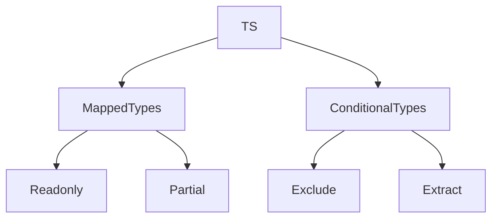

# Advanced patterns: mapped types, conditional types

## Вступ

Advanced patterns — це потужні механізми TypeScript для створення гнучких, типобезпечних та масштабованих структур. Mapped types та conditional types дозволяють автоматизувати трансформацію типів, створювати складні API та уникати дублювання.

## Mapped types

Mapped types — це типи, які створюються шляхом перебору властивостей іншого типу та трансформації їх.

### Основи

```ts
type ReadonlyUser = {
    readonly [K in keyof User]: User[K];
};
```

### Вбудовані mapped types

-   Readonly<T>
-   Partial<T>
-   Required<T>
-   Pick<T, K>
-   Record<K, T>

#### Приклад: Partial

```ts
interface User {
    name: string;
    age: number;
}
const u: Partial<User> = { name: "Alice" };
```

### Неочевидний приклад: кастомний mapped type

```ts
type Nullable<T> = {
    [K in keyof T]: T[K] | null;
};
const user: Nullable<User> = { name: null, age: 30 };
```

## Conditional types

Conditional types — це типи, які залежать від умови, визначеної через extends.

### Основи

```ts
type IsString<T> = T extends string ? true : false;
let a: IsString<"abc">; // true
let b: IsString<123>; // false
```

### Вбудовані conditional types

-   Exclude<T, U>
-   Extract<T, U>
-   ReturnType<T>
-   Parameters<T>

#### Приклад: Exclude

```ts
type Status = "active" | "inactive" | "pending";
type NotPending = Exclude<Status, "pending">; // 'active' | 'inactive'
```

### Неочевидний приклад: conditional для розширення

```ts
type ElementType<T> = T extends (infer U)[] ? U : T;
type A = ElementType<string[]>; // string
type B = ElementType<number>; // number
```

## Пояснення під капотом

-   Mapped types — перебирають ключі типу, трансформують властивості
-   Conditional types — визначають тип залежно від умови
-   Всі advanced patterns — працюють лише на етапі компіляції

## Підводні камені

-   Складна типова логіка — важко читати та дебажити
-   Надмірне використання mapped/conditional — ускладнює підтримку
-   Неочевидні помилки при складних умовах
-   Можливі проблеми з inference

## Best practices

-   Використовуйте mapped types для DRY
-   Conditional types — для складних API
-   Документуйте складні типи
-   Тестуйте типову логіку
-   Уникайте надмірної вкладеності

## Діаграми



## Неочевидні приклади

### 1. Мapped type для readonly

```ts
type MyReadonly<T> = {
    readonly [K in keyof T]: T[K];
};
```

### 2. Conditional type для функцій

```ts
type FuncReturn<T> = T extends (...args: any[]) => infer R ? R : never;
function foo(): number {
    return 42;
}
type R = FuncReturn<typeof foo>; // number
```

### 3. Комбінування mapped та conditional

```ts
type NullableProps<T> = {
    [K in keyof T]: T[K] extends string ? string | null : T[K];
};
```

## Крос-посилання

-   [Типізація: базові типи, utility types, generics](./02-types.md)
-   [Інтерфейси, типи, alias](./03-interfaces-alias.md)
-   [Best practices](./10-best-practices.md)

## Підсумок

-   Mapped types — автоматизація трансформації типів
-   Conditional types — гнучкість, складна логіка
-   Best practices — документація, тестування, уникнення надмірної складності
-   Підводні камені — складна типова логіка, inference
