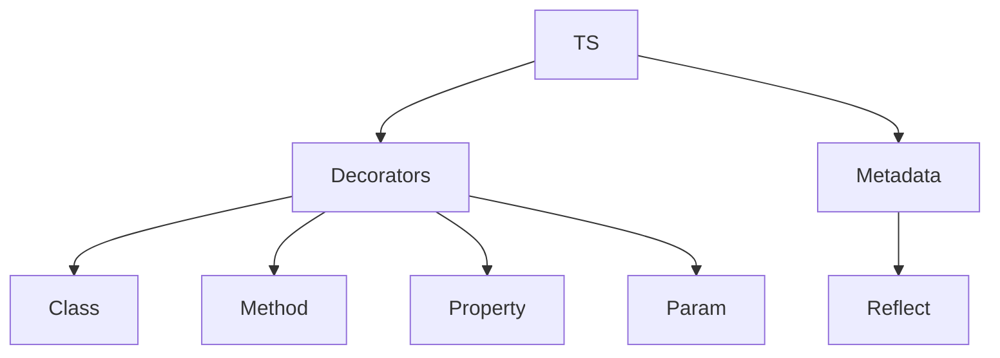

# Декоратори, metadata

## Вступ

Декоратори та metadata — це потужні механізми TypeScript для розширення функціоналу класів, методів, властивостей та параметрів. Вони дозволяють автоматизувати логіку, створювати фреймворки, впроваджувати DI, логування, валідацію та інші advanced patterns.

## Декоратори

Декоратор — це спеціальна функція, яка може змінювати або розширювати поведінку класу, методу, властивості чи параметра. Декоратори працюють на етапі компіляції.

### Основи

-   Декоратори позначаються через @
-   Потрібно увімкнути experimentalDecorators у tsconfig.json

#### Приклад: декоратор класу

```ts
function Logger(constructor: Function) {
    console.log("Class created:", constructor.name);
}
@Logger
class MyClass {}
```

#### Приклад: декоратор методу

```ts
function Log(target: any, propertyKey: string, descriptor: PropertyDescriptor) {
    const original = descriptor.value;
    descriptor.value = function (...args: any[]) {
        console.log(`Call: ${propertyKey} with`, args);
        return original.apply(this, args);
    };
}
class Service {
    @Log
    run(x: number) {
        return x * 2;
    }
}
```

#### Приклад: декоратор властивості

```ts
function Readonly(target: any, key: string) {
    Object.defineProperty(target, key, {
        writable: false,
    });
}
class Config {
    @Readonly
    name = "App";
}
```

### Неочевидний приклад: декоратор параметра

```ts
function ParamLog(target: any, propertyKey: string, parameterIndex: number) {
    console.log(`Parameter in ${propertyKey} at index ${parameterIndex}`);
}
class Controller {
    run(@ParamLog id: number) {}
}
```

## Metadata

Metadata — це додаткова інформація про клас, метод, властивість чи параметр, яку можна зчитувати та використовувати у рантаймі.

### Основи

-   Потрібно увімкнути emitDecoratorMetadata у tsconfig.json
-   Використовується бібліотека reflect-metadata

#### Приклад: зберігання metadata

```ts
import "reflect-metadata";
function Type(type: string) {
    return Reflect.metadata("design:type", type);
}
class Model {
    @Type("string")
    name: string;
}
console.log(Reflect.getMetadata("design:type", Model.prototype, "name"));
```

### Неочевидний приклад: DI через metadata

```ts
function Injectable(target: any) {
    // зберігає типи залежностей
}
@Injectable
class Service {}
```

## Пояснення під капотом

-   Декоратори — функції, які змінюють/розширюють клас, метод, властивість
-   Metadata — зберігається через Reflect API
-   Працюють лише у TypeScript, не потрапляють у JS

## Підводні камені

-   Потрібно увімкнути experimentalDecorators, emitDecoratorMetadata
-   Декоратори не підтримуються у чистому JS
-   Можливі конфлікти при багатьох декораторах
-   Metadata — потребує Reflect API
-   Складна логіка — важко дебажити

## Best practices

-   Використовуйте декоратори для DI, логування, валідації
-   Документуйте всі декоратори
-   Тестуйте складну логіку
-   Уникайте надмірної вкладеності декораторів
-   Використовуйте metadata для автоматизації

## Діаграми



## Неочевидні приклади

### 1. Декоратор для кешування

```ts
function Cache(target: any, key: string, descriptor: PropertyDescriptor) {
    const cache = new Map();
    const original = descriptor.value;
    descriptor.value = function (arg: any) {
        if (cache.has(arg)) return cache.get(arg);
        const result = original.call(this, arg);
        cache.set(arg, result);
        return result;
    };
}
class Math {
    @Cache
    fib(n: number): number {
        if (n < 2) return n;
        return this.fib(n - 1) + this.fib(n - 2);
    }
}
```

### 2. Декоратор для валідації

```ts
function Validate(target: any, key: string, descriptor: PropertyDescriptor) {
    const original = descriptor.value;
    descriptor.value = function (...args: any[]) {
        if (args.some((a) => a == null)) throw new Error("Invalid arg");
        return original.apply(this, args);
    };
}
class User {
    @Validate
    setName(name: string) {
        this.name = name;
    }
}
```

## Крос-посилання

-   [Advanced patterns: mapped types, conditional types](./05-advanced-patterns.md)
-   [Best practices](./10-best-practices.md)
-   [JavaScript: advanced patterns](../JavaScript/13-advanced-patterns.md)

## Підсумок

-   Декоратори — для розширення класів, методів, властивостей
-   Metadata — для зберігання додаткової інформації
-   Best practices — документація, тестування, автоматизація
-   Підводні камені — конфлікти, складна логіка, налаштування
