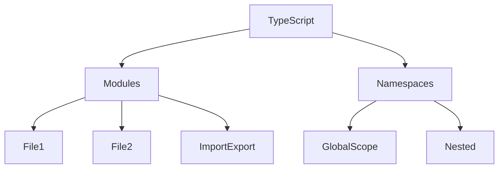

# Робота з модулями та namespaces

## Вступ

Модулі та простори імен (namespaces) — це фундаментальні механізми організації коду в TypeScript. Вони дозволяють структурувати великі проєкти, ізолювати логіку, уникати конфліктів і підвищувати масштабованість.

## Модулі

Модуль — це файл, який експортує та імпортує сутності (класи, функції, змінні, типи). Модулі ізолюють код, дозволяють розбивати проєкт на частини.

### Основи

-   Кожен файл — окремий модуль
-   Експорт: `export`, імпорт: `import`
-   Модулі бувають ES6 та CommonJS

#### Приклад: експорт та імпорт

```ts
// math.ts
export function add(a: number, b: number) {
    return a + b;
}
// app.ts
import { add } from "./math";
console.log(add(2, 3));
```

### Динамічний імпорт

```ts
async function loadMath() {
    const math = await import("./math");
    console.log(math.add(1, 2));
}
```

### Неочевидний приклад: реекспорт

```ts
// utils.ts
export * from "./math";
```

### Модулі та типи

```ts
// types.ts
export type User = { name: string };
// app.ts
import type { User } from "./types";
```

## Namespaces

Namespace — це логічна група сутностей всередині одного файлу або декількох файлів. Використовуються для ізоляції, коли немає модулів.

### Основи

-   Оголошуються через `namespace`
-   Використовується оператор `export` для доступу
-   Підтримуються лише у старих проєктах

#### Приклад: namespace

```ts
namespace Geometry {
    export function area(r: number) {
        return Math.PI * r * r;
    }
}
console.log(Geometry.area(2));
```

### Неочевидний приклад: вкладені namespaces

```ts
namespace App {
    export namespace Models {
        export class User {
            constructor(public name: string) {}
        }
    }
}
const user = new App.Models.User("Ivan");
```

### Namespace та модулі

-   Не можна змішувати namespace та модулі в одному файлі
-   Якщо є `import`/`export` — це вже модуль

## Пояснення під капотом

-   Модулі — це ізольовані області видимості
-   Namespace — це логічна група у глобальному scope
-   Модулі компілюються у JS-файли, namespace — у глобальний об'єкт

## Підводні камені

-   Не можна змішувати модулі та namespace
-   Namespace не підтримуються у сучасних фреймворках
-   Модулі — стандарт для сучасного TypeScript
-   Можливі конфлікти імен у глобальному scope

## Best practices

-   Використовуйте модулі для всіх нових проєктів
-   Namespace — лише для legacy-коду
-   Документуйте структуру модулів
-   Уникайте глобальних змінних
-   Використовуйте реекспорт для зручності

## Діаграми



## Неочевидні приклади

### 1. Модуль з приватними змінними

```ts
// counter.ts
let count = 0;
export function inc() {
    count++;
}
export function get() {
    return count;
}
```

### 2. Namespace для ізоляції типів

```ts
namespace Types {
    export type User = { name: string };
    export type Product = { price: number };
}
let u: Types.User = { name: "Ivan" };
```

## Крос-посилання

-   [Типи, інтерфейси](./02-types.md)
-   [Advanced patterns](./05-advanced-patterns.md)
-   [JavaScript: модулі](../JavaScript/09-modules.md)

## Підсумок

-   Модулі — для ізоляції та структурування
-   Namespace — для групування у legacy-коді
-   Best practices — модулі, документація, реекспорт
-   Підводні камені — конфлікти, несумісність із сучасними фреймворками
