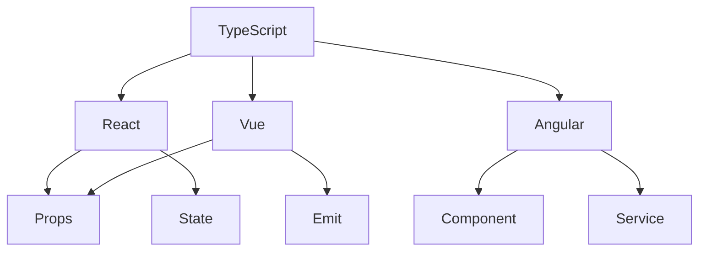

# Інтеграція з фреймворками: React, Vue, Angular

## Вступ

TypeScript став стандартом для розробки сучасних фронтенд-фреймворків. Його типізація, автодоповнення та перевірка помилок значно підвищують якість коду у React, Vue та Angular.

## React + TypeScript

### Основи

-   Встановлення: `npm install --save typescript @types/react @types/react-dom`
-   Файли мають розширення `.tsx`
-   Типізація props, state, refs

#### Приклад: типізація props

```tsx
interface ButtonProps {
    label: string;
    onClick: () => void;
}
const Button: React.FC<ButtonProps> = ({ label, onClick }) => (
    <button onClick={onClick}>{label}</button>
);
```

#### Неочевидний приклад: generic-компонент

```tsx
function List<T>({ items }: { items: T[] }) {
    return (
        <ul>
            {items.map((i, idx) => (
                <li key={idx}>{i}</li>
            ))}
        </ul>
    );
}
```

### Типізація useState, useRef

```tsx
const [count, setCount] = React.useState<number>(0);
const inputRef = React.useRef<HTMLInputElement>(null);
```

### Підводні камені

-   Не всі бібліотеки мають типи
-   Можливі проблеми з generic-типами
-   Складна типізація HOC

## Vue + TypeScript

### Основи

-   Встановлення: `npm install --save-dev typescript`
-   Файли: `.ts`, `.vue` (з <script lang="ts">)
-   Використання Composition API

#### Приклад: типізація props у Vue 3

```ts
<script lang="ts">
import { defineComponent } from 'vue';
export default defineComponent({
  props: {
    count: Number
  },
  setup(props) {
    // props.count: number
  }
});
</script>
```

#### Неочевидний приклад: типізація emit

```ts
<script lang="ts">
import { defineComponent, SetupContext } from 'vue';
export default defineComponent({
  setup(_, ctx: SetupContext) {
    ctx.emit('update', 42);
  }
});
</script>
```

### Підводні камені

-   Складна інтеграція з legacy-кодом
-   Не всі плагіни підтримують типи
-   Можливі проблеми з типізацією шаблонів

## Angular + TypeScript

### Основи

-   TypeScript — стандарт для Angular
-   Типізація компонентів, сервісів, DI
-   Використання декораторів

#### Приклад: типізація компоненту

```ts
import { Component } from "@angular/core";
@Component({
    selector: "app-root",
    template: `<h1>{{ title }}</h1>`,
})
export class AppComponent {
    title: string = "Hello";
}
```

#### Неочевидний приклад: типізація DI

```ts
import { Injectable } from "@angular/core";
@Injectable({ providedIn: "root" })
export class DataService {
    getData(): string[] {
        return ["a", "b"];
    }
}
```

### Підводні камені

-   Складна типізація RxJS
-   Можливі конфлікти типів при DI
-   Велика кількість boilerplate

## Пояснення під капотом

-   React: типи для props, state, refs, generic-компоненти
-   Vue: типи для props, emit, шаблонів
-   Angular: типи для компонентів, сервісів, DI
-   Всі фреймворки використовують типи для автодоповнення та перевірки

## Best practices

-   Використовуйте типи для всіх props, state, emit
-   Документуйте типи компонентів
-   Використовуйте generic-компоненти
-   Тестуйте типи через unit-тести
-   Уникайте any

## Діаграми



## Неочевидні приклади

### 1. Типізація контексту у React

```tsx
interface ThemeContextType {
    theme: string;
    setTheme: (t: string) => void;
}
const ThemeContext = React.createContext<ThemeContextType | undefined>(
    undefined
);
```

### 2. Типізація slot у Vue

```ts
<script lang="ts">
import { defineComponent } from 'vue';
export default defineComponent({
  setup(_, { slots }) {
    // slots.default: (() => VNode[]) | undefined
  }
});
</script>
```

### 3. Типізація сервісу у Angular

```ts
import { Injectable } from "@angular/core";
@Injectable({ providedIn: "root" })
export class LoggerService {
    log(msg: string): void {
        console.log(msg);
    }
}
```

## Крос-посилання

-   [Декоратори, metadata](./06-decorators-metadata.md)
-   [Advanced patterns](./05-advanced-patterns.md)
-   [JavaScript: фреймворки](../JavaScript/14-frameworks.md)

## Підсумок

-   TypeScript — стандарт для React, Vue, Angular
-   Типізація props, state, emit, DI — ключ до якості
-   Best practices — типізація, документація, generic-компоненти
-   Підводні камені — legacy-код, boilerplate, конфлікти типів
