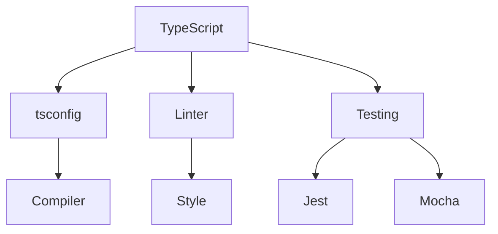

# Інструменти: tsconfig, linter, тестування

## Вступ

Інструменти — це фундамент для якісної роботи з TypeScript. Вони забезпечують контроль над компіляцією, перевірку стилю коду, автоматичне тестування та CI/CD.

## tsconfig.json

`tsconfig.json` — це конфігураційний файл, який визначає параметри компілятора TypeScript.

### Основи

-   `compilerOptions`: налаштування компіляції
-   `include`, `exclude`: які файли компілювати
-   Важливі опції: `strict`, `target`, `module`, `esModuleInterop`, `experimentalDecorators`, `emitDecoratorMetadata`

#### Приклад tsconfig.json

```json
{
    "compilerOptions": {
        "target": "ES2020",
        "module": "commonjs",
        "strict": true,
        "esModuleInterop": true,
        "experimentalDecorators": true,
        "emitDecoratorMetadata": true
    },
    "include": ["src/**/*"],
    "exclude": ["node_modules"]
}
```

### Неочевидний приклад: розділені конфіги

```json
// tsconfig.base.json
{
  "compilerOptions": { "strict": true }
}
// tsconfig.prod.json
{
  "extends": "./tsconfig.base.json",
  "compilerOptions": { "removeComments": true }
}
```

## Linter

Linter — це інструмент для перевірки стилю та якості коду.

### Основи

-   Найпопулярніший: ESLint
-   Підтримка TypeScript через плагін `@typescript-eslint`
-   Конфігурація у `.eslintrc.js` або `.eslintrc.json`

#### Приклад конфігурації ESLint

```js
module.exports = {
    parser: "@typescript-eslint/parser",
    plugins: ["@typescript-eslint"],
    extends: ["eslint:recommended", "plugin:@typescript-eslint/recommended"],
    rules: {
        "@typescript-eslint/no-unused-vars": "error",
        semi: ["error", "always"],
    },
};
```

### Неочевидний приклад: кастомний rule

```js
module.exports = {
    rules: {
        "no-console": "warn",
        "@typescript-eslint/explicit-function-return-type": "warn",
    },
};
```

## Тестування

Тестування — це процес перевірки працездатності коду.

### Основи

-   Найпопулярніші фреймворки: Jest, Mocha, Jasmine
-   Підтримка TypeScript через `ts-jest` або `@types/jest`
-   Тестування функцій, класів, компонентів

#### Приклад: тестування функції

```ts
// sum.ts
export function sum(a: number, b: number) {
    return a + b;
}
// sum.test.ts
import { sum } from "./sum";
test("sum adds numbers", () => {
    expect(sum(2, 3)).toBe(5);
});
```

### Неочевидний приклад: тестування типів

```ts
// types.test.ts
import type { User } from "./types";
type Test = User extends { name: string } ? true : false;
const result: Test = true;
```

## Пояснення під капотом

-   tsconfig — керує компіляцією, strict-режим
-   Linter — перевіряє стиль, знаходить помилки
-   Тести — гарантують працездатність
-   Всі інструменти інтегруються у CI/CD

## Підводні камені

-   Неправильна конфігурація tsconfig — помилки компіляції
-   Linter може конфліктувати з форматтером
-   Тести можуть бути повільними
-   Не всі типи покриваються тестами

## Best practices

-   Використовуйте strict-режім у tsconfig
-   Налаштовуйте linter для всіх файлів
-   Пишіть unit-тести для всіх функцій
-   Інтегруйте тести у CI/CD
-   Документуйте конфігурації

## Діаграми



## Неочевидні приклади

### 1. Тестування асинхронних функцій

```ts
// async.test.ts
async function fetchData() {
    return "data";
}
test("fetchData returns data", async () => {
    const data = await fetchData();
    expect(data).toBe("data");
});
```

### 2. Linter для типів

```js
module.exports = {
    rules: {
        "@typescript-eslint/ban-types": "error",
    },
};
```

## Крос-посилання

-   [tsconfig, advanced patterns](./05-advanced-patterns.md)
-   [Декоратори, metadata](./06-decorators-metadata.md)
-   [JavaScript: тестування](../JavaScript/15-testing.md)

## Підсумок

-   tsconfig — контроль компіляції
-   Linter — якість та стиль
-   Тестування — гарантія працездатності
-   Best practices — strict, unit-тести, CI/CD
-   Підводні камені — конфлікти, повільні тести, неправильна конфігурація
