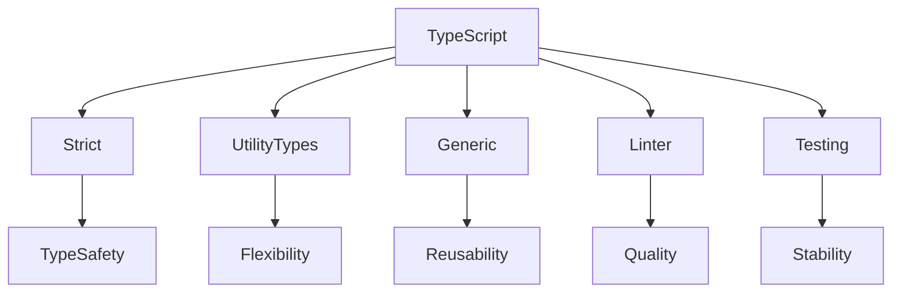

# Best practices, типові помилки, антипатерни

## Вступ

Best practices — це набір правил, які допомагають писати якісний, безпечний та підтримуваний TypeScript-код. Антипатерни та типові помилки — це те, чого слід уникати для стабільної роботи проєкту.

## Best practices

### 1. Використовуйте strict-режим

-   Увімкніть `strict` у tsconfig.json
-   Забезпечує максимальну перевірку типів

### 2. Документуйте типи

-   Описуйте типи, інтерфейси, функції
-   Використовуйте JSDoc для складних типів

### 3. Уникайте any

-   Використовуйте конкретні типи
-   any — джерело помилок

### 4. Використовуйте utility types

-   Partial, Pick, Omit, Record — для гнучкості

### 5. Тестуйте типи

-   Пишіть unit-тести для типів
-   Використовуйте conditional types для перевірки

### 6. Використовуйте readonly

-   Для незмінних властивостей

### 7. Використовуйте generic-типи

-   Для гнучких функцій та класів

### 8. Використовуйте linter

-   ESLint з @typescript-eslint
-   Виявляє помилки та антипатерни

### 9. Інтегруйте тести у CI/CD

-   Гарантія стабільності

### 10. Використовуйте декоратори для DI, логування, валідації

## Типові помилки

### 1. Використання any

```ts
function bad(x: any) {
    return x.prop;
} // runtime error
```

### 2. Відсутність strict-режиму

-   Можливі неочікувані помилки типів

### 3. Неправильне використання union/tuple

```ts
type T = [string | number]; // не tuple, а масив
```

### 4. Відсутність типізації props/state

```tsx
function Comp(props) {
    return <div>{props.x}</div>;
} // props: any
```

### 5. Неправильне використання декораторів

-   Не увімкнено experimentalDecorators

### 6. Відсутність типізації DI у Angular

-   Можливі конфлікти типів

### 7. Неправильна конфігурація tsconfig

-   Помилки компіляції

### 8. Відсутність тестів

-   Неочікувані баги

## Антипатерни

### 1. Overuse any

-   any скрізь — відсутність типізації

### 2. God object

-   Клас з десятками властивостей

### 3. Magic numbers/strings

-   Використовуйте enum або константи

### 4. Вкладені union/tuple

-   Складна типізація, важко читати

### 5. Відсутність документації

-   Складно підтримувати

### 6. Відсутність перевірки типів у тестах

-   Тести лише для логіки, не для типів

### 7. Змішування namespace та модулів

-   Конфлікти, несумісність

### 8. Відсутність readonly

-   Можливі неочікувані зміни

### 9. Відсутність utility types

-   Складний код

### 10. Відсутність лінтера

-   Багато стилістичних помилок

## Пояснення під капотом

-   Strict-режим — гарантія типобезпеки
-   Utility types — гнучкість
-   Generic — універсальність
-   Linter — контроль якості
-   Тести — стабільність

## Підводні камені

-   any — джерело помилок
-   Відсутність strict — неочікувані баги
-   Відсутність тестів — нестабільність
-   Відсутність документації — складна підтримка
-   Змішування namespace та модулів — конфлікти

## Best practices для великих проєктів

-   Розбивайте код на модулі
-   Використовуйте типи для API
-   Документуйте всі публічні інтерфейси
-   Використовуйте generic для бібліотек
-   Інтегруйте тести у CI/CD

## Діаграми



## Неочевидні приклади

### 1. Тестування типів через conditional types

```ts
type IsString<T> = T extends string ? true : false;
const test: IsString<"abc"> = true;
```

### 2. Використання readonly для масиву

```ts
const arr: readonly number[] = [1, 2, 3];
```

### 3. Використання utility type для API

```ts
type ApiResponse<T> = Partial<T> & { error?: string };
```

## Крос-посилання

-   [Типи, інтерфейси](./02-types.md)
-   [Декоратори, metadata](./06-decorators-metadata.md)
-   [Інструменти, тестування](./09-tools-testing.md)
-   [JavaScript: best practices](../JavaScript/16-best-practices.md)

## Підсумок

-   Best practices — strict, utility types, generic, тести, документація
-   Типові помилки — any, відсутність strict, неправильна типізація
-   Антипатерни — god object, magic numbers, відсутність лінтера
-   Підводні камені — конфлікти, нестабільність, складна підтримка
