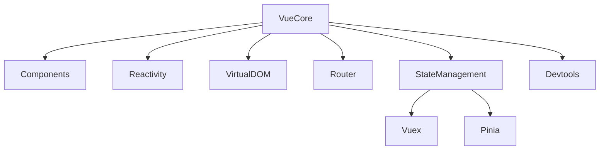

# Вступ: історія, філософія, архітектура

## Вступ

Vue.js — це прогресивний JavaScript-фреймворк для створення інтерфейсів. Його філософія — простота, гнучкість, поступове впровадження та потужна реактивність.

## Історія

-   Створений Evan You у 2014 році після роботи з AngularJS у Google.
-   Мета — зробити легкий, простий, але потужний фреймворк.
-   Швидко набув популярності завдяки простоті та документації.
-   Версії:
    -   Vue 1.x — старт, базова реактивність.
    -   Vue 2.x — Virtual DOM, компоненти, розширення API.
    -   Vue 3.x (2020) — Composition API, покращена продуктивність, TypeScript support.

## Філософія

-   **Поступове впровадження**: можна використовувати Vue для окремих частин сторінки або для SPA.
-   **Простота**: низький поріг входу, зрозуміла документація.
-   **Гнучкість**: підтримка шаблонів, JSX, TypeScript.
-   **Реактивність**: автоматичне оновлення UI при зміні даних.
-   **Модульність**: компоненти, плагіни, екосистема.

## Архітектура

### Основні компоненти

-   **Core**: реактивність, рендеринг, компоненти.
-   **CLI**: генератор проєктів, конфігурація.
-   **Router**: маршрутизація для SPA.
-   **Vuex/Pinia**: менеджмент стану.
-   **Devtools**: інструменти для дебагу.

### Пояснення під капотом

-   Реактивність через Proxy (Vue 3) або Object.defineProperty (Vue 2).
-   Virtual DOM — швидке оновлення UI.
-   Компонентний підхід — ізоляція логіки та UI.
-   Composition API — гнучке управління станом та логікою.

### Діаграма архітектури



## Неочевидні приклади

### 1. Реактивність через Proxy

```js
const state = new Proxy(
    { count: 0 },
    {
        set(target, key, value) {
            target[key] = value;
            // trigger UI update
            return true;
        },
    }
);
```

### 2. Впровадження Vue у legacy-проєкт

```html
<div id="app">{{ message }}</div>
<script src="https://cdn.jsdelivr.net/npm/vue@3"></script>
<script>
    const app = Vue.createApp({
        data() {
            return { message: "Hello Vue!" };
        },
    });
    app.mount("#app");
</script>
```

### 3. Використання Composition API

```js
import { ref } from "vue";
export default {
    setup() {
        const count = ref(0);
        return { count };
    },
};
```

## Підводні камені

-   Vue 2 vs Vue 3 — різна реактивність, API
-   Legacy-проєкти — складна міграція
-   Неочевидна робота з TypeScript
-   Відсутність SSR у базовій версії
-   Можливі конфлікти з іншими фреймворками

## Best practices

-   Використовуйте Vue 3 для нових проєктів
-   Документуйте компоненти та API
-   Використовуйте Composition API для складної логіки
-   Інтегруйте TypeScript для типобезпеки
-   Тестуйте компоненти

## Крос-посилання

-   [React: історія, архітектура](../JavaScript/12-react.md)
-   [TypeScript: інтеграція з фреймворками](../TypeScript/08-frameworks.md)
-   [Vue: компоненти, реактивність](./02-components-reactivity.md)

## Підсумок

-   Vue — простий, гнучкий, реактивний фреймворк
-   Архітектура — компоненти, Virtual DOM, Composition API
-   Best practices — Vue 3, документація, TypeScript, тестування
-   Підводні камені — міграція, legacy, SSR
