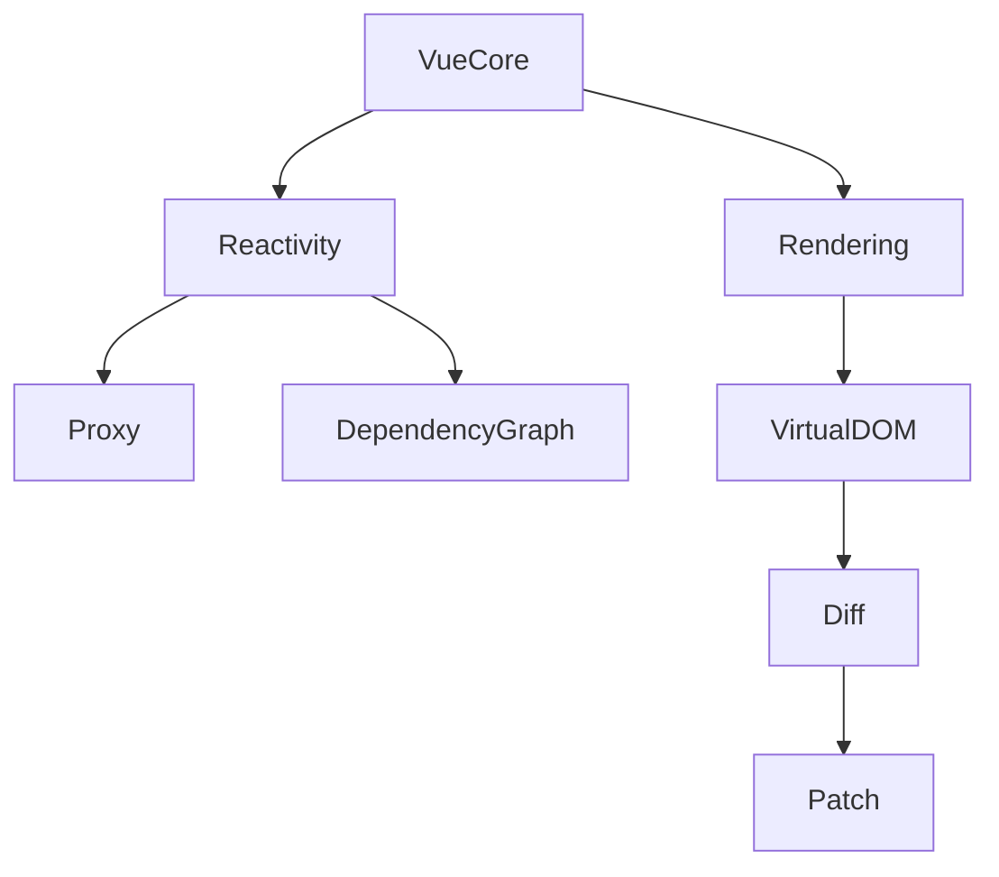

# Ядро Vue 3: реактивність, рендеринг

## Вступ

Ядро Vue 3 — це реактивність та рендеринг. Саме ці механізми забезпечують автоматичне оновлення UI при зміні даних, високу продуктивність та простоту розробки.

## Реактивність

### Основи

-   Реалізовано через Proxy (Vue 3)
-   Автоматичне відстеження залежностей
-   Оновлення UI при зміні стану

#### Приклад: реактивний об'єкт

```js
import { reactive } from "vue";
const state = reactive({ count: 0 });
state.count++;
```

### ref vs reactive

-   `ref` — для простих типів
-   `reactive` — для об'єктів та масивів

#### Приклад: ref

```js
import { ref } from "vue";
const count = ref(0);
count.value++;
```

### Неочевидний приклад: глибока реактивність

```js
const state = reactive({ user: { name: "Ivan" } });
state.user.name = "Petro"; // UI оновиться
```

### Пояснення під капотом

-   Proxy перехоплює get/set
-   Vue створює dependency graph
-   Оновлення лише тих компонентів, які залежать від змінених даних

## Рендеринг

### Основи

-   Virtual DOM — швидке оновлення UI
-   Рендеринг через шаблони або JSX
-   Оптимізація оновлень

#### Приклад: шаблон

```html
<template>
    <button @click="count++">{{ count }}</button>
</template>
<script setup>
    import { ref } from "vue";
    const count = ref(0);
</script>
```

### Неочевидний приклад: рендер-функція

```js
import { h } from "vue";
export default {
    render() {
        return h("div", {}, "Hello Vue");
    },
};
```

### Пояснення під капотом

-   Virtual DOM — дерево вузлів
-   diff-алгоритм — знаходить мінімальні зміни
-   patch — оновлює DOM

## Підводні камені

-   Глибока реактивність — можливі неочікувані оновлення
-   Не можна робити реактивними non-plain objects (Map, Set)
-   Рендер-функції складні для читання
-   Можливі memory leaks при неправильному використанні

## Best practices

-   Використовуйте ref для простих типів, reactive — для складних
-   Не змінюйте реактивні об'єкти напряму через прототип
-   Тестуйте рендеринг компонентів
-   Використовуйте шаблони для простоти
-   Документуйте складну реактивну логіку

## Діаграми



## Неочевидні приклади

### 1. Реактивність у масивах

```js
const arr = reactive([1, 2, 3]);
arr.push(4); // UI оновиться
```

### 2. Рендеринг через JSX

```jsx
<script setup lang="jsx">
    import {ref} from 'vue'; const count = ref(0); export default () =>{" "}
    <button onClick={() => count.value++}>{count.value}</button>;
</script>
```

### 3. Відстеження залежностей вручну

```js
import { watch } from "vue";
const state = reactive({ x: 1 });
watch(
    () => state.x,
    (newVal) => {
        console.log("x changed:", newVal);
    }
);
```

## Крос-посилання

-   [Вступ: архітектура Vue](./01-intro.md)
-   [Компоненти, реактивність](./02-components-reactivity.md)
-   [TypeScript: реактивність](../TypeScript/08-frameworks.md)

## Підсумок

-   Реактивність — Proxy, dependency graph, автоматичне оновлення
-   Рендеринг — Virtual DOM, шаблони, рендер-функції
-   Best practices — ref/reactive, тестування, документація
-   Підводні камені — глибока реактивність, memory leaks, складні рендер-функції
